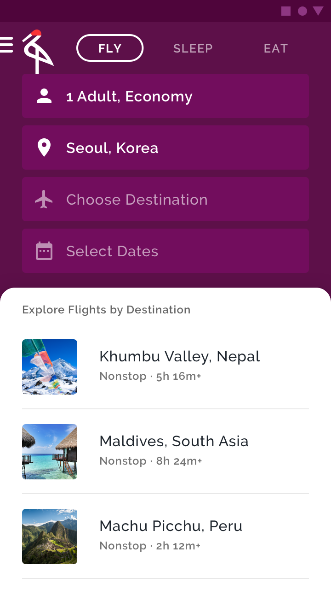

# Backdrop
#### Engineering Guidance Document

### What is the backdrop?
The backdrop is a component that consists of a **back layer** and a **front layer**. The front layer displays content. When the back layer is revealed, it shows context and actions related to the front layer’s content. 

To learn more about the backdrop, take a look at the [Material Guidelines](https://material.io/design/components/backdrop.html#).

### Is there a widget for the backdrop in Material Components for Flutter?
_No._ . Advanced components don't make great reusable components as they tend to be highly specific to your app. But you can use existing components and classes to achieve the desired interaction!

### What are some good ideas for building my own?
When you break it down, backdrops are composed of 2 pieces:
1. The front layer, a surface that displays the user’s main content. On certain events, its height can change to reveal information on the back layer.
1. The back layer, which contains context and actionable items. Changes here update the information shown on the front layer.

To start, you can use a [StatefulWidget](https://material.io/design/components/backdrop.html#) to tie the two pieces together. This widget can contain the back layer and other widgets, such as the [AppBar](https://flutter.io/catalog/samples/basic-app-bar). You will have a separate widget to build out the front layer. 

**Backdrop motion**
To produce the open/close motion of the front layer, build an animation in the back layer’s parent widget. Manage that motion with an [AnimationController](https://docs.flutter.io/flutter/animation/AnimationController-class.html). To trigger the animation, implement a button on the AppBar.

### Example code
Example code for building a simple backdrop can be found in the [MDC-Flutter codelabs repo](https://github.com/material-components/material-components-flutter-codelabs/blob/104-complete/mdc_100_series/lib/backdrop.dart).

The example uses existing widgets such as [PositionedTransition](https://docs.flutter.io/flutter/widgets/PositionedTransition-class.html) in tandem with the [AnimationController](https://docs.flutter.io/flutter/animation/AnimationController-class.html). It also uses some custom widgets to establish the desired look.

### Codelab
See [MDC-103 for Flutter](http://codelabs.developers.google.com/codelabs/mdc-103-flutter) for a codelab on building this example.

### Related Documentation
To learn more about animations in Flutter, see [flutter.io/animations](flutter.io/animations).

### From a designer’s point of view
The backdrop gives users easy access to an important, secondary element of an app. Its back layer is persistent yet unobtrusive, giving users access to the actions and content relevant to the front layer.

### Why not a reusable code component?
_The backdrop is complex._ The component uses multiple types of animations and may depend on app-specific models or information. This makes it difficult to generalize across a variety of contexts. It's not a good candidate for a reusable code component.

_The appearance of the backdrop can change with context._
* Some apps only need a single front layer and back layer. This limits the backdrop interaction to moving between the front layer and the back layer.
* Tabs may necessitate multiple front layer widgets and may also require custom widgets, as the widgets in Flutter don’t currently support the desired interactions out of the box.

In the Material study [Shrine](https://material.io/design/material-studies/shrine.html#product-architecture), the backdrop unveils a menu that allows users to filter products shown on the front layer.  In [Crane](https://material.io/design/material-studies/crane.html), the backdrop has multiple front layers, and each front layer changes content based on the selected Tab. The backdrop component can be used many different ways. It isn't a one-size-fits-all component.

_A backdrop is meant to be used only once per app._ You don't need to instantiate more than one for a normal experience even if you have multiple front layers.
