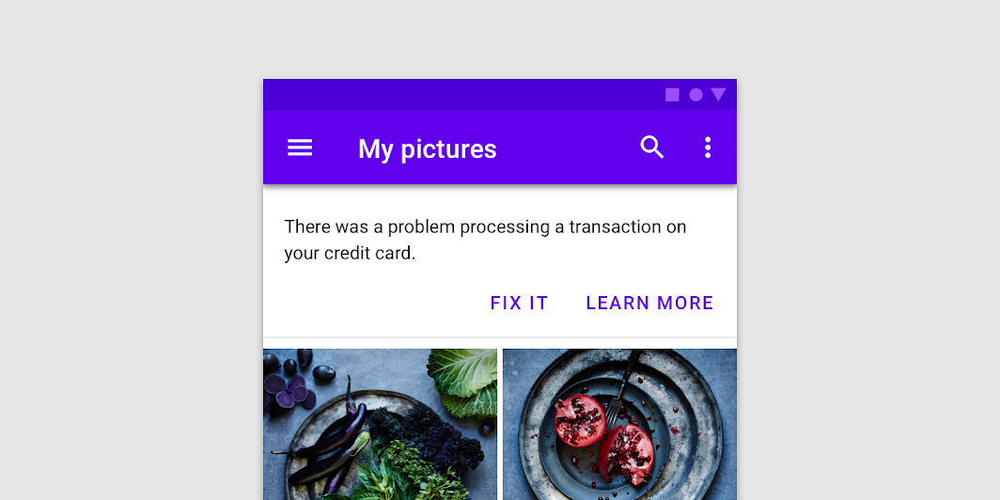
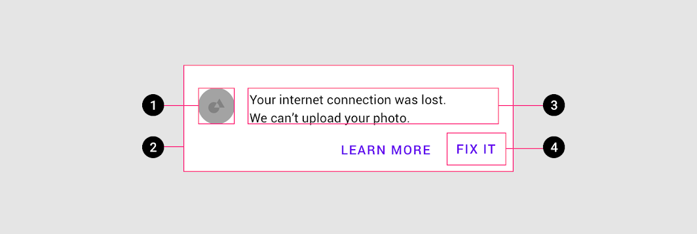
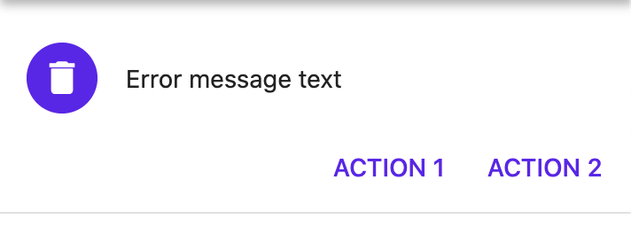
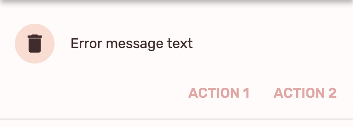

<!--docs:
title: "Material Banners"
layout: detail
section: components
excerpt: "A banner displays a prominent message and related optional actions."
iconId: 
path: /catalog/material-banners/
-->

# Banners

A [banner](https://material.io/components/banners) displays a prominent message and related optional actions.



## Contents

- [Contents](#contents)
- [Using banners](#using-banners)
- [Banners example](#banners-example)
- [Theming banners](#theming-banners)

## Using banners

A banner displays an important, succinct message, and provides actions for users to address (or dismiss the banner). It requires a user action to be dismissed.

Banners should be displayed at the top of the screen, below a top app bar. They’re persistent and nonmodal, allowing the user to either ignore them or interact with them at any time. Only one banner should be shown at a time.

### Import banners

Before you can use banners, you need to import the Material Components package for Flutter:

```dart
package:flutter/material.dart.
```

You need to be using a [`MaterialApp`](https://api.flutter.dev/flutter/material/MaterialApp-class.html).

For more information on getting started with the Material for Flutter, go to the Flutter [Material library](https://api.flutter.dev/flutter/material/material-library.html) page.

### Making banners accessible

Flutter's APIs support accessibility setting for large fonts, screen readers, and sufficient contrast. For more information, go to Flutter's [accessibility](https://flutter.dev/docs/development/accessibility-and-localization/accessibility) and [internationalization](https://flutter.dev/docs/development/accessibility-and-localization/internationalization) pages.

For more guidance on writing labels, go to [our page on how to write a good accessibility label](https://material.io/design/usability/accessibility.html#writing).

### Anatomy and key properties



Banners consist of the following:

1. Supporting illustration (optional)
2. Container
3. Text
4. Buttons


#### Supporting illustration

&nbsp;         | Property
-------------- | ------------------------ 
**Illustration** | `leading`

#### Container

&nbsp; | Property
------ | --------- 
**Color** | `backgroundColor` 

#### Text

&nbsp;         | Property
-------------- | ------------------------ 
**Text label** | `content`
**Color**      | `style` on `content` when using a `Text`
**Typography** | `style` on `content` when using a `Text`

#### Buttons

&nbsp;         | Property
-------------- | ------------------------ 
**Buttons** | `actions`


## Banners example

`MaterialBanner`
- [Class definition](https://master-api.flutter.dev/flutter/material/MaterialBanner-class.html)
- [GitHub source](https://github.com/flutter/flutter/blob/master/packages/flutter/lib/src/material/banner.dart)
- [Dartpad demo](https://dartpad.dev/embed-flutter.html?gh_owner=material-components&gh_repo=material-components-flutter&gh_path=docs/components/dartpad/banners/regular)

The following example shows a banner being used with an icon and two actions.



```dart
MaterialBanner(
  content: const Text('Error message text'),
  leading: CircleAvatar(child: Icon(Icons.delete)),
  actions: [
    FlatButton(
      child: const Text('ACTION 1'),
      onPressed: () { },
    ),
    FlatButton(
      child: const Text('ACTION 2'),
      onPressed: () { },
    ),
  ],
)
```

## Theming banners

`MaterialBanner`
- [Class definition](https://master-api.flutter.dev/flutter/material/MaterialBanner-class.html)
- [GitHub source](https://github.com/flutter/flutter/blob/master/packages/flutter/lib/src/material/banner.dart)
- [[Dartpad demo](https://dartpad.dev/embed-flutter.html?gh_owner=material-components&gh_repo=material-components-flutter&gh_path=docs/components/dartpad/banners/theme)

Banners support [Material Theming](https://material.io/components/buttons/#theming) and can be
customized in terms of color and typography.

The following example shows a banner with the [Material Shrine Theme](https://material.io/design/material-studies/shrine.html).




```dart
import 'package:flutter/material.dart';

void main() => runApp(MyApp());

class MyApp extends StatelessWidget {
  @override
  Widget build(BuildContext context) {
    return MaterialApp(
      title: 'Flutter Demo',
      debugShowCheckedModeBanner: false,
      home: MyHomePage(),
      theme: _buildShrineTheme(),
    );
  }
}

class MyHomePage extends StatelessWidget {
  Widget build(BuildContext context) {
    return Scaffold(
      appBar: AppBar(title: Text('Banners'),),
      body: MaterialBanner(
        content: const Text('Error message text'),
        leading: CircleAvatar(child: Icon(Icons.delete)),
        actions: [
          FlatButton(
            child: const Text('ACTION 1'),
            onPressed: () { },
          ),
          FlatButton(
            child: const Text('ACTION 2'),
            onPressed: () { },
          ),
        ],
      ),
    );
  }
}

ThemeData _buildShrineTheme() {
  final ThemeData base = ThemeData.light();
  return base.copyWith(
    colorScheme: _shrineColorScheme,
    toggleableActiveColor: shrinePink400,
    accentColor: shrineBrown900,
    primaryColor: shrinePink100,
    primaryColorLight: shrinePink100,
    buttonColor: shrinePink100,
    scaffoldBackgroundColor: shrineBackgroundWhite,
    cardColor: shrineBackgroundWhite,
    textSelectionColor: shrinePink100,
    errorColor: shrineErrorRed,
    buttonTheme: ButtonThemeData(
      colorScheme: _shrineColorScheme.copyWith(primary: shrinePink400),
      textTheme: ButtonTextTheme.normal,
    ),
    primaryIconTheme: _customIconTheme(base.iconTheme),
    textTheme: _buildShrineTextTheme(base.textTheme),
    primaryTextTheme: _buildShrineTextTheme(base.primaryTextTheme),
    accentTextTheme: _buildShrineTextTheme(base.accentTextTheme),
    iconTheme: _customIconTheme(base.iconTheme),
  );
}

IconThemeData _customIconTheme(IconThemeData original) {
  return original.copyWith(color: shrineBrown900);
}

TextTheme _buildShrineTextTheme(TextTheme base) {
  return base
      .copyWith(
    caption: base.caption.copyWith(
      fontWeight: FontWeight.w400,
      fontSize: 14,
      letterSpacing: defaultLetterSpacing,
    ),
    button: base.button.copyWith(
      fontWeight: FontWeight.w500,
      fontSize: 14,
      letterSpacing: defaultLetterSpacing,
    ),
  )
      .apply(
    fontFamily: 'Rubik',
    displayColor: shrineBrown900,
    bodyColor: shrineBrown900,
  );
}

const ColorScheme _shrineColorScheme = ColorScheme(
  primary: shrinePink100,
  primaryVariant: shrineBrown900,
  secondary: shrinePink50,
  secondaryVariant: shrineBrown900,
  surface: shrineSurfaceWhite,
  background: shrineBackgroundWhite,
  error: shrineErrorRed,
  onPrimary: shrineBrown900,
  onSecondary: shrineBrown900,
  onSurface: shrineBrown900,
  onBackground: shrineBrown900,
  onError: shrineSurfaceWhite,
  brightness: Brightness.light,
);

const Color shrinePink50 = Color(0xFFFEEAE6);
const Color shrinePink100 = Color(0xFFFEDBD0);
const Color shrinePink300 = Color(0xFFFBB8AC);
const Color shrinePink400 = Color(0xFFEAA4A4);

const Color shrineBrown900 = Color(0xFF442B2D);
const Color shrineBrown600 = Color(0xFF7D4F52);

const Color shrineErrorRed = Color(0xFFC5032B);

const Color shrineSurfaceWhite = Color(0xFFFFFBFA);
const Color shrineBackgroundWhite = Colors.white;

const defaultLetterSpacing = 0.03;
```

