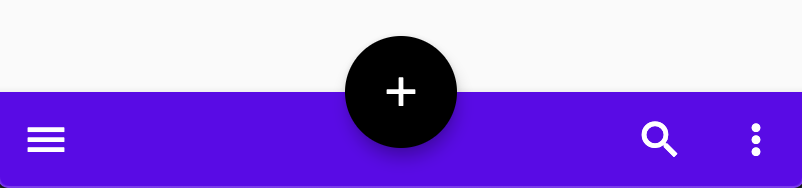
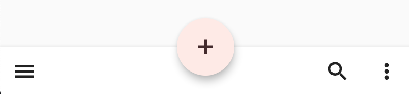

<!--docs:
title: "Material bottom app bar"
layout: detail
section: components
excerpt: "Bottom app bars provide access to a bottom navigation drawer and up to four actions, including the floating action button.
iconId:
path: /catalog/material-bottom-app-bar/
-->

# Bottom app bars

[Bottom app bars](https://material.io/components/app-bars-bottom/) provide access to a bottom navigation drawer and up to four actions, including the floating action button.


## Contents

- [Bottom app bars](#bottom-app-bars)
  - [Contents](#contents)
  - [Using the bottom app bar](#using-the-bottom-app-bar)
  - [Bottom app bar example](#bottom-app-bar-example)
  - [Anatomy and key properties](#anatomy-and-key-properties)
    - [Container attributes](#container-attributes)
    - [FAB attributes](#fab-attributes)
    - [Icons attributes](#icons-attributes)
  - [Theming](#theming)
    - [Theming example](#theming-example)

## Using the bottom app bar

Bottom app bars provide access to a bottom navigation drawer and up to four actions, including the [floating action button](fab.md).

Before you can use Material buttons, you need to import the Material Components package for Flutter:

```dart
package:flutter/material.dart
```

You need to use [`MaterialApp`](https://api.flutter.dev/flutter/material/MaterialApp-class.html).

For more information on getting started with the Material for Flutter, go to the Flutter [Material library](https://api.flutter.dev/flutter/material/material-library.html) page.

For more guidance using the bottom app bar, go to the [Material design page](https://material.io/components/app-bars-bottom/).

## Bottom app bar example

`BottomAppBar`

- [Class description](https://api.flutter.dev/flutter/material/BottomAppBar-class.html)
- [GitHub source](https://github.com/flutter/flutter/blob/master/packages/flutter/lib/src/material/bottom_app_bar.dart)
- [Dartpad demo](https://dartpad.dev/embed-flutter.html?gh_owner=material-components&gh_repo=material-components-flutter&gh_path=docs/components/dartpad/bottom_app_bars/regular)



```dart
Scaffold(
  bottomNavigationBar: BottomAppBar(
    child: Row(
      children: [
        IconButton(icon: Icon(Icons.menu), onPressed: () {}),
        Spacer(),
        IconButton(icon: Icon(Icons.search), onPressed: () {}),
        IconButton(icon: Icon(Icons.more_vert), onPressed: () {}),
      ],
    ),
  ),
  floatingActionButton:
      FloatingActionButton(child: Icon(Icons.add), onPressed: () {}),
  floatingActionButtonLocation: FloatingActionButtonLocation.centerDocked,
),
```

## Anatomy and key properties


1. Container
1. Navigation drawer icon
1. Floating action button (FAB)
1. Action icon
1. Overflow menu icon

### Container attributes

| &nbsp; | Property |
| --- | --- |
| **Color** | `color` |
| **Shape** | `shape` |
| **Elevation** | `elevation` |

### FAB attributes

See [floating action button](fab.md).

### Icons attributes

Using an [`IconButton`](https://api.flutter.dev/flutter/material/IconButton-class.html)

| &nbsp; | Property |
| --- | --- |
| **Icon** | `icon` |
| **Color** | `color` |
| **Size** | `iconSize` |

## Theming

### Theming example

The following example shows a bottom app bar with the [Material Shrine Theme](https://material.io/design/material-studies/shrine.html).

- [Dartpad demo](https://dartpad.dev/embed-flutter.html?gh_owner=material-components&gh_repo=material-components-flutter&gh_path=docs/components/dartpad/bottom_app_bars/theme)



```dart
import 'package:flutter/material.dart';

void main() => runApp(MyApp());

class MyApp extends StatelessWidget {
  @override
  Widget build(BuildContext context) {
    return MaterialApp(
      title: 'Flutter Demo',
      home: MyHomePage(),
    );
  }
}

class MyHomePage extends StatelessWidget {
  @override
  Widget build(BuildContext context) {
    return Scaffold(
      bottomNavigationBar: BottomAppBar(
        child: Row(
          children: [
            IconButton(icon: Icon(Icons.menu), onPressed: () {}),
            Spacer(),
            IconButton(icon: Icon(Icons.search), onPressed: () {}),
            IconButton(icon: Icon(Icons.more_vert), onPressed: () {}),
          ],
        ),
      ),
      floatingActionButton:
          FloatingActionButton(child: Icon(Icons.add), onPressed: () {}),
      floatingActionButtonLocation: FloatingActionButtonLocation.centerDocked,
    );
  }
}

ThemeData _buildShrineTheme() {
  final ThemeData base = ThemeData.light();
  return base.copyWith(
    colorScheme: _shrineColorScheme,
    textTheme: _buildShrineTextTheme(base.textTheme),
  );
}

TextTheme _buildShrineTextTheme(TextTheme base) {
  return base
      .copyWith(
        caption: base.caption.copyWith(
          fontWeight: FontWeight.w400,
          fontSize: 14,
          letterSpacing: defaultLetterSpacing,
        ),
        button: base.button.copyWith(
          fontWeight: FontWeight.w500,
          fontSize: 14,
          letterSpacing: defaultLetterSpacing,
        ),
      )
      .apply(
        fontFamily: 'Rubik',
        displayColor: shrineBrown900,
        bodyColor: shrineBrown900,
      );
}

const ColorScheme _shrineColorScheme = ColorScheme(
  primary: shrinePink100,
  primaryVariant: shrineBrown900,
  secondary: shrinePink50,
  secondaryVariant: shrineBrown900,
  surface: shrineSurfaceWhite,
  background: shrineBackgroundWhite,
  error: shrineErrorRed,
  onPrimary: shrineBrown900,
  onSecondary: shrineBrown900,
  onSurface: shrineBrown900,
  onBackground: shrineBrown900,
  onError: shrineSurfaceWhite,
  brightness: Brightness.light,
);

const Color shrinePink50 = Color(0xFFFEEAE6);
const Color shrinePink100 = Color(0xFFFEDBD0);
const Color shrinePink300 = Color(0xFFFBB8AC);
const Color shrinePink400 = Color(0xFFEAA4A4);

const Color shrineBrown900 = Color(0xFF442B2D);
const Color shrineBrown600 = Color(0xFF7D4F52);

const Color shrineErrorRed = Color(0xFFC5032B);

const Color shrineSurfaceWhite = Color(0xFFFFFBFA);
const Color shrineBackgroundWhite = Colors.white;

const defaultLetterSpacing = 0.03;
```
