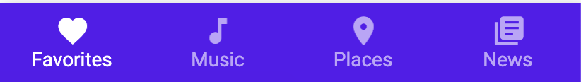
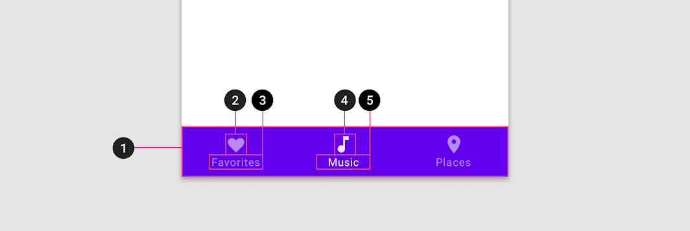
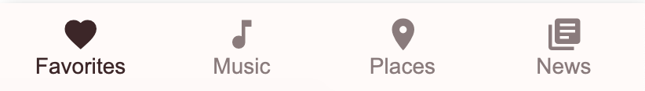

<!--docs:
title: "Bottom navigation"
layout: detail
section: components
excerpt: "Bottom Navigation bars allow movement between primary distinations in an app"
iconId:
path: /components/bottom-navigation/
-->

# Bottom navigation

[Bottom navigation](https://material.io/components/bottom-navigation/#) bars allow movement between primary destinations in an app.


## Contents

- [Using bottom navigation](#using-bottom-navigation)
- [Bottom navigation example](#bottom-navigation-example)
- [Theming a bottom nav bar](#theming-a-bottom-nav-bar)

## Using bottom navigation

Before you can use Material `BottomNavigationBar`s, you need to import the Material Components package for Flutter:

```dart
import 'package:flutter/material.dart';
```

You need to be using a [`MaterialApp`](https://api.flutter.dev/flutter/material/MaterialApp-class.html).

For more information on getting started with the Material for Flutter, go to the Flutter [Material library](https://api.flutter.dev/flutter/material/material-library.html) page.

## Bottom navigation example

Source code API:

`BottomNavigationBar`

- [Class description](https://api.flutter.dev/flutter/material/BottomNavigationBar-class.html)
- [GitHub source](https://github.com/flutter/flutter/blob/master/packages/flutter/lib/src/material/bottom_navigation_bar.dart)
- [Demo site](https://dartpad.dev/embed-flutter.html?gh_owner=material-components&gh_repo=material-components-flutter&gh_path=docs/components/dartpad/bottom_navigation/regular)

The following example shows a bottom navigation bar with four icons:

- favorites
- music note
- places
- news



```dart
BottomNavigationBar(
  type: BottomNavigationBarType.fixed,
  backgroundColor: Color(0xFF6200EE),
  selectedItemColor: Colors.white,
  unselectedItemColor: Colors.white.withOpacity(.60),
  selectedFontSize: 14,
  unselectedFontSize: 14,
  onTap: (value) {
    // Respond to item press.
  },
  items: [
    BottomNavigationBarItem(
      title: Text('Favorites'),
      icon: Icon(Icons.favorite),
    ),
    BottomNavigationBarItem(
      title: Text('Music'),
      icon: Icon(Icons.music_note),
    ),
    BottomNavigationBarItem(
      title: Text('Places'),
      icon: Icon(Icons.location_on),
    ),
    BottomNavigationBarItem(
      title: Text('News'),
      icon: Icon(Icons.library_books),
    ),
  ],
)
```

### Anatomy and key properties

The following is an anatomy diagram for the bottom navigation bar:



1. Container
1. Inactive icon
1. Inactive text label
1. Active icon
1. Active text label

### Container attributes

| &nbsp; | Property |
| --- | --- |
| **Color** | `backgroundColor` |
| **Elevation** | `elevation` |

### Inactive icon attributes

| &nbsp; | Property |
| --- | --- |
| **Icon** | `icon` |
| **Color** | `unselectedItemColor` |
| **Size** | `size` on `unselectedIconTheme` |

### Inactive text label attributes

| &nbsp; | Property |
| --- | --- |
| **Text label** | `title` |
| **Color** | `unselectedItemColor` |
| **Typography** | `unselectedLabelStyle` |

### Active icon attributes

| &nbsp; | Property |
| --- | --- |
| **Icon** | `icon` |
| **Color** | `selectedItemColor` |
| **Size** | `size` on `selectedIconTheme` |

### Active text label attributes

| &nbsp; | Property |
| --- | --- |
| **Text label** | `title`|
| **Color** | `selectedItemColor` |
| **Typography** | `selectedLabelStyle` |

## Theming a bottom nav bar

The following example shows a bottom navigation bar with the [Material Shrine Theme](https://material.io/design/material-studies/shrine.html).

[Dartpad Demo](https://dartpad.dev/embed-flutter.html?gh_owner=material-components&gh_repo=material-components-flutter&gh_path=docs/components/dartpad/bottom_navigation/theme)



```dart
import 'package:flutter/material.dart';

void main() => runApp(MyApp());

class MyApp extends StatelessWidget {
  @override
  Widget build(BuildContext context) {
    return MaterialApp(
      theme: _buildShrineTheme(),
      title: 'Flutter Demo',
      home: MyHomePage(),
    );
  }
}

class MyHomePage extends StatefulWidget {
  @override
  _MyHomePageState createState() => _MyHomePageState();
}

class _MyHomePageState extends State<MyHomePage> {
  int _currentIndex = 0;

  Widget build(BuildContext context) {
    final colorScheme = Theme.of(context).colorScheme;
    final textTheme = Theme.of(context).textTheme;
    return Scaffold(
      bottomNavigationBar: BottomNavigationBar(
        type: BottomNavigationBarType.fixed,
        currentIndex: _currentIndex,
        backgroundColor: colorScheme.surface,
        selectedItemColor: colorScheme.onSurface,
        unselectedItemColor: colorScheme.onSurface.withOpacity(.60),
        selectedLabelStyle: textTheme.caption,
        unselectedLabelStyle: textTheme.caption,
        onTap: (value) {
          // Respond to item press.
          setState(() => _currentIndex = value);
        },
        items: [
          BottomNavigationBarItem(
            title: Text('Favorites'),
            icon: Icon(Icons.favorite),
          ),
          BottomNavigationBarItem(
            title: Text('Music'),
            icon: Icon(Icons.music_note),
          ),
          BottomNavigationBarItem(
            title: Text('Places'),
            icon: Icon(Icons.location_on),
          ),
          BottomNavigationBarItem(
            title: Text('News'),
            icon: Icon(Icons.library_books),
          ),
        ],
      ),
    );
  }
}

ThemeData _buildShrineTheme() {
  final ThemeData base = ThemeData.light();
  return base.copyWith(
    colorScheme: _shrineColorScheme,
    textTheme: _buildShrineTextTheme(base.textTheme),
  );
}

TextTheme _buildShrineTextTheme(TextTheme base) {
  return base
      .copyWith(
        caption: base.caption.copyWith(
          fontWeight: FontWeight.w400,
          fontSize: 14,
          letterSpacing: defaultLetterSpacing,
        ),
        button: base.button.copyWith(
          fontWeight: FontWeight.w500,
          fontSize: 14,
          letterSpacing: defaultLetterSpacing,
        ),
      )
      .apply(
        fontFamily: 'Rubik',
        displayColor: shrineBrown900,
        bodyColor: shrineBrown900,
      );
}

const ColorScheme _shrineColorScheme = ColorScheme(
  primary: shrinePink100,
  primaryVariant: shrineBrown900,
  secondary: shrinePink50,
  secondaryVariant: shrineBrown900,
  surface: shrineSurfaceWhite,
  background: shrineBackgroundWhite,
  error: shrineErrorRed,
  onPrimary: shrineBrown900,
  onSecondary: shrineBrown900,
  onSurface: shrineBrown900,
  onBackground: shrineBrown900,
  onError: shrineSurfaceWhite,
  brightness: Brightness.light,
);

const Color shrinePink50 = Color(0xFFFEEAE6);
const Color shrinePink100 = Color(0xFFFEDBD0);
const Color shrinePink300 = Color(0xFFFBB8AC);
const Color shrinePink400 = Color(0xFFEAA4A4);

const Color shrineBrown900 = Color(0xFF442B2D);
const Color shrineBrown600 = Color(0xFF7D4F52);

const Color shrineErrorRed = Color(0xFFC5032B);

const Color shrineSurfaceWhite = Color(0xFFFFFBFA);
const Color shrineBackgroundWhite = Colors.white;

const defaultLetterSpacing = 0.03;
```
