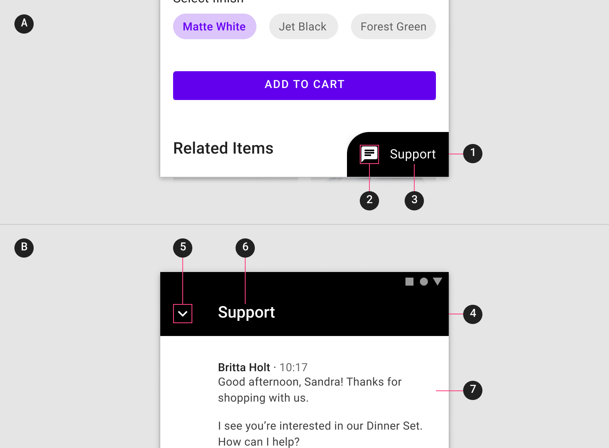

<!--docs:
title: "Material sheets: bottom"
layout: detail
section: components
excerpt: "Bottom sheets are surfaces containing supplementary content that are anchored to the bottom of the screen."
iconId:
path: /catalog/material-sheets-bottom/
-->

# Sheets: bottom

[Bottom sheets](https://material.io/components/sheets-bottom) are surfaces containing supplementary content that are anchored to the bottom of the screen.


## Contents

- [Using bottom sheets](#using-bottom-sheets)
- [Making bottom sheets accessible](#making-bottom-sheets-accessible)
- [Standard bottom sheet](#standard-bottom-sheet)
- [Modal bottom sheet](#modal-bottom-sheet)
- [Expanding bottom sheet](#expanding-bottom-sheet)
- [Theming bottom sheets](#theming-bottom-sheets)

## Using bottom sheets

Bottom sheets are supplementary surfaces primarily used on mobile.

Before you can use bottom sheets, you need to import the Material Components package for Flutter:

```dart
package:flutter/material.dart
```

You need to be using a [`MaterialApp`](https://api.flutter.dev/flutter/material/MaterialApp-class.html).

For more information on getting started with the Material for Flutter, go to the Flutter [Material library](https://api.flutter.dev/flutter/material/material-library.html) page.

### Making bottom sheets accessible

Flutter's APIs support accessibility setting for large fonts, screen readers, and sufficient contrast. For more information, go to Flutter's [accessibility](https://flutter.dev/docs/development/accessibility-and-localization/accessibility) and [internationalization](https://flutter.dev/docs/development/accessibility-and-localization/internationalization) pages.

For more guidance on writing labels, go to [our page on how to write a good accessibility label](https://material.io/design/usability/accessibility.html#writing).

## Types

There are three types suitable for different use cases:
1. [Standard bottom sheets](#standard-bottom-sheet) display content that complements the screen’s primary content and remain visible while users interact with the primary content.
2. [Modal bottom sheets](#modal-bottom-sheet) are an alternative to inline menus or simple dialogs on mobile and provide room for additional items, longer descriptions, and iconography, and must be dismissed in order to interact with the underlying content.
3. [Expanding bottom sheets](#expanding-bottom-sheet) provide a small, collapsed surface that can be expanded by the user to access a key feature or task to offer the persistent access of a standard sheet with the space and focus of a modal sheet.


## Standard bottom sheet

Standard bottom sheets co-exist with the screen’s main UI region and allow for simultaneously viewing and interacting with both regions. They are commonly used to keep a feature or secondary content visible on screen when content in main UI region is frequently scrolled or panned.

### Standard bottom sheet example

`BottomSheet`
* [Class definition](https://api.flutter.dev/flutter/material/BottomSheet-class.html)
* [GitHub source](https://github.com/flutter/flutter/blob/master/packages/flutter/lib/src/material/bottom_sheet.dart)
* [Demo site](link here)

**Note to developers: Generate code and screenshots (expanded and collapsed) for a standard bottom sheet showing the following:**
* An app screen showing an [example image](assets/bottom_sheets/SheetsBottom_standard_image)
* A standard bottom sheet (collapsed) that shows:
    * A header "Header"
* A standard bottom sheet (expanded) of an app that shows:
    * "Title 1", "Title 2" ... "Title 5"

### Anatomy and key properties

The following shows the anatomy of a standard bottom sheet:


1. Sheet
1. Contents

#### Sheets properties

&nbsp;         | Property
-------------- | ------------------------
 |

#### Contents properties

&nbsp;         | Property
-------------- | ------------------------
 |

## Modal bottom sheet

Modal bottom sheets present a set of choices while blocking interaction with the rest of the screen. They are an alternative to inline menus and simple dialogs on mobile, providing additional room for content, iconography, and actions.

Modal bottom sheets are used in mobile apps only.

### Modal bottom sheet example

`BottomSheet`
* [Class definition](https://api.flutter.dev/flutter/material/BottomSheet-class.html)
* [GitHub source](https://github.com/flutter/flutter/blob/master/packages/flutter/lib/src/material/bottom_sheet.dart)
* [Demo site](link here)


**Note to developers: Generate code and a screenshot (expanded) for a modal bottom sheet showing the following:**
* An image display app that shows an [example image](assets/bottom_sheets/SheetsBottom_modal_image.jpg) overlayed with a scrim
* A modal bottom sheet with 4 user options:
    * A "share" icon followed by "Share" text
    * A "link" icon followed by "Get link" text
    * An "edit" icon" followed by "Edit name" text
    * A "delete" icon followed by "Delete collection" text

## Anatomy and key properties

The following shows the anatomy of a modal bottom sheet:


1. Sheet
2. Contents
3. Scrim


#### Sheets properties

&nbsp;         | Property
-------------- | ------------------------
 |

#### Contents properties

&nbsp;         | Property
-------------- | ------------------------
 |

#### Scrim properties

&nbsp;         | Property
-------------- | ------------------------
 |


## Expanding bottom sheet

An expanding bottom sheet is a surface anchored to the bottom of the screen that users can expand to access a feature or task. It can be used for:

* **Persistently displaying a cross-app feature**, such as a shopping cart
* **Collecting and acting on user selections** from a set of items, such as photos in a gallery
* **Supporting tasks**, such as chat and comments
* **Indirect navigation between items**, such as videos in a playlist

Expanding bottom sheets are recommended for use on mobile and tablet.

### Expanding bottom sheet example

`BottomSheet`
* [Class definition](https://api.flutter.dev/flutter/material/BottomSheet-class.html)
* [GitHub source](https://github.com/flutter/flutter/blob/master/packages/flutter/lib/src/material/bottom_sheet.dart)
* [Demo site](link here)


**Note to developers: Generate code and screenshots (collapsed and expanded) for an expanding bottom sheet showing the following:**
* Collapsed:
    * An image of [pasta](assets/bottom_sheets/SheetsBottom_expanding_1.jpg)
    * A collapsed expanding bottom sheet container with a "cart" icon and a label that reads "Cart"
* Expanded:
    * A header
    * A "close action" icon
    * A label "Cart"
    * Content showing a title "Pasta", and a "delete" icon

### Anatomy and key properties

The following shows the anatomy of an expanding bottom sheet:



**Collapsed state**</br>
1.Container</br>
2.Icon</br>
3.Label (Optional)

**Expanded state**</br>
4.Header</br>
5.Close action</br>
6.Label</br>
7.Content</br>

#### Container properties

&nbsp;         | Property
-------------- | ------------------------
 |


#### Icon properties

&nbsp;         | Property
-------------- | ------------------------
 |

#### Label properties

&nbsp;         | Property
-------------- | ------------------------
 |

#### Header properties

&nbsp;         | Property
-------------- | ------------------------
 |

#### Close action properties

&nbsp;         | Property
-------------- | ------------------------
 |

#### Label properties

&nbsp;         | Property
-------------- | ------------------------
 |

#### Content properties

&nbsp;         | Property
-------------- | ------------------------
 |

## Theming bottom sheets


`\<API name\>`
* [Class definition](link here)
* [GitHub source](link here)
* [Demo site](link here)


The following shows a modal bottom sheet  with [Shrine theming](https://material.io/design/material-studies/shrine.html):

**Note to developers: Generate code and a screenshot (expanded) for a modal bottom sheet showing the following using [Shrine theming](https://material.io/design/material-studies/shrine.html):**
* An image display app that shows an [example image](assets/bottom_sheets/SheetsBottom_modal_image.jpg) overlayed with a scrim
* A modal bottom sheet with 4 user options:
    * A "share" icon followed by "Share" text
    * A "link" icon followed by "Get link" text
    * An "edit" icon" followed by "Edit name" text
    * A "delete" icon followed by "Delete collection" text
