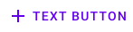
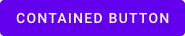
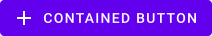
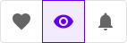

<!--docs:
title: "Material Button"
layout: detail
section: components
excerpt: "A customizable button component with updated visual styles."
iconId: 
path: /catalog/material-button/
-->

# Buttons

[Buttons](https://material.io/components/buttons/) allow users to take actions, and make choices, with a single tap.

There are four types of buttons:

1. [Text button](#text-button)
1. [Outlined button](#outlined-button)
1. [Contained button](#contained-button)
1. [Toggle button](#toggle-button)


## Using buttons

Before you can use Material buttons, you need to import the Material Components package for Flutter: `package:flutter/material.dart`.

You need to be using a [`MaterialApp`](https://api.flutter.dev/flutter/material/MaterialApp-class.html).

For more information on getting started with the Material for Flutter, go to the Flutter [Material library](https://api.flutter.dev/flutter/material/material-library.html) page.

### Making buttons accessible

Flutter's APIs support accessibility setting for large fonts, screen readers, and sufficient contrast. For more information, go to Flutter's [accessibility](https://flutter.dev/docs/development/accessibility-and-localization/accessibility) and [internationalization](https://flutter.dev/docs/development/accessibility-and-localization/internationalization) pages.

For more guidance on writing labels, go to [our page on how to write a good accessibility label](https://material.io/design/usability/accessibility.html#writing).

## Text button

[Text buttons](https://material.io/components/buttons/#text-button) are typically used for less-pronounced actions, including those located in dialogs and cards. In cards, text buttons help maintain an emphasis on card content.

### Text button examples

API and source code:
* `FlatButton`
    * [Class description](https://api.flutter.dev/flutter/material/FlatButton-class.html)
    * [GitHub source](https://github.com/flutter/flutter/blob/master/packages/flutter/lib/src/material/flat_button.dart)
    * [Dartpad demo](https://dartpad.dev/embed-flutter.html?gh_owner=material-components&gh_repo=material-components-flutter&gh_path=docs/components/dartpad/buttons/flat&gh_ref=develop)

The following example shows a text button with a text label.


```dart
FlatButton(
    textColor: Color(0xFF6200EE),
    onPressed: () {
        // Respond to button press
    },
    child: Text("TEXT BUTTON"),
)
```

    
The following example shows a text button with an icon.



```dart
FlatButton.icon(
    textColor: Color(0xFF6200EE),
    onPressed: () {
        // Respond to button press
    },
    icon: Icon(Icons.add, size: 18),
    label: Text("TEXT BUTTON"),
)
```
<!-- **Test code may eventually be replaced with dartpad link**

To test code copy and paste code into [dartpad.dev](https://dartpad.dev/).

```dart
import 'package:flutter/material.dart';

void main() => runApp(MyApp());

class MyApp extends StatelessWidget {
  @override
  Widget build(BuildContext context) {
    return MaterialApp(
      title: 'Flutter Demo',
      debugShowCheckedModeBanner: false,
      home: MyHomePage(title: 'Flutter Demo Text Page'),
    );
  }
}

class MyHomePage extends StatefulWidget {
  MyHomePage({Key key, this.title}) : super(key: key);

  final String title;

  @override
  _MyHomePageState createState() => _MyHomePageState();
}

class _MyHomePageState extends State<MyHomePage> {
  Widget build(BuildContext context) {
    return Scaffold(
      body: Center(
        child: Column(
          mainAxisAlignment: MainAxisAlignment.center,
          children: [
            FlatButton(
              textColor: Color(0xFF6200EE),
              onPressed: () {
                // Respond to button press
              },
              child: Text("TEXT BUTTON"),
            ),
            FlatButton.icon(
              textColor: Color(0xFF6200EE),
              onPressed: () {
                // Respond to button press
              },
              icon: Icon(Icons.add, size: 18),
              label: Text("TEXT BUTTON"),
            ),
          ],
        ),
      ),
    );
  }
}

```
-->

### Anatomy and key properties

A text button has a text label, a transparent container and an optional icon.


1. Text label
1. Container
1. Icon

<b>Text label</b>

| &nbsp; | Property |
| --- | --- |
| **Text label** | `child` (`label` on `FlatButton.icon`) |
| **Color** | `textColor` |
| **Disabled Text Color** | `disabledTextColor` |
| **Typography** | `style` on `child` or `label` |


<b>Container</b>

| &nbsp; | Property |
| --- | --- |
| **Color** | `color` |
| **Stroke color** | N/A |
| **Stroke width** | N/A |
| **Shape** | `shape` |
| **Elevation** | `elevation` |
| **Ripple color** | `splashColor` |
| **Disabled color** | `disabledColor` |
| **Disabled elevation** | `disabledElevation` |

<b>Icon</b>
    
| &nbsp; | Property |
| --- | --- |
| **Icon** | `icon` |
| **Color** | `color` on `icon` |
| **Size** | `size` on `icon` |

<b>Constructors</b>

| &nbsp; | Constructor |
| --- | --- |
| **Default constructor** | `FlatButton()` |
| **Icon constructor** | `FlatButton.icon()` |


## Outlined button

[Outlined buttons](https://material.io/components/buttons/#outlined-button) are medium-emphasis buttons. They contain actions that are important, but aren’t the primary action in an app.

### Outlined button examples

API and source code:

* `OutlineButton`
    * [Class definition](https://api.flutter.dev/flutter/material/OutlineButton-class.html)
    * [GitHub source](https://github.com/flutter/flutter/blob/master/packages/flutter/lib/src/material/outline_button.dart)
    * [Dartpad demo](https://dartpad.dev/embed-flutter.html?gh_owner=material-components&gh_repo=material-components-flutter&gh_path=docs/components/dartpad/buttons/outline&gh_ref=develop)
    


```dart
OutlineButton(
    textColor: Color(0xFF6200EE),        
    highlightedBorderColor: Colors.black.withOpacity(0.12),
    onPressed: () {
        // Respond to button press
    },
    child: Text("OUTLINED BUTTON"),
)
```

The following example shows an outlined button with an icon.


```dart
OutlineButton.icon(
    textColor: Color(0xFF6200EE),
    highlightedBorderColor: Colors.black.withOpacity(0.12),
    onPressed: () {
        // Respond to button press
    },
    icon: Icon(Icons.add, size: 18),
    label: Text("OUTLINED BUTTON"),
)
```
<!-- **Test code may eventually be replaced with dartpad link**
To test code copy and paste code into [dartpad.dev](https://dartpad.dev/).

```dart
import 'package:flutter/material.dart';

void main() => runApp(MyApp());

class MyApp extends StatelessWidget {
  @override
  Widget build(BuildContext context) {
    return MaterialApp(
      title: 'Flutter Demo',
      debugShowCheckedModeBanner: false,
      home: MyHomePage(title: 'Flutter Demo Text Page'),
    );
  }
}

class MyHomePage extends StatefulWidget {
  MyHomePage({Key key, this.title}) : super(key: key);

  final String title;

  @override
  _MyHomePageState createState() => _MyHomePageState();
}

class _MyHomePageState extends State<MyHomePage> {
  Widget build(BuildContext context) {
    return Scaffold(
      body: Center(
        child: Column(
          mainAxisAlignment: MainAxisAlignment.center,
          children: [
            OutlineButton(
              textColor: Color(0xFF6200EE),
              highlightedBorderColor: Colors.black.withOpacity(0.12),
              onPressed: () {
                // Respond to button press
              },
              child: Text("OUTLINED BUTTON"),
            ),
            OutlineButton.icon(
              textColor: Color(0xFF6200EE),
              highlightedBorderColor: Colors.black.withOpacity(0.12),
              onPressed: () {
                // Respond to button press
              },
              icon: Icon(Icons.add, size: 18),
              label: Text("OUTLINED BUTTON"),
            ),
          ],
        ),
      ),
    );
  }
}

```
-->

### Anatomy and key properties

An outlined button has a text label, a stroked container and an optional icon.


1. Text label
1. Container
1. Icon

<b>Text label</b> 

| &nbsp; | Property |
| --- | --- |
| **Text label** | `child` (`label` on `OutlineButton.icon`) |
| **Color** | `textColor` |
| **Disabled Text Color** | `disabledTextColor` |
| **Typography** | `style` on `child` or `label` |

<b>Container</b>
    
| &nbsp; | Property |
| --- | --- |
| **Color** | `color` |
| **Stroke color** | `borderSide` and `disabledBorderColor` and `highlightedBorderColor` |
| **Stroke width** | `borderSide` |
| **Shape** | `shape` |
| **Elevation** | `elevation` |
| **Ripple color** | `splashColor` |

<b>Icon</b> 
    
| &nbsp; | Property |
| --- | --- |
| **Icon** | `icon` |
| **Color** | `color` on `icon` |
| **Size** | `size` on `icon` |

<b>Constructors</b>

| &nbsp; | Constructor |
| --- | --- |
| **Default constructor** | `OutlineButton` |
| **Icon constructor** | `OutlineButton.icon` |


## Contained button

[Contained buttons](https://material.io/components/buttons/#contained-button) are high-emphasis, distinguished by their use of elevation and fill. They contain actions that are primary to your app.

### Contained button examples

API and source code:

* `RaisedButton`
    * [Class definition](https://api.flutter.dev/flutter/material/RaisedButton-class.html)
    * [GitHub source](https://github.com/flutter/flutter/blob/master/packages/flutter/lib/src/material/raised_button.dart)
    * [Dartpad demo](https://dartpad.dev/embed-flutter.html?gh_owner=material-components&gh_repo=material-components-flutter&gh_path=docs/components/dartpad/buttons/raised&gh_ref=develop)

The following example shows a contained button with a text label and a filled container.



```dart
RaisedButton(
    textColor: Colors.white,
    color: Color(0xFF6200EE),
    onPressed: () {
        // Respond to button press
    },
    child: Text('CONTAINED BUTTON'),
)
```

The following example shows a contained button with an icon.



```dart
RaisedButton.icon(
    textColor: Colors.white,
    color: Color(0xFF6200EE),
    onPressed: () {
        // Respond to button press
    },
    icon: Icon(Icons.add, size: 18),
    label: Text("CONTAINED BUTTON"),
)
```
<!-- **Test code may eventually be replaced with dartpad link**
To test code copy and paste code into [dartpad.dev](https://dartpad.dev/).

```dart
import 'package:flutter/material.dart';

void main() => runApp(MyApp());

class MyApp extends StatelessWidget {
  @override
  Widget build(BuildContext context) {
    return MaterialApp(
      title: 'Flutter Demo',
      debugShowCheckedModeBanner: false,
      home: MyHomePage(title: 'Flutter Demo Text Page'),
    );
  }
}

class MyHomePage extends StatefulWidget {
  MyHomePage({Key key, this.title}) : super(key: key);

  final String title;

  @override
  _MyHomePageState createState() => _MyHomePageState();
}

class _MyHomePageState extends State<MyHomePage> {
  Widget build(BuildContext context) {
    return Scaffold(
      body: Center(
        child: Column(
          mainAxisAlignment: MainAxisAlignment.center,
          children: [
            RaisedButton(
              textColor: Colors.white,
              color: Color(0xFF6200EE),
              onPressed: () {
                // Respond to button press
              },
              child: Text('CONTAINED BUTTON'),
            ),
            RaisedButton.icon(
              textColor: Colors.white,
              color: Color(0xFF6200EE),
              onPressed: () {
                // Respond to button press
              },
              icon: Icon(Icons.add, size: 18),
              label: Text("CONTAINED BUTTON"),
            ),
          ],
        ),
      ),
    );
  }
}

```
-->

### Anatomy and key properties

A contained button has a text label, a filled container and an optional icon.


1. Text label
1. Container
1. Icon

<b>Text label</b>
    
| &nbsp; | Property |
| --- | --- |
| **Text label** | `child` (`label` on `RaisedButton.icon`) |
| **Color** | `textColor` |
| **Disabled Text Color** | `disabledTextColor` |
| **Typography** | `style` on `child` or `label` |

<b>Container</b>
    
| &nbsp; | Property |
| --- | --- |
| **Color** | `color` |
| **Stroke color** | N/A |
| **Stroke width** | N/A |
| **Shape** | `shape` |
| **Elevation** | `elevation` |
| **Ripple color** | `splashColor` |

<b>Icon</b>
    
| &nbsp; | Property |
| --- | --- |
| **Icon** | `icon` |
| **Color** | `color` on `icon` |
| **Size** | `size` on `icon` |

<b>Constructors</b>

| &nbsp; | Constructor |
| --- | --- |
| **Default constructor** | `RaisedButton` |
| **Icon constructor** | `RaisedButton.icon` |


## Toggle button

[Toggle buttons](https://material.io/components/buttons/#toggle-button) can be used to select from a group of choices.

There are two types of toggle buttons:

* [Toggle button](#toggle-button)
* [Icon](#icon)

### Toggle button

To emphasize groups of related toggle buttons, a group should share a common container.

#### Toggle button examples

API and source code:

* `ToggleButtons`
    * [Class definition](https://api.flutter.dev/flutter/material/ToggleButtons-class.html)
    * [GitHub source](https://github.com/flutter/flutter/blob/master/packages/flutter/lib/src/material/toggle_buttons.dart)
    * [Dartpad demo](https://dartpad.dev/embed-flutter.html?gh_owner=material-components&gh_repo=material-components-flutter&gh_path=docs/components/dartpad/buttons/icon&gh_ref=develop)

The following example shows a toggle button with three buttons that have text labels.


In the state:
```dart
final isSelected = <bool>[false, false, false];
```

In the widget hierarchy:
```dart
ToggleButtons(
    color: Colors.black.withOpacity(0.60),
    selectedColor: Color(0xFF6200EE),
    selectedBorderColor: Color(0xFF6200EE),
    fillColor: Color(0xFF6200EE).withOpacity(0.08),
    splashColor: Color(0xFF6200EE).withOpacity(0.12),
    hoverColor: Color(0xFF6200EE).withOpacity(0.04),
    borderRadius: BorderRadius.circular(4.0),
    constraints: BoxConstraints(minHeight: 36.0),
    isSelected: isSelected,
    onPressed: (index) {
        // Respond to button selection
        setState(() {
            isSelected[index] = !isSelected[index];
        });
    },
    children: [
        Padding(
            padding: EdgeInsets.symmetric(horizontal: 16.0),
            child: Text('BUTTON 1'),
        ),
        Padding(
            padding: EdgeInsets.symmetric(horizontal: 16.0),
            child: Text('BUTTON 2'),
        ),
        Padding(
            padding: EdgeInsets.symmetric(horizontal: 16.0),
            child: Text('BUTTON 3'),
        ),
    ],
)
```
<b>Implementing an icon-only toggle button</b>

The following example shows a toggle button with three buttons that have icons.



```dart
ToggleButtons(
    color: Colors.black.withOpacity(0.60),
    selectedColor: Color(0xFF6200EE),
    selectedBorderColor: Color(0xFF6200EE),
    fillColor: Color(0xFF6200EE).withOpacity(0.08),
    splashColor: Color(0xFF6200EE).withOpacity(0.12),
    hoverColor: Color(0xFF6200EE).withOpacity(0.04),
    borderRadius: BorderRadius.circular(4.0),
    isSelected: isSelected,
    onPressed: (index) {
        // Respond to button selection
        setState(() {
            isSelected[index] = !isSelected[index];
        });
    },
    children: [
        Icon(Icons.favorite),
        Icon(Icons.visibility),
        Icon(Icons.notifications),
    ],
)
```
<!-- **Test code may eventually be replaced with dartpad link**
To test code copy and paste code into [dartpad.dev](https://dartpad.dev/).

```dart
import 'package:flutter/material.dart';

void main() => runApp(MyApp());

class MyApp extends StatelessWidget {
  @override
  Widget build(BuildContext context) {
    return MaterialApp(
      title: 'Flutter Demo',
      debugShowCheckedModeBanner: false,
      home: MyHomePage(title: 'Flutter Demo Text Page'),
    );
  }
}

class MyHomePage extends StatefulWidget {
  MyHomePage({Key key, this.title}) : super(key: key);

  final String title;

  @override
  _MyHomePageState createState() => _MyHomePageState();
}

class _MyHomePageState extends State<MyHomePage> {
  final isSelected = <bool>[false, false, false];

  Widget build(BuildContext context) {
    return Scaffold(
      body: Center(
        child: Column(
          mainAxisAlignment: MainAxisAlignment.center,
          children: [
            ToggleButtons(
              color: Colors.black.withOpacity(0.60),
              selectedColor: Color(0xFF6200EE),
              selectedBorderColor: Color(0xFF6200EE),
              fillColor: Color(0xFF6200EE).withOpacity(0.08),
              splashColor: Color(0xFF6200EE).withOpacity(0.12),
              hoverColor: Color(0xFF6200EE).withOpacity(0.04),
              borderRadius: BorderRadius.circular(4.0),
              constraints: BoxConstraints(minHeight: 36.0),
              isSelected: isSelected,
              onPressed: (index) {
                // Respond to button selection
                setState(() {
                  isSelected[index] = !isSelected[index];
                });
              },
              children: [
                Padding(
                  padding: EdgeInsets.symmetric(horizontal: 16.0),
                  child: Text('BUTTON 1'),
                ),
                Padding(
                  padding: EdgeInsets.symmetric(horizontal: 16.0),
                  child: Text('BUTTON 2'),
                ),
                Padding(
                  padding: EdgeInsets.symmetric(horizontal: 16.0),
                  child: Text('BUTTON 3'),
                ),
              ],
            ),
            ToggleButtons(
              color: Colors.black.withOpacity(0.60),
              selectedColor: Color(0xFF6200EE),
              selectedBorderColor: Color(0xFF6200EE),
              fillColor: Color(0xFF6200EE).withOpacity(0.08),
              splashColor: Color(0xFF6200EE).withOpacity(0.12),
              hoverColor: Color(0xFF6200EE).withOpacity(0.04),
              borderRadius: BorderRadius.circular(4.0),
              isSelected: isSelected,
              onPressed: (index) {
                // Respond to button selection
                setState(() {
                  isSelected[index] = !isSelected[index];
                });
              },
              children: [
                Icon(Icons.favorite),
                Icon(Icons.visibility),
                Icon(Icons.notifications),
              ],
            ),
          ],
        ),
      ),
    );
  }
}

```
-->

#### Anatomy and key properties

A toggle button has a shared stroked container, icons and/or text labels.


1. Container
1. Icon

<b>Selection</b> 

| &nbsp; | Property |
| --- | --- |
| **Selection state of each button** | `isSelected` |

<b>Constructors</b>

| &nbsp; | Constructor |
| --- | --- |
| **Default constructor** | `ToggleButtons` |


### Icon

Icons can be used as toggle buttons when they allow selection, or deselection, of a single choice, such as marking an item as a favorite.

#### Icon example

API and source code:

* `IconButton`
    * [Class definition](https://api.flutter.dev/flutter/material/IconButton-class.html)
    * [GitHub source](https://github.com/flutter/flutter/blob/master/packages/flutter/lib/src/material/icon_button.dart)
    * [Dartpad demo](https://dartpad.dev/embed-flutter.html?gh_owner=material-components&gh_repo=material-components-flutter&gh_path=docs/components/dartpad/buttons/theme&gh_ref=develop)

The following example shows an icon that can be used independently or in items of a `GridView`.


In the state:
```dart
var isSelected = false;
var icon = Icons.favorite_border;
```

In the widget hierarchy:
```dart
IconButton(
    icon: Icon(icon),
    color: Colors.white,
    onPressed: () {
        // Respond to icon toggle
        setState(() {
            isSelected = !isSelected;
            icon = isSelected ? Icons.favorite : Icons.favorite_border;
        });
    },
)
```
<!-- **Test code may eventually be replaced with dartpad link**
To test code copy and paste code into [dartpad.dev](https://dartpad.dev/).

```dart
import 'package:flutter/material.dart';

void main() => runApp(MyApp());

class MyApp extends StatelessWidget {
  @override
  Widget build(BuildContext context) {
    return MaterialApp(
      title: 'Flutter Demo',
      debugShowCheckedModeBanner: false,
      home: MyHomePage(title: 'Flutter Demo Text Page'),
    );
  }
}

class MyHomePage extends StatefulWidget {
  MyHomePage({Key key, this.title}) : super(key: key);

  final String title;

  @override
  _MyHomePageState createState() => _MyHomePageState();
}

class _MyHomePageState extends State<MyHomePage> {
  final isSelected = <bool>[false, false, false];

  Widget build(BuildContext context) {
    return Scaffold(
      body: Center(
        child: Column(
          mainAxisAlignment: MainAxisAlignment.center,
          children: [
            ToggleButtons(
              color: Colors.black.withOpacity(0.60),
              selectedColor: Color(0xFF6200EE),
              selectedBorderColor: Color(0xFF6200EE),
              fillColor: Color(0xFF6200EE).withOpacity(0.08),
              splashColor: Color(0xFF6200EE).withOpacity(0.12),
              hoverColor: Color(0xFF6200EE).withOpacity(0.04),
              borderRadius: BorderRadius.circular(4.0),
              constraints: BoxConstraints(minHeight: 36.0),
              isSelected: isSelected,
              onPressed: (index) {
                // Respond to button selection
                setState(() {
                  isSelected[index] = !isSelected[index];
                });
              },
              children: [
                Padding(
                  padding: EdgeInsets.symmetric(horizontal: 16.0),
                  child: Text('BUTTON 1'),
                ),
                Padding(
                  padding: EdgeInsets.symmetric(horizontal: 16.0),
                  child: Text('BUTTON 2'),
                ),
                Padding(
                  padding: EdgeInsets.symmetric(horizontal: 16.0),
                  child: Text('BUTTON 3'),
                ),
              ],
            ),
            ToggleButtons(
              color: Colors.black.withOpacity(0.60),
              selectedColor: Color(0xFF6200EE),
              selectedBorderColor: Color(0xFF6200EE),
              fillColor: Color(0xFF6200EE).withOpacity(0.08),
              splashColor: Color(0xFF6200EE).withOpacity(0.12),
              hoverColor: Color(0xFF6200EE).withOpacity(0.04),
              borderRadius: BorderRadius.circular(4.0),
              isSelected: isSelected,
              onPressed: (index) {
                // Respond to button selection
                setState(() {
                  isSelected[index] = !isSelected[index];
                });
              },
              children: [
                Icon(Icons.favorite),
                Icon(Icons.visibility),
                Icon(Icons.notifications),
              ],
            ),
          ],
        ),
      ),
    );
  }
}

```
-->

## Theming buttons

Buttons support [Material Theming](https://material.io/components/buttons/#theming) and can be customized in terms of color, typography and shape.

### Button theming example

The following example shows text, outlined and contained button types with the [Material Shrine Theme](https://material.io/design/material-studies/shrine.html).


<b>Implementing button theming</b>

The Material Shrine theme uses the following colors:
```dart
const Color shrinePink50 = Color(0xFFFEEAE6);
const Color shrinePink100 = Color(0xFFFEDBD0);
const Color shrinePink300 = Color(0xFFFBB8AC);
const Color shrinePink400 = Color(0xFFEAA4A4);

const Color shrineBrown900 = Color(0xFF442B2D);
const Color shrineBrown600 = Color(0xFF7D4F52);

const Color shrineErrorRed = Color(0xFFC5032B);

const Color shrineSurfaceWhite = Color(0xFFFFFBFA);
const Color shrineBackgroundWhite = Colors.white;
```

In the theme category within the `MaterialApp` class:
```dart
theme: ThemeData(
  buttonColor: shrinePink100,
  buttonTheme: const ButtonThemeData(
    colorScheme: ColorScheme(
      primary: shrinePink100,
      primaryVariant: shrineBrown900,
      secondary: shrinePink50,
      secondaryVariant: shrineBrown900,
      surface: shrineSurfaceWhite,
      background: shrineBackgroundWhite,
      error: shrineErrorRed,
      onPrimary: shrineBrown900,
      onSecondary: shrineBrown900,
      onSurface: shrineBrown900,
      onBackground: shrineBrown900,
      onError: shrineSurfaceWhite,
      brightness: Brightness.light,
     ),
    textTheme: ButtonTextTheme.normal,
  ),
),
```
<!-- **Test code may eventually be replaced with dartpad link**
To test code copy and paste code into [dartpad.dev](https://dartpad.dev/)
```dart
import 'package:flutter/material.dart';

void main() => runApp(MyApp());

class MyApp extends StatelessWidget {
  @override
  Widget build(BuildContext context) {
    return MaterialApp(
      title: 'Flutter Demo',
      debugShowCheckedModeBanner: false,
      theme: ThemeData(
        buttonColor: shrinePink100,
        buttonTheme: const ButtonThemeData(
          colorScheme: ColorScheme(
            primary: shrinePink100,
            primaryVariant: shrineBrown900,
            secondary: shrinePink50,
            secondaryVariant: shrineBrown900,
            surface: shrineSurfaceWhite,
            background: shrineBackgroundWhite,
            error: shrineErrorRed,
            onPrimary: shrineBrown900,
            onSecondary: shrineBrown900,
            onSurface: shrineBrown900,
            onBackground: shrineBrown900,
            onError: shrineSurfaceWhite,
            brightness: Brightness.light,
          ),
          textTheme: ButtonTextTheme.normal,
        ),
      ),
      home: MyHomePage(title: 'Flutter Demo Home Page'),
    );
  }
}

class MyHomePage extends StatefulWidget {
  MyHomePage({Key key, this.title}) : super(key: key);

  final String title;

  @override
  _MyHomePageState createState() => _MyHomePageState();
}

class _MyHomePageState extends State<MyHomePage> {
  @override
  final isSelected = <bool>[false, false, false];
  var isSelectedIcon = false;

  var icon = Icons.favorite_border;
  Widget build(BuildContext context) {
    return Scaffold(
      appBar: AppBar(
        title: Text(widget.title),
      ),
      body: Center(
        child: Column(
          mainAxisAlignment: MainAxisAlignment.center,
          children: [
            FlatButton(
              onPressed: () {
                // Perform some action
              },
              child: const Text('FLAT BUTTON', semanticsLabel: 'FLAT BUTTON 1'),
            ),
            FlatButton.icon(
              icon: const Icon(Icons.ac_unit),
              onPressed: () {},
              label: const Text('ICON FLAT BUTTON'),
            ),
            OutlineButton(
              onPressed: () {},
              child: const Text('OUTLINE BUTTON'),
            ),
            RaisedButton(
              onPressed: () {},
              child: const Text('RAISED BUTTON'),
            ),
            ToggleButtons(
              isSelected: isSelected,
              onPressed: (index) {
                // Respond to button selection
                setState(() {
                  isSelected[index] = !isSelected[index];
                });
              },
              children: [
                Padding(
                  padding: EdgeInsets.symmetric(horizontal: 16.0),
                  child: Text('TOGGLE BUTTON 1'),
                ),
                Padding(
                  padding: EdgeInsets.symmetric(horizontal: 16.0),
                  child: Text('TOGGLE BUTTON 2'),
                ),
                Padding(
                  padding: EdgeInsets.symmetric(horizontal: 16.0),
                  child: Text('TOGGLE BUTTON 3'),
                ),
              ],
            ),
            IconButton(
              icon: Icon(icon),
              onPressed: () {
                // Respond to icon toggle
                setState(() {
                  isSelectedIcon = !isSelectedIcon;
                  icon =
                      isSelectedIcon ? Icons.favorite : Icons.favorite_border;
                });
              },
            )
          ],
        ),
      ),
    );
  }
}

const Color shrinePink50 = Color(0xFFFEEAE6);
const Color shrinePink100 = Color(0xFFFEDBD0);
const Color shrinePink300 = Color(0xFFFBB8AC);
const Color shrinePink400 = Color(0xFFEAA4A4);

const Color shrineBrown900 = Color(0xFF442B2D);
const Color shrineBrown600 = Color(0xFF7D4F52);

const Color shrineErrorRed = Color(0xFFC5032B);

const Color shrineSurfaceWhite = Color(0xFFFFFBFA);
const Color shrineBackgroundWhite = Colors.white;

```
-->