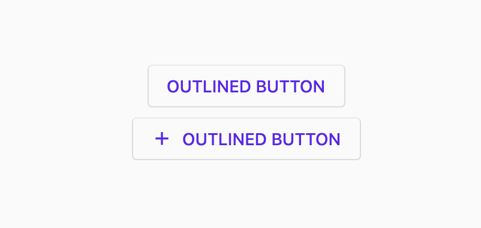
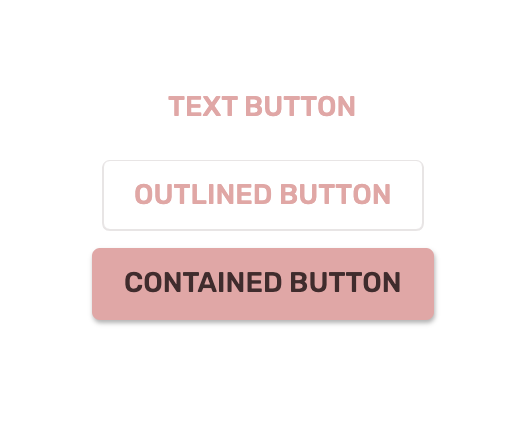

<!--docs:
title: "Material Button"
layout: detail
section: components
excerpt: "A customizable button component with updated visual styles."
iconId:
path: /catalog/material-button/
-->

# Buttons

[Buttons](https://material.io/components/buttons/) allow users to take actions, and make choices, with a single tap.


## Contents

- [Using buttons](#using-buttons)
- [Text button](#text-button)
- [Outlined button](#outlined-button)
- [Contained button](#contained-button)
- [Toggle button](#toggle-button)
- [Icon](#icon)
- [Theming buttons](#theming-buttons)

## Using buttons

Before you can use Material buttons, you need to import the Material Components package for Flutter: `package:flutter/material.dart`.

You need to be using a [`MaterialApp`](https://api.flutter.dev/flutter/material/MaterialApp-class.html).

For more information on getting started with the Material for Flutter, go to the Flutter [Material library](https://api.flutter.dev/flutter/material/material-library.html) page.

### Making buttons accessible

Flutter's APIs support accessibility setting for large fonts, screen readers, and sufficient contrast. For more information, go to Flutter's [accessibility](https://flutter.dev/docs/development/accessibility-and-localization/accessibility) and [internationalization](https://flutter.dev/docs/development/accessibility-and-localization/internationalization) pages.

For more guidance on writing labels, go to [our page on how to write a good accessibility label](https://material.io/design/usability/accessibility.html#writing).

### Types

There are four types of buttons: 1. [Text button](#text-button), 2. [Outlined button](#outlined-button), 3. [Contained button](#contained-button), 4. [Toggle button](#toggle-button)


## Text button

[Text buttons](https://material.io/components/buttons/#text-button) are typically used for less-pronounced actions, including those located in dialogs and cards. In cards, text buttons help maintain an emphasis on card content.

### Text button examples

API and source code:

`TextButton`

- [Class description](https://api.flutter.dev/flutter/material/TextButton-class.html)
- [GitHub source](https://github.com/flutter/flutter/blob/master/packages/flutter/lib/src/material/text_button.dart)
- [Dartpad demo](https://dartpad.dev/embed-flutter.html?gh_owner=material-components&gh_repo=material-components-flutter&gh_path=docs/components/dartpad/buttons/text&gh_ref=develop)


The following example shows a text button with a text label.

```dart
TextButton(
  onPressed: () {
      // Respond to button press
  },
  child: Text("TEXT BUTTON"),
)
```

The following example shows a text button with an icon.

```dart
TextButton.icon(
  onPressed: () {
      // Respond to button press
  },
  icon: Icon(Icons.add, size: 18),
  label: Text("TEXT BUTTON"),
)
```

### Anatomy and key properties for text button

A text button has a text label, a transparent container and an optional icon.


1. Text label
1. Container
1. Icon

#### Text label for text button

| &nbsp; | Property |
| --- | --- |
| **Text label** | `child` (`label` on `TextButton.icon`) |
| **Color** | `foregroundColor` on `TextButton.style` |
| **Disabled Text Color** | `foregroundColor` on `TextButton.style` |
| **Typography** | `style` on `child` or `label` |

#### Container for text button

| &nbsp; | Property |
| --- | --- |
| **Color** | `backgroundColor` on `TextButton.style` |
| **Shape** | `shape` on `TextButton.style` |
| **Elevation** | `elevation` on `TextButton.style` |
| **Ripple color** | `overlayColor` on `TextButton.style` |

#### Icon for text button

| &nbsp; | Property |
| --- | --- |
| **Icon** | `icon` |
| **Color** | `color` on `icon` |
| **Size** | `size` on `icon` |

#### Constructors for text button

| &nbsp; | Constructor |
| --- | --- |
| **Default constructor** | `TextButton()` |
| **Icon constructor** | `TextButton.icon()` |

## Outlined button

[Outlined buttons](https://material.io/components/buttons/#outlined-button) are medium-emphasis buttons. They contain actions that are important, but aren’t the primary action in an app.

### Outlined button examples

API and source code:

`OutlinedButton`

- [Class definition](https://api.flutter.dev/flutter/material/OutlinedButton-class.html)
- [GitHub source](https://github.com/flutter/flutter/blob/master/packages/flutter/lib/src/material/outlined_button.dart)
- [Dartpad demo](https://dartpad.dev/embed-flutter.html?gh_owner=material-components&gh_repo=material-components-flutter&gh_path=docs/components/dartpad/buttons/outlined&gh_ref=develop)



```dart
OutlinedButton(
  onPressed: () {
      // Respond to button press
  },
  child: Text("OUTLINED BUTTON"),
)
```

The following example shows an outlined button with an icon.

```dart
OutlinedButton.icon(
  onPressed: () {
      // Respond to button press
  },
  icon: Icon(Icons.add, size: 18),
  label: Text("OUTLINED BUTTON"),
)
```

### Anatomy and key properties for outlined button

An outlined button has a text label, a stroked container and an optional icon.


1. Text label
1. Container
1. Icon

#### Text label for outlined button

| &nbsp; | Property |
| --- | --- |
| **Text label** | `child` (`label` on `OutlinedButton.icon`) |
| **Color** | `foregroundColor` on `OutlinedButton.style` |
| **Typography** | `style` on `child` or `label` |

#### Container for outlined button

| &nbsp; | Property |
| --- | --- |
| **Color** | `backgroundColor` on `OutlinedButton.style` |
| **Stroke color** | `side.color` on `OutlinedButton.style` |
| **Stroke width** | `side.width` on `OutlinedButton.style` |
| **Shape** | `shape` on `OutlinedButton.style` |
| **Elevation** | `elevation` on `OutlinedButton.style` |
| **Ripple color** | `overlayColor` on `OutlinedButton.style` |

#### Icon for outlined button

| &nbsp; | Property |
| --- | --- |
| **Icon** | `icon` |
| **Color** | `color` on `icon` |
| **Size** | `size` on `icon` |

#### Constructors for outlined button

| &nbsp; | Constructor |
| --- | --- |
| **Default constructor** | `OutlinedButton` |
| **Icon constructor** | `OutlinedButton.icon` |

## Contained button

[Contained buttons](https://material.io/components/buttons/#contained-button) are high-emphasis, distinguished by their use of elevation and fill. They contain actions that are primary to your app.

### Contained button examples

API and source code:

`ElevatedButton`

- [Class definition](https://api.flutter.dev/flutter/material/ElevatedButton-class.html)
- [GitHub source](https://github.com/flutter/flutter/blob/master/packages/flutter/lib/src/material/elevated_button.dart)
- [Dartpad demo](https://dartpad.dev/embed-flutter.html?gh_owner=material-components&gh_repo=material-components-flutter&gh_path=docs/components/dartpad/buttons/contained&gh_ref=develop)


The following example shows a contained button with a text label and a filled container.

```dart
ElevatedButton(
  onPressed: () {
      // Respond to button press
  },
  child: Text('CONTAINED BUTTON'),
)
```

The following example shows a contained button with an icon.

```dart
ElevatedButton.icon(
  onPressed: () {
      // Respond to button press
  },
  icon: Icon(Icons.add, size: 18),
  label: Text("CONTAINED BUTTON"),
)
```

### Anatomy and key properties for elevated button

A contained button has a text label, a filled container and an optional icon.


1. Text label
1. Container
1. Icon

#### Text label for elevated button

| &nbsp; | Property |
| --- | --- |
| **Text label** | `child` (`label` on `ElevatedButton.icon`) |
| **Color** | `foregroundColor` on `ElevatedButton.style` |
| **Typography** | `style` on `child` or `label` |

#### Container for elevated button

| &nbsp; | Property |
| --- | --- |
| **Color** | `backgroundColor` on `ElevatedButton.style` |
| **Shape** | `shape` on `ElevatedButton.style` |
| **Elevation** | `elevation` on `ElevatedButton.style` |
| **Ripple color** | `overlayColor` on `ElevatedButton.style` |

#### Icon for elevated button

| &nbsp; | Property |
| --- | --- |
| **Icon** | `icon` |
| **Color** | `color` on `icon` |
| **Size** | `size` on `icon` |

#### Constructors for elevated button

| &nbsp; | Constructor |
| --- | --- |
| **Default constructor** | `ElevatedButton` |
| **Icon constructor** | `ElevatedButton.icon` |

## Toggle button

[Toggle buttons](https://material.io/components/buttons/#toggle-button) can be used to select from a group of choices.

There are two types of toggle buttons:

- [Toggle](#toggle)
- [Icon](#icon)

### Toggle

To emphasize groups of related toggle buttons, a group should share a common container.

#### Toggle button examples

API and source code:

`ToggleButtons`

- [Class definition](https://api.flutter.dev/flutter/material/ToggleButtons-class.html)
- [GitHub source](https://github.com/flutter/flutter/blob/master/packages/flutter/lib/src/material/toggle_buttons.dart)
- [Dartpad demo](https://dartpad.dev/embed-flutter.html?gh_owner=material-components&gh_repo=material-components-flutter&gh_path=docs/components/dartpad/buttons/icon&gh_ref=develop)
- [YouTube video](https://www.youtube.com/watch?v=kVEguaQWGAY&list=PLjxrf2q8roU23XGwz3Km7sQZFTdB996iG&index=63&ab_channel=Flutter)

The following example shows a toggle button with three buttons that have text labels.


In the state:

```dart
final isSelected = <bool>[false, false, false];
```

In the widget hierarchy:

```dart
ToggleButtons(
    color: Colors.black.withOpacity(0.60),
    selectedColor: Color(0xFF6200EE),
    selectedBorderColor: Color(0xFF6200EE),
    fillColor: Color(0xFF6200EE).withOpacity(0.08),
    splashColor: Color(0xFF6200EE).withOpacity(0.12),
    hoverColor: Color(0xFF6200EE).withOpacity(0.04),
    borderRadius: BorderRadius.circular(4.0),
    constraints: BoxConstraints(minHeight: 36.0),
    isSelected: isSelected,
    onPressed: (index) {
        // Respond to button selection
        setState(() {
            isSelected[index] = !isSelected[index];
        });
    },
    children: [
        Padding(
            padding: EdgeInsets.symmetric(horizontal: 16.0),
            child: Text('BUTTON 1'),
        ),
        Padding(
            padding: EdgeInsets.symmetric(horizontal: 16.0),
            child: Text('BUTTON 2'),
        ),
        Padding(
            padding: EdgeInsets.symmetric(horizontal: 16.0),
            child: Text('BUTTON 3'),
        ),
    ],
)
```

#### Implementing an icon-only toggle button

The following example shows a toggle button with three buttons that have icons.


```dart
ToggleButtons(
    color: Colors.black.withOpacity(0.60),
    selectedColor: Color(0xFF6200EE),
    selectedBorderColor: Color(0xFF6200EE),
    fillColor: Color(0xFF6200EE).withOpacity(0.08),
    splashColor: Color(0xFF6200EE).withOpacity(0.12),
    hoverColor: Color(0xFF6200EE).withOpacity(0.04),
    borderRadius: BorderRadius.circular(4.0),
    isSelected: isSelected,
    onPressed: (index) {
        // Respond to button selection
        setState(() {
            isSelected[index] = !isSelected[index];
        });
    },
    children: [
        Icon(Icons.favorite),
        Icon(Icons.visibility),
        Icon(Icons.notifications),
    ],
)
```

#### Anatomy and key properties

A toggle button has a shared stroked container, icons and/or text labels.


1. Container
1. Icon

#### Selection

| &nbsp; | Property |
| --- | --- |
| **Selection state of each button** | `isSelected` |

#### Constructors

| &nbsp; | Constructor |
| --- | --- |
| **Default constructor** | `ToggleButtons` |

### Icon

Icons can be used as toggle buttons when they allow selection, or deselection, of a single choice, such as marking an item as a favorite.

#### Icon example

API and source code:

`IconButton`

- [Class definition](https://api.flutter.dev/flutter/material/IconButton-class.html)
- [GitHub source](https://github.com/flutter/flutter/blob/master/packages/flutter/lib/src/material/icon_button.dart)
- [Dartpad demo](https://dartpad.dev/embed-flutter.html?gh_owner=material-components&gh_repo=material-components-flutter&gh_path=docs/components/dartpad/buttons/theme&gh_ref=develop)

The following example shows an icon that can be used independently or in items of a `GridView`.


In the state:

```dart
var isSelected = false;
var icon = Icons.favorite_border;
```

In the widget hierarchy:

```dart
IconButton(
    icon: Icon(icon),
    color: Colors.white,
    onPressed: () {
        // Respond to icon toggle
        setState(() {
            isSelected = !isSelected;
            icon = isSelected ? Icons.favorite : Icons.favorite_border;
        });
    },
)
```

## Theming buttons

Buttons support [Material Theming](https://material.io/components/buttons/#theming) and can be customized in terms of color, typography and shape.

### Button theming example

The following example shows text, outlined and contained button types with the [Material Shrine Theme](https://material.io/design/material-studies/shrine.html).

- [Dartpad demo](https://dartpad.dev/embed-flutter.html?gh_owner=material-components&gh_repo=material-components-flutter&gh_path=docs/components/dartpad/buttons/theme&gh_ref=develop)



```dart
import 'package:flutter/material.dart';

void main() => runApp(MyApp());

class MyApp extends StatelessWidget {
  @override
  Widget build(BuildContext context) {
    return MaterialApp(
      title: 'Flutter Demo',
      debugShowCheckedModeBanner: false,
      theme: _buildShrineTheme(),
      home: MyHomePage(),
    );
  }
}

class MyHomePage extends StatelessWidget {
  Widget build(BuildContext context) {
    return Scaffold(
      body: Center(
        child: Column(
          mainAxisAlignment: MainAxisAlignment.center,
          children: [
            TextButton(
              onPressed: () {
                // Respond to button press
              },
              child: Text('TEXT BUTTON'),
            ),
            SizedBox(height: 8.0),
            OutlinedButton(
              onPressed: () {
                // Respond to button press
              },
              child: Text("OUTLINED BUTTON"),
            ),
            SizedBox(height: 8.0),
            ElevatedButton(
              onPressed: () {
                // Respond to button press
              },
              child: Text("CONTAINED BUTTON"),
            ),
          ],
        ),
      ),
    );
  }
}

ThemeData _buildShrineTheme() {
  final ThemeData base = ThemeData.light();
  return base.copyWith(
    colorScheme: _shrineColorScheme,
    toggleableActiveColor: shrinePink400,
    accentColor: shrineBrown900,
    primaryColor: shrinePink100,
    buttonColor: shrinePink100,
    scaffoldBackgroundColor: shrineBackgroundWhite,
    cardColor: shrineBackgroundWhite,
    textSelectionColor: shrinePink100,
    errorColor: shrineErrorRed,
    primaryIconTheme: _customIconTheme(base.iconTheme),
    textTheme: _buildShrineTextTheme(base.textTheme),
    primaryTextTheme: _buildShrineTextTheme(base.primaryTextTheme),
    accentTextTheme: _buildShrineTextTheme(base.accentTextTheme),
    iconTheme: _customIconTheme(base.iconTheme),
  );
}

IconThemeData _customIconTheme(IconThemeData original) {
  return original.copyWith(color: shrineBrown900);
}

TextTheme _buildShrineTextTheme(TextTheme base) {
  return base
      .copyWith(
        caption: base.caption.copyWith(
          fontWeight: FontWeight.w400,
          fontSize: 14,
          letterSpacing: defaultLetterSpacing,
        ),
        button: base.button.copyWith(
          fontWeight: FontWeight.w500,
          fontSize: 14,
          letterSpacing: defaultLetterSpacing,
        ),
      )
      .apply(
        fontFamily: 'Rubik',
        displayColor: shrineBrown900,
        bodyColor: shrineBrown900,
      );
}

const ColorScheme _shrineColorScheme = ColorScheme(
  primary: shrinePink400,
  primaryVariant: shrineBrown900,
  secondary: shrinePink50,
  secondaryVariant: shrineBrown900,
  surface: shrineSurfaceWhite,
  background: shrineBackgroundWhite,
  error: shrineErrorRed,
  onPrimary: shrineBrown900,
  onSecondary: shrineBrown900,
  onSurface: shrineBrown900,
  onBackground: shrineBrown900,
  onError: shrineSurfaceWhite,
  brightness: Brightness.light,
);

const Color shrinePink50 = Color(0xFFFEEAE6);
const Color shrinePink100 = Color(0xFFFEDBD0);
const Color shrinePink300 = Color(0xFFFBB8AC);
const Color shrinePink400 = Color(0xFFEAA4A4);

const Color shrineBrown900 = Color(0xFF442B2D);
const Color shrineBrown600 = Color(0xFF7D4F52);

const Color shrineErrorRed = Color(0xFFC5032B);

const Color shrineSurfaceWhite = Color(0xFFFFFBFA);
const Color shrineBackgroundWhite = Colors.white;

const defaultLetterSpacing = 0.03;
```
