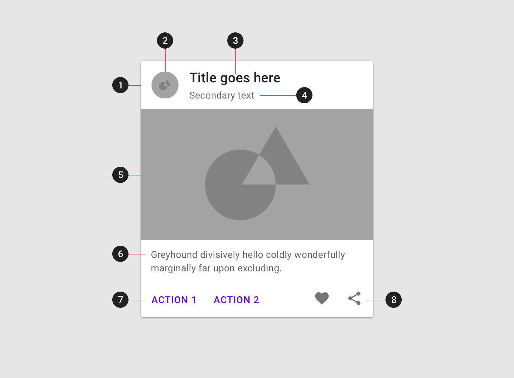

<!--docs:
title: "Material Cards"
layout: detail
section: components
excerpt: "A customizable card component with updated visual styles."
iconId: materialbutton
path: /catalog/material-card/
-->

# Cards

[Cards](https://material.io/components/cards/) contain content and actions about a single subject.


**Contents**

- [Using cards](#using-cards)
- [Card](#card)
- [Theming a card](#theming-a-card)

## Using cards

### Making cards accessible

Flutter's card component APIs support labeling for accessibility. For more guidance on writing labels, go to [our page on how to write a good accessibility label](https://material.io/design/usability/accessibility.html#writing).

## Card

On mobile, a [card’s](https://material.io/components/cards/#specs) default elevation is 1dp, with a raised dragged elevation of 8dp.

### Card example

Source code API:

`Card`

- [Class definition](https://api.flutter.dev/flutter/material/Card-class.html)
- [GitHub source](https://github.com/flutter/flutter/blob/master/packages/flutter/lib/src/material/card.dart)
- [Dartpad demo](https://dartpad.dev/embed-flutter.html?gh_owner=material-components&gh_repo=material-components-flutter&gh_path=docs/components/dartpad/cards/elevated&gh_ref=develop)

The following example shows an elevated card. The card has a title, a secondary title, text, and two actions: Action 1 and Action 2 in purple (#6200EE).


The example code below generates the card:

```dart
          Card(
            clipBehavior: Clip.antiAlias,
            child: Column(
              children: [
                ListTile(
                  leading: Icon(Icons.arrow_drop_down_circle),
                  title: const Text('Card title 1'),
                  subtitle: Text(
                    'Secondary Text',
                    style: TextStyle(color: Colors.black.withOpacity(0.6)),
                  ),
                ),
                Padding(
                  padding: const EdgeInsets.all(16.0),
                  child: Text(
                    'Greyhound divisively hello coldly wonderfully marginally far upon excluding.',
                    style: TextStyle(color: Colors.black.withOpacity(0.6)),
                  ),
                ),
                ButtonBar(
                  alignment: MainAxisAlignment.start,
                  children: [
                    FlatButton(
                      textColor: const Color(0xFF6200EE),
                      onPressed: () {
                        // Perform some action
                      },
                      child: const Text('ACTION 1'),
                    ),
                    FlatButton(
                      textColor: const Color(0xFF6200EE),
                      onPressed: () {
                        // Perform some action
                      },
                      child: const Text('ACTION 2'),
                    ),
                  ],
                ),
                Image.asset('assets/card-sample-image.jpg'),
                Image.asset('assets/card-sample-image-2.jpg'),
              ],
            ),
          ),
```

### Anatomy and key properties



### Elevated card attributes

1. Container
1. Thumbnail (optional)
1. Header text (optional)
1. Subhead (optional)
1. Media (optional)
1. Supporting text (optional)
1. Buttons (optional)
1. Icons (optional)

#### Container

| &nbsp; | Property |
|---|---|
| **Container width** |  Wrap `Card` widget with `Container` widget and use `width` property |
| **Container height** |  Wrap `Card` widget with `Container` widget and use `height` property|
| **Container margin (left)** |  Wrap `Card` widget with `Container` widget and use `margin` property with `EdgeInsets.only(left: 10)`|
| **Container margin (right)** |  Wrap `Card` widget with `Container` widget and use `margin` property with `EdgeInsets.only(right: 10)`|
| **Container margin (top)** |  Wrap `Card` widget with `Container` widget and use `margin` property with `EdgeInsets.only(top: 10)`|
| **Container elevation** | `elevation` |

#### Thumbnail (optional)

| &nbsp; | Property |
|---|---|
| **Desc. 1** | Not by default but can be made by using `ListTile()` and use property `leading` |

#### Header text (optional)

| &nbsp; | Property |
|---|---|
| **Text label** | Not by default but can be made by using `ListTile()` and use property `title` |
| **Text color** | Within `title` property you can customize the Text color by using the `style` property. The `style` property uses a `TextStyle` property and within that class use the `color` property |
| **Typography** | Within `title` property you can customize the typography by using the `style property`. The `style` property uses a `TextStyle` property and within that class use the `fontFamily` property |

#### Subhead (optional)

| &nbsp; | Property |
|---|---|
| **Text label** | Not by default but can be made by using `ListTile()` and use property `subtitle` |
| **Text color** | Within `subtitle` property you can customize the Text color by using the `style` property. The `style` property uses a `TextStyle` property and within that class use the `color` property|
| **Typography** | Within `subtitle` property you can customize the typography by using the `style` property. The `style` property uses a `TextStyle` property and within that class use the `fontFamily` property|

#### Media (optional)

| &nbsp; | Property |
|---|---|
| **Desc. 1** | Can be made using `Image.asset()` within Card |

#### Supporting text (optional)

| &nbsp; | Property |
|---|---|
| **Text label** | Can be made using `text` property |
| **Text color** | Within `text` property you can customize the Text color by using the `style` property. The `style` property uses a `TextStyle` property and within that class use the `color` property|
| **Typography** | Within `text` property you can customize the typography by using the `style` property. The `style` property uses a `TextStyle` property and within that class use the `fontFamily` property|

#### Button (optional)

[Material button API:](https://api.flutter.dev/flutter/material/MaterialButton-class.html)

| &nbsp; | Property |
|---|---|
| **Desc. 1** | Can be made using `ButtonBar`, within `ButtonBar` use `FlatButtons` |

#### Icon (optional)

| &nbsp; | Property |
|---|---|
| **Desc. 1** | Can be made using `ButtonBar`, within `ButtonBar` use `IconButton` or `Icon`|

## Theming a card

A card supports [Material Theming](https://material.io/components/cards/#theming) and can be customized in terms of color, typography and shape.

### Card theming example

Source code API:

- [Class definition](https://api.flutter.dev/flutter/material/Card-class.html)
- [Dartpad demo](https://dartpad.dev/embed-flutter.html?gh_owner=material-components&gh_repo=material-components-flutter&gh_path=docs/components/dartpad/cards/theme&gh_ref=develop)


To test code copy and paste code into [dartpad.dev](https://dartpad.dev/).

```dart
import 'package:flutter/material.dart';

void main() => runApp(MyApp());

class MyApp extends StatelessWidget {
  @override
  Widget build(BuildContext context) {
    return MaterialApp(
      title: 'Flutter Demo',
      debugShowCheckedModeBanner: false,
      theme: _buildShrineTheme(),
      home: MyHomePage(title: 'Flutter Demo Home Page'),
    );
  }
}

class MyHomePage extends StatefulWidget {
  MyHomePage({Key key, this.title}) : super(key: key);

  final String title;

  @override
  _MyHomePageState createState() => _MyHomePageState();
}

class _MyHomePageState extends State<MyHomePage> {
  Widget build(BuildContext context) {
    return Scaffold(
      body: ListView(
        children: [
            Card(
              clipBehavior: Clip.antiAlias,
              child: Column(
                children: [
                  ListTile(
                    leading: Icon(Icons.arrow_drop_down_circle),
                    title: const Text('Card title 1'),
                    subtitle: Text(
                      'Secondary Text',
                      style: TextStyle(color: Colors.black.withOpacity(0.6)),
                    ),
                  ),
                  Padding(
                    padding: const EdgeInsets.all(16.0),
                    child: Text(
                      'Greyhound divisively hello coldly wonderfully marginally far upon excluding.',
                      style: TextStyle(color: Colors.black.withOpacity(0.6)),
                    ),
                  ),
                  ButtonBar(
                    alignment: MainAxisAlignment.start,
                    children: [
                      FlatButton(
                        onPressed: () {
                          // Perform some action
                        },
                        child: const Text('ACTION 1'),
                      ),
                      FlatButton(
                        onPressed: () {
                          // Perform some action
                        },
                        child: const Text('ACTION 2'),
                      ),
                    ],
                  ),
                  Image.asset('assets/card-sample-image.jpg'),
                ],
              ),
            ),
            Card(
              clipBehavior: Clip.antiAlias,
              child: Column(
                children: [
                  ListTile(
                    leading: Icon(Icons.arrow_drop_down_circle),
                    title: const Text('Card title 1'),
                    subtitle: Text(
                      'Secondary Text',
                      style: TextStyle(color: Colors.black.withOpacity(0.6)),
                    ),
                  ),
                  Padding(
                    padding: const EdgeInsets.all(16.0),
                    child: Text(
                      'Greyhound divisively hello coldly wonderfully marginally far upon excluding.',
                      style: TextStyle(color: Colors.black.withOpacity(0.6)),
                    ),
                  ),
                  ButtonBar(
                    alignment: MainAxisAlignment.start,
                    children: [
                      FlatButton(
                        onPressed: () {
                          // Perform some action
                        },
                        child: const Text('ACTION 1'),
                      ),
                      FlatButton(
                        onPressed: () {
                          // Perform some action
                        },
                        child: const Text('ACTION 2'),
                      ),
                    ],
                  ),
                  Image.asset('assets/card-sample-image-2.jpg'),
                ],
              ),
            ),
        ],
      ),
    );
  }
}

IconThemeData _customIconTheme(IconThemeData original) {
  return original.copyWith(color: shrineBrown900);
}

ThemeData _buildShrineTheme() {
  final ThemeData base = ThemeData.light();
  return base.copyWith(
    colorScheme: _shrineColorScheme,
    accentColor: shrineBrown900,
    primaryColor: shrinePink100,
    buttonColor: shrinePink100,
    scaffoldBackgroundColor: shrineBackgroundWhite,
    cardColor: shrineBackgroundWhite,
    textSelectionTheme: TextSelectionThemeData(selectionColor: shrinePink100),
    errorColor: shrineErrorRed,
    buttonTheme: const ButtonThemeData(
      colorScheme: _shrineColorScheme,
      textTheme: ButtonTextTheme.normal,
    ),
    primaryIconTheme: _customIconTheme(base.iconTheme),
    textTheme: _buildShrineTextTheme(base.textTheme),
    primaryTextTheme: _buildShrineTextTheme(base.primaryTextTheme),
    accentTextTheme: _buildShrineTextTheme(base.accentTextTheme),
    iconTheme: _customIconTheme(base.iconTheme),
  );
}

TextTheme _buildShrineTextTheme(TextTheme base) {
  return base
      .copyWith(
    headline: base.headline.copyWith(
      fontWeight: FontWeight.w500,
      letterSpacing: defaultLetterSpacing,
    ),
    title: base.title.copyWith(
      fontSize: 18,
      letterSpacing: defaultLetterSpacing,
    ),
    caption: base.caption.copyWith(
      fontWeight: FontWeight.w400,
      fontSize: 14,
      letterSpacing: defaultLetterSpacing,
    ),
    body2: base.body2.copyWith(
      fontWeight: FontWeight.w500,
      fontSize: 16,
      letterSpacing: defaultLetterSpacing,
    ),
    body1: base.body1.copyWith(
      letterSpacing: defaultLetterSpacing,
    ),
    subhead: base.subhead.copyWith(
      letterSpacing: defaultLetterSpacing,
    ),
    display1: base.display1.copyWith(
      letterSpacing: defaultLetterSpacing,
    ),
    button: base.button.copyWith(
      fontWeight: FontWeight.w500,
      fontSize: 14,
      letterSpacing: defaultLetterSpacing,
    ),
  )
      .apply(
    fontFamily: 'Rubik',
    displayColor: shrineBrown900,
    bodyColor: shrineBrown900,
  );
}

const ColorScheme _shrineColorScheme = ColorScheme(
  primary: shrinePink100,
  primaryVariant: shrineBrown900,
  secondary: shrinePink50,
  secondaryVariant: shrineBrown900,
  surface: shrineSurfaceWhite,
  background: shrineBackgroundWhite,
  error: shrineErrorRed,
  onPrimary: shrineBrown900,
  onSecondary: shrineBrown900,
  onSurface: shrineBrown900,
  onBackground: shrineBrown900,
  onError: shrineSurfaceWhite,
  brightness: Brightness.light,
);

const Color shrinePink50 = Color(0xFFFEEAE6);
const Color shrinePink100 = Color(0xFFFEDBD0);
const Color shrinePink300 = Color(0xFFFBB8AC);
const Color shrinePink400 = Color(0xFFEAA4A4);

const Color shrineBrown900 = Color(0xFF442B2D);
const Color shrineBrown600 = Color(0xFF7D4F52);

const Color shrineErrorRed = Color(0xFFC5032B);

const Color shrineSurfaceWhite = Color(0xFFFFFBFA);
const Color shrineBackgroundWhite = Colors.white;

const defaultLetterSpacing = 0.03;


```
