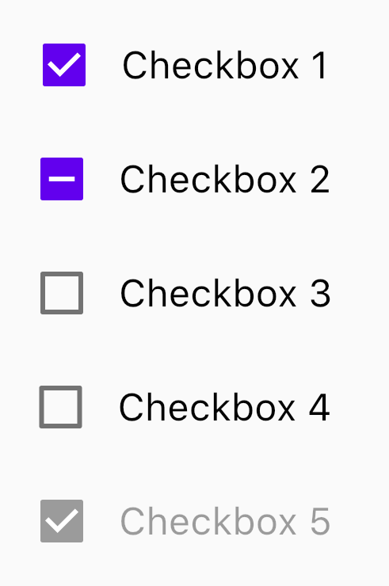
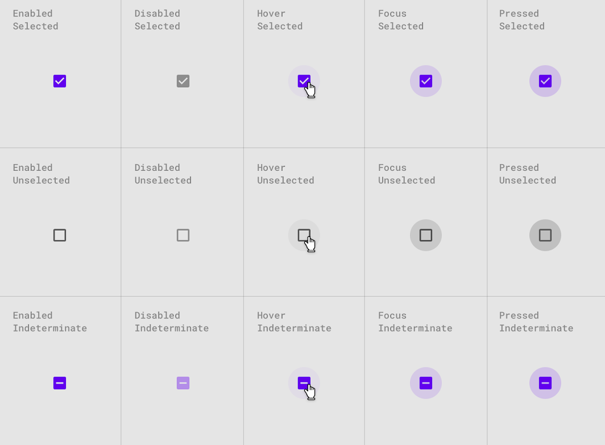

<!--docs:
title: "Material selection controls: CheckBoxes"
layout: detail
section: components
excerpt: "Selection controls allow the user to select options."
iconId:
path: /catalog/SelectionControlsCheckBoxes/
-->

# Selection controls: checkboxes

[Selection controls](https://material.io/components/selection-controls#usage) allow the user to select options.

Use checkboxes to:

- Select one or more options from a list
- Present a list containing sub-selections
- Turn an item on or off in a desktop environment


## Contents

- [Using checkboxes](#using-checkboxes)
- [Checkboxes](#checkboxes)
- [Checkbox key properties](#checkbox-key-properties)
- [Theming](#theming)

## Using checkboxes

Checkboxes allow the user to select one or more items from a set. Checkboxes can be used to turn an option on or off.

### Making checkboxes accessible

Flutter's APIs support accessibility setting for large fonts, screen readers, and sufficient contrast. For more information, go to Flutter's [accessibility](https://flutter.dev/docs/development/accessibility-and-localization/accessibility) and [internationalization](https://flutter.dev/docs/development/accessibility-and-localization/internationalization) pages.

## Checkboxes

### Checkboxes example

`CheckBox`

- [Class description](https://api.flutter.dev/flutter/material/Checkbox-class.html)
- [GitHub source](https://github.com/flutter/flutter/blob/master/packages/flutter/lib/src/material/checkbox.dart)
- [Dartpad demo](https://dartpad.dev/embed-flutter.html?gh_owner=material-components&gh_repo=material-components-flutter&gh_path=docs/components/dartpad/checkboxes/regular&gh_ref=develop)
- [YouTube video](https://www.youtube.com/watch?v=RkSqPAn9szs&list=PLjxrf2q8roU23XGwz3Km7sQZFTdB996iG&index=82&t=35s&ab_channel=Flutter)

The following example should five checkboxes. The first one is enabled, the second one has tristate enabled, and the last one is disabled.



```dart
Column(
  children: [
    for (var i = 0; i < 5; i += 1)
      Row(
        children: [
          Checkbox(
            onChanged: i == 4 ? null : (bool value) {
              setState(() {
                checked[i] = value;
              });
            },
            tristate: i == 1,
            value: checked[i],
            activeColor: Color(0xFF6200EE),
          ),
          Text(
            'Checkbox ${i + 1}',
            style: Theme.of(context).textTheme.subtitle1.copyWith(color: i == 4 ? Colors.black38 : Colors.black),
          ),
        ],
        mainAxisAlignment: MainAxisAlignment.center,
      ),
  ],
)
```

### Checkbox states

Checkboxes can be selected, unselected, or indeterminate. Checkboxes have enabled, disabled, hover, focused, and pressed states.



## Checkbox key properties

### Checkbox attributes

&nbsp; | Property
------ | ---------
**Color** | `activeColor` on `Checkbox`
**Checked** | `value` on `Checkbox`
**Tristate** | `tristate` on `Checkbox`
**Disabled** | pass `null` to `onChanged` on `Checkbox`

## Theming

- [Class description](https://api.flutter.dev/flutter/material/Checkbox-class.html)
- [GitHub source](https://github.com/flutter/flutter/blob/master/packages/flutter/lib/src/material/checkbox.dart)
- [Dartpad demo](https://dartpad.dev/embed-flutter.html?gh_owner=material-components&gh_repo=material-components-flutter&gh_path=docs/components/dartpad/checkboxes/theme&gh_ref=develop)

Checkboxes support [Material Theming](https://material.io/components/buttons/#theming) and can be customized in terms of color, typography and shape.

The following example shows checkboxes with the [Material Shrine Theme](https://material.io/design/material-studies/shrine.html).


```dart
import 'package:flutter/material.dart';

void main() {
  runApp(App());
}

class App extends StatelessWidget {
  @override
  Widget build(BuildContext context) {
    return MaterialApp(
      title: 'Checkboxes Demo',
      debugShowCheckedModeBanner: false,
      home: CheckboxesDemo(),
      theme: _buildShrineTheme(),
    );
  }
}

class CheckboxesDemo extends StatefulWidget {
  @override
  _CheckboxesDemoState createState() => _CheckboxesDemoState();
}

class _CheckboxesDemoState extends State<CheckboxesDemo> {
  List<bool> checked = [true, true, false, false, true];

  @override
  Widget build(BuildContext context) {
    return Scaffold(
      appBar: AppBar(
        title: Text('Checkboxes Demo'),
      ),
      body: Container(
        margin: EdgeInsets.symmetric(vertical: 40),
        child: Column(
          children: [
            for (var i = 0; i < 5; i += 1)
              Row(
                children: [
                  Checkbox(
                    onChanged: i == 4
                        ? null
                        : (bool value) {
                      setState(() {
                        checked[i] = value;
                      });
                    },
                    tristate: i == 1,
                    value: checked[i],
                  ),
                  Text(
                    'Checkbox ${i + 1}',
                    style: Theme.of(context).textTheme.subtitle1.copyWith(color: i == 4 ? Colors.black38 : Colors.black),
                  ),
                ],
                mainAxisAlignment: MainAxisAlignment.center,
              ),
          ],
        ),
      ),
    );
  }
}

ThemeData _buildShrineTheme() {
  final ThemeData base = ThemeData.light();
  return base.copyWith(
    colorScheme: _shrineColorScheme,
    toggleableActiveColor: shrinePink400,
    accentColor: shrineBrown900,
    primaryColor: shrinePink100,
    buttonColor: shrinePink100,
    scaffoldBackgroundColor: shrineBackgroundWhite,
    cardColor: shrineBackgroundWhite,
    textSelectionColor: shrinePink100,
    errorColor: shrineErrorRed,
    primaryIconTheme: _customIconTheme(base.iconTheme),
    textTheme: _buildShrineTextTheme(base.textTheme),
    primaryTextTheme: _buildShrineTextTheme(base.primaryTextTheme),
    accentTextTheme: _buildShrineTextTheme(base.accentTextTheme),
    iconTheme: _customIconTheme(base.iconTheme),
  );
}

IconThemeData _customIconTheme(IconThemeData original) {
  return original.copyWith(color: shrineBrown900);
}

TextTheme _buildShrineTextTheme(TextTheme base) {
  return base.apply(
    fontFamily: 'Rubik',
    displayColor: shrineBrown900,
    bodyColor: shrineBrown900,
  );
}

const ColorScheme _shrineColorScheme = ColorScheme(
  primary: shrinePink100,
  primaryVariant: shrineBrown900,
  secondary: shrinePink50,
  secondaryVariant: shrineBrown900,
  surface: shrineSurfaceWhite,
  background: shrineBackgroundWhite,
  error: shrineErrorRed,
  onPrimary: shrineBrown900,
  onSecondary: shrineBrown900,
  onSurface: shrineBrown900,
  onBackground: shrineBrown900,
  onError: shrineSurfaceWhite,
  brightness: Brightness.light,
);

const Color shrinePink50 = Color(0xFFFEEAE6);
const Color shrinePink100 = Color(0xFFFEDBD0);
const Color shrinePink300 = Color(0xFFFBB8AC);
const Color shrinePink400 = Color(0xFFEAA4A4);

const Color shrineBrown900 = Color(0xFF442B2D);
const Color shrineBrown600 = Color(0xFF7D4F52);

const Color shrineErrorRed = Color(0xFFC5032B);

const Color shrineSurfaceWhite = Color(0xFFFFFBFA);
const Color shrineBackgroundWhite = Colors.white;

```
