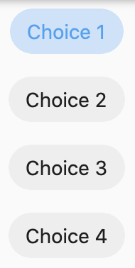

<!--docs:
title: "Material chips"
layout: detail
section: components
excerpt: "Chips are compact elements that represent an input, attribute, or action."
iconId:
path: /catalog/material-chips/
-->

# Chips

[Chips](https://material.io/components/chips) are compact elements that represent an input, attribute, or action.


## Contents

- [Using chips](#using-chips)
- [Anatomy and key properties](#anatomy-and-key-properties)
- [Types](#types)
- [Theming](#theming)

## Using chips

Chips allow users to enter information, make selections, filter content, or trigger actions. While buttons are expected to appear consistently and with familiar calls to action, chips should appear dynamically as a group of multiple interactive elements.

### Making chips accessible

Flutter's APIs support accessibility setting for large fonts, screen readers, and sufficient contrast. For more information, go to Flutter's [accessibility](https://flutter.dev/docs/development/accessibility-and-localization/accessibility) and [internationalization](https://flutter.dev/docs/development/accessibility-and-localization/internationalization) pages.

## Anatomy and key properties

The following is an anatomy diagram of a chip:


1. Container
1. Thumbnail (optional)
1. Text
1. Remove icon (optional)

### Container

&nbsp; | Property
------ | ---------
**Height** | padding

### Thumbnail

&nbsp;         | Property
-------------- | ------------------------
**avatar** | avatar
**border** | avatarBorder

### Text

&nbsp;         | Property
-------------- | ------------------------
**Text label** | label and use Text widget
**Color**      | label and use Text widget within textWidget set style
**Typography** | label and use Text widget within textWidget set style
**padding** | labelPadding

### Remove icon

&nbsp;         | Property
-------------- | ------------------------
**color** | deleteIconColor

## Types

There are four different types of chips that are subclasses of [`Chip`](https://api.flutter.dev/flutter/material/Chip-class.html), including [input](#input-chips), [choice](#choice-chips), [filter](#filter-chips), and [action](#action-chips).


### Input chips

Input chips represent a complex piece of information in compact form, such as an entity (person, place, or thing) or text. They enable user input and verify that input by converting text into chips.

#### Input chips example

`InputChip`

- [Class definition](https://api.flutter.dev/flutter/material/InputChip-class.html)
- [GitHub source](https://github.com/flutter/flutter/blob/master/packages/flutter/lib/src/material/chip.dart)
- [Demo site](https://dartpad.dev/embed-flutter.html?gh_owner=material-components&gh_repo=material-components-flutter&gh_path=docs/components/dartpad/chips/input)


```dart
@override
Widget build(BuildContext context) {
  return MaterialApp(
    title: 'Input Chips Demo',
    debugShowCheckedModeBanner: false,
    home: Scaffold(
      appBar: AppBar(
        title: Text('Input Chips Demo'),
      ),
      body: Center(
        child: Column(
          children: [
            InputChip(
              avatar: Icon(Icons.remove),
              label: Text('Input 1'),
              onSelected: (bool value) {},
            ),
            InputChip(
              avatar: Icon(Icons.remove),
              label: Text('Input 2'),
              onSelected: (bool value) {},
            ),
            InputChip(
              avatar: Icon(Icons.remove),
              label: Text('Input 3'),
              onSelected: (bool value) {},
            ),
          ],
        ),
      ),
    ),
  );
}
```

### Choice chips

Choice chips allow selection of a single chip from a set of options.

Choice chips clearly delineate and display options in a compact area. They are a good alternative to toggle buttons, radio buttons, and single select menus.

#### Choice chips example

`ChoiceChip`

- [Class definition](https://api.flutter.dev/flutter/material/ChoiceChip-class.html)
- [GitHub source](https://github.com/flutter/flutter/blob/master/packages/flutter/lib/src/material/chip.dart)
- [Demo site](https://dartpad.dev/embed-flutter.html?gh_owner=material-components&gh_repo=material-components-flutter&gh_path=docs/components/dartpad/chips/choice)



```dart
@override
Widget build(BuildContext context) {
  return MaterialApp(
    title: 'Choice Chips Demo',
    debugShowCheckedModeBanner: false,
    home: Scaffold(
      appBar: AppBar(
        title: Text('Choice Chips Demo'),
      ),
      body: Center(
        child: Column(
          children: [
            ChoiceChip(
              label: Text('Choice 1'),
              selected: true,
            ),
            ChoiceChip(
              label: Text('Choice 2'),
              selected: false,
            ),
            ChoiceChip(
              label: Text('Choice 3'),
              selected: false,
            ),
            ChoiceChip(
              label: Text('Choice 4'),
              selected: false,
            ),
          ],
        ),
      ),
    ),
  );
}
```

### Filter chips

Filter chips use tags or descriptive words to filter content.

Filter chips clearly delineate and display options in a compact area. They are a good alternative to toggle buttons or checkboxes.

#### Filter chips example

`FilterChip`

- [Class definition](https://api.flutter.dev/flutter/material/FilterChip-class.html)
- [GitHub source](https://github.com/flutter/flutter/blob/master/packages/flutter/lib/src/material/chip.dart)
- [Demo site](https://dartpad.dev/embed-flutter.html?gh_owner=material-components&gh_repo=material-components-flutter&gh_path=docs/components/dartpad/chips/filter)


```dart
@override
Widget build(BuildContext context) {
  return MaterialApp(
    title: 'Filter Chips Demo',
    debugShowCheckedModeBanner: false,
    home: Scaffold(
      appBar: AppBar(
        title: Text('Filter Chips Demo'),
      ),
      body: Center(
        child: Column(
          children: [
            FilterChip(
              label: Text('Filter 1'),
              selected: true,
              onSelected: (bool value) {},
            ),
            FilterChip(
              label: Text('Filter 2'),
              onSelected: (bool value) {},
            ),
            FilterChip(
              label: Text('Filter 3'),
              selected: true,
              onSelected: (bool value) {},
            ),
            FilterChip(
              label: Text('Filter 4'),
              onSelected: (bool value) {},
            ),
            FilterChip(
              label: Text('Filter 5'),
              onSelected: (bool value) {},
            ),
            FilterChip(
              label: Text('Filter 6'),
              onSelected: (bool value) {},
            ),
          ],
        ),
      ),
    ),
  );
}
```

### Action chips

Action chips offer actions related to primary content. They should appear dynamically and contextually in a UI.

An alternative to action chips are buttons, which should appear persistently and consistently.

#### Action chips example

`ActionChip`

- [Class definition](https://api.flutter.dev/flutter/material/ActionChip-class.html)
- [GitHub source](https://github.com/flutter/flutter/blob/master/packages/flutter/lib/src/material/chip.dart)
- [Demo site](https://dartpad.dev/embed-flutter.html?gh_owner=material-components&gh_repo=material-components-flutter&gh_path=docs/components/dartpad/chips/action)


```dart
@override
Widget build(BuildContext context) {
  return MaterialApp(
    title: 'Action Chip Demo',
    debugShowCheckedModeBanner: false,
    home: Scaffold(
      appBar: AppBar(
        title: Text('Action Chips Demo'),
      ),
      body: Center(
        child: Column(
          children: [
            ActionChip(
              avatar: Icon(Icons.favorite),
              label: Text('Action 1'),
              onPressed: () {},
            ),
            ActionChip(
              avatar: Icon(Icons.delete),
              label: Text('Action 2'),
              onPressed: () {},
            ),
            ActionChip(
              avatar: Icon(Icons.alarm),
              label: Text('Action 3'),
              onPressed: () {},
            ),
            ActionChip(
              avatar: Icon(Icons.location_on),
              label: Text('Action 4'),
              onPressed: () {},
            ),
          ],
        ),
      ),
    ),
  );
}
```

## Theming

Chips support [Material Theming](https://material.io/components/chips/#theming) and can be customized in terms of color, typography and shape.

### Theming example

`InputChip`

- [Class definition](https://api.flutter.dev/flutter/material/InputChip-class.html)
- [GitHub source](https://github.com/flutter/flutter/blob/master/packages/flutter/lib/src/material/chip.dart)
- [Demo site](https://dartpad.dev/embed-flutter.html?gh_owner=material-components&gh_repo=material-components-flutter&gh_path=docs/components/dartpad/chips/theme)


```dart
import 'package:flutter/material.dart';

void main() {
  runApp(App());
}

class App extends StatelessWidget {
  @override
  Widget build(BuildContext context) {
    return MaterialApp(
      title: 'Checkboxes Demo',
      debugShowCheckedModeBanner: false,
      theme: _buildShrineTheme(),
      home: Scaffold(
        appBar: AppBar(
          title: Text('Input Theme Chips Demo'),
        ),
        body: Center(
          child: Column(
            children: [
              InputChip(
                avatar: Icon(Icons.add_shopping_cart),
                label: Text('Input 1'),
                onSelected: (bool value) {},
              ),
              InputChip(
                avatar: Icon(Icons.card_giftcard),
                label: Text('Input 2'),
                onSelected: (bool value) {},
              ),
              InputChip(
                avatar: Icon(Icons.credit_card),
                label: Text('Input 3'),
                onSelected: (bool value) {},
              ),
            ],
          ),
        ),
      ),
    );
  }
}

ThemeData _buildShrineTheme() {
  final ThemeData base = ThemeData.light();
  return base.copyWith(
    colorScheme: _shrineColorScheme,
    toggleableActiveColor: shrinePink400,
    accentColor: shrineBrown900,
    primaryColor: shrinePink100,
    buttonColor: shrinePink100,
    scaffoldBackgroundColor: shrineBackgroundWhite,
    cardColor: shrineBackgroundWhite,
    textSelectionColor: shrinePink100,
    errorColor: shrineErrorRed,
    primaryIconTheme: _customIconTheme(base.iconTheme),
    textTheme: _buildShrineTextTheme(base.textTheme),
    primaryTextTheme: _buildShrineTextTheme(base.primaryTextTheme),
    accentTextTheme: _buildShrineTextTheme(base.accentTextTheme),
    iconTheme: _customIconTheme(base.iconTheme),
  );
}

IconThemeData _customIconTheme(IconThemeData original) {
  return original.copyWith(color: shrineBrown900);
}

TextTheme _buildShrineTextTheme(TextTheme base) {
  return base.apply(
    fontFamily: 'Rubik',
    displayColor: shrineBrown900,
    bodyColor: shrineBrown900,
  );
}

const ColorScheme _shrineColorScheme = ColorScheme(
  primary: shrinePink100,
  primaryVariant: shrineBrown900,
  secondary: shrinePink50,
  secondaryVariant: shrineBrown900,
  surface: shrineSurfaceWhite,
  background: shrineBackgroundWhite,
  error: shrineErrorRed,
  onPrimary: shrineBrown900,
  onSecondary: shrineBrown900,
  onSurface: shrineBrown900,
  onBackground: shrineBrown900,
  onError: shrineSurfaceWhite,
  brightness: Brightness.light,
);

const Color shrinePink50 = Color(0xFFFEEAE6);
const Color shrinePink100 = Color(0xFFFEDBD0);
const Color shrinePink300 = Color(0xFFFBB8AC);
const Color shrinePink400 = Color(0xFFEAA4A4);

const Color shrineBrown900 = Color(0xFF442B2D);
const Color shrineBrown600 = Color(0xFF7D4F52);

const Color shrineErrorRed = Color(0xFFC5032B);

const Color shrineSurfaceWhite = Color(0xFFFFFBFA);
const Color shrineBackgroundWhite = Colors.white;

```
