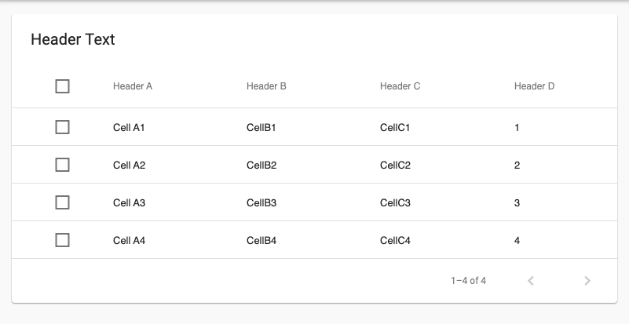
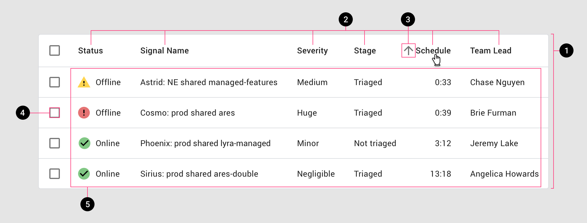
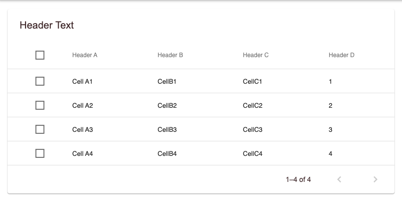

<!--docs:
title: "Data tables"
layout: detail
section: components
excerpt: "Data tables display information in a grid-like format of rows and columns."
iconId:
path: /catalog/data-tables/
api_doc_root: true
-->

# Data tables

[Data tables](https://material.io/components/data-tables/#) display sets of data across rows and columns.


## Contents

- [Using data tables](#using-data-tables)
- [Theming data tables](#theming-data-tables)

## Using data tables

Data tables display information in a grid-like format of rows and columns. They organize information in a way that’s easy to scan, so that users can look for patterns and insights.

Data tables can contain:

- Interactive components (such as chips, buttons, or menus)
- Non-interactive elements
- Tools to query and manipulate data

### Making data tables accessible

Flutter's APIs support accessibility setting for large fonts, screen readers, and sufficient contrast. For more information, go to Flutter's [accessibility](https://flutter.dev/docs/development/accessibility-and-localization/accessibility) and [internationalization](https://flutter.dev/docs/development/accessibility-and-localization/internationalization) pages.

For more guidance on writing labels, go to [our page on how to write a good accessibility label](https://material.io/design/usability/accessibility.html#writing).

## Data tables information

`PaginatedDataTable`

- [Class description](https://api.flutter.dev/flutter/material/DataTable-class.html)
- [GitHub source](https://github.com/flutter/flutter/blob/master/packages/flutter/lib/src/material/data_table.dart)
- [Dartpad demo](https://dartpad.dev/embed-flutter.html?gh_owner=material-components&gh_repo=material-components-flutter&gh_path=docs/components/dartpad/data_tables/normal&gh_ref=develop)
- [Demo site](https://gallery.flutter.dev/#/demo/data-table)



```dart

class DataTableDemo extends StatelessWidget {
  Widget build(BuildContext context) {
    return Scaffold(
      appBar: AppBar(
        title: Text('Data Tables'),
      ),
      body: ListView(
        padding: const EdgeInsets.all(16),
        children: [
          PaginatedDataTable(
            header: Text('Header Text'),
            rowsPerPage: 4,
            columns: [
              DataColumn(label: Text('Header A')),
              DataColumn(label: Text('Header B')),
              DataColumn(label: Text('Header C')),
              DataColumn(label: Text('Header D')),
            ],
            source: _DataSource(context),
          ),
        ],
      ),
    );
  }
}

class _Row {
  _Row(
    this.valueA,
    this.valueB,
    this.valueC,
    this.valueD,
  );

  final String valueA;
  final String valueB;
  final String valueC;
  final int valueD;

  bool selected = false;
}

class _DataSource extends DataTableSource {
  _DataSource(this.context) {
    _rows = <_Row>[
      _Row('Cell A1', 'CellB1', 'CellC1', 1),
      _Row('Cell A2', 'CellB2', 'CellC2', 2),
      _Row('Cell A3', 'CellB3', 'CellC3', 3),
      _Row('Cell A4', 'CellB4', 'CellC4', 4),
    ];
  }

  final BuildContext context;
  List<_Row> _rows;

  int _selectedCount = 0;

  @override
  DataRow getRow(int index) {
    assert(index >= 0);
    if (index >= _rows.length) return null;
    final row = _rows[index];
    return DataRow.byIndex(
      index: index,
      selected: row.selected,
      onSelectChanged: (value) {
        if (row.selected != value) {
          _selectedCount += value ? 1 : -1;
          assert(_selectedCount >= 0);
          row.selected = value;
          notifyListeners();
        }
      },
      cells: [
        DataCell(Text(row.valueA)),
        DataCell(Text(row.valueB)),
        DataCell(Text(row.valueC)),
        DataCell(Text(row.valueD.toString())),
      ],
    );
  }

  @override
  int get rowCount => _rows.length;

  @override
  bool get isRowCountApproximate => false;

  @override
  int get selectedRowCount => _selectedCount;
}

```

### Key properties

The following is an anatomy diagram of a data table:



A data table consists of the following properties:

1. Container
1. Column header names
1. Sort button
1. Row checkboxes
1. Rows

#### Container

| &nbsp; | Property |
| --- | --- |
| **Color** | style |
| **Stroke color** | while setting `ThemeData` fill out `divideColor` parameter |

#### Column header names

| &nbsp; | Property |
| --- | --- |
| **Label text** | Use `columns`, within `Column` set create `DataColumn` widget fill out `label` property with `Text` Widget|
| **Typography** | Within the `Text` widget from note above fill out `style` property with `TextStyle` widget|
| **Color** | Within the `Text` widget from note above fill out `style` property with `TextStyle` widget fill out the `color` property |

#### Sort button

Sorting button can't be customized.

#### Row checkboxes

| &nbsp; | Property |
| --- | --- |
| **active Color** | while setting `ThemeData` fill out `accentColor`|

#### Rows

| &nbsp; | Property |
| --- | --- |
| **Label text** | Use `DataCell` widget, fill out with property with `Text` Widget |
| **Typography** | Within the `Text` widget from note above fill out `style` property with `TextStyle` widget|
| **Color** |  Within the `Text` widget from note above fill out `style` property with `TextStyle` widget fill out the `color` property  |

## Theming data tables

Data Table cells children are Widgets. This means that the Data table is dependent on the Widgets that the user puts within it. The only theme variables that affect the DataTable is:

- `dividerColor`
- `secondaryHeaderColor`
- `accentColor`

The following is an example data table using the [Shrine theme](https://material.io/design/material-studies/shrine.html).

[Dartpad demo](https://dartpad.dev/embed-flutter.html?gh_owner=material-components&gh_repo=material-components-flutter&gh_path=docs/components/dartpad/data_tables/normal&gh_ref=develop)



```dart

import 'package:flutter/material.dart';

void main() => runApp(MyApp());

class MyApp extends StatelessWidget {
  @override
  Widget build(BuildContext context) {
    return MaterialApp(
      title: 'Flutter Demo',
      debugShowCheckedModeBanner: false,
      theme: _buildShrineTheme(),
      home: DataTableDemo(),
    );
  }
}

class DataTableDemo extends StatelessWidget {
  Widget build(BuildContext context) {
    return Scaffold(
      appBar: AppBar(
        title: Text('Data Tables'),
      ),
      body: ListView(
        padding: const EdgeInsets.all(16),
        children: [
          PaginatedDataTable(
            header: Text('Header Text'),
            rowsPerPage: 4,
            columns: [
              DataColumn(label: Text('Header A')),
              DataColumn(label: Text('Header B')),
              DataColumn(label: Text('Header C')),
              DataColumn(label: Text('Header D')),
            ],
            source: _DataSource(context),
          ),
        ],
      ),
    );
  }
}

class _Row {
  _Row(
      this.valueA,
      this.valueB,
      this.valueC,
      this.valueD,
      );

  final String valueA;
  final String valueB;
  final String valueC;
  final int valueD;

  bool selected = false;
}

class _DataSource extends DataTableSource {
  _DataSource(this.context) {
    _rows = <_Row>[
      _Row('Cell A1', 'CellB1', 'CellC1', 1),
      _Row('Cell A2', 'CellB2', 'CellC2', 2),
      _Row('Cell A3', 'CellB3', 'CellC3', 3),
      _Row('Cell A4', 'CellB4', 'CellC4', 4),
    ];
  }

  final BuildContext context;
  List<_Row> _rows;

  int _selectedCount = 0;

  @override
  DataRow getRow(int index) {
    assert(index >= 0);
    if (index >= _rows.length) return null;
    final row = _rows[index];
    return DataRow.byIndex(
      index: index,
      selected: row.selected,
      onSelectChanged: (value) {
        if (row.selected != value) {
          _selectedCount += value ? 1 : -1;
          assert(_selectedCount >= 0);
          row.selected = value;
          notifyListeners();
        }
      },
      cells: [
        DataCell(Text(row.valueA)),
        DataCell(Text(row.valueB)),
        DataCell(Text(row.valueC)),
        DataCell(Text(row.valueD.toString())),
      ],
    );
  }

  @override
  int get rowCount => _rows.length;

  @override
  bool get isRowCountApproximate => false;

  @override
  int get selectedRowCount => _selectedCount;
}

ThemeData _buildShrineTheme() {
  final ThemeData base = ThemeData.light();
  return base.copyWith(
    colorScheme: _shrineColorScheme,
    accentColor: shrineBrown900,
    primaryColor: shrinePink100,
    buttonColor: shrinePink100,
    scaffoldBackgroundColor: shrineBackgroundWhite,
    cardColor: shrineBackgroundWhite,
    textSelectionColor: shrinePink100,
    errorColor: shrineErrorRed,
    buttonTheme: const ButtonThemeData(
      colorScheme: _shrineColorScheme,
      textTheme: ButtonTextTheme.normal,
    ),
    primaryIconTheme: _customIconTheme(base.iconTheme),
    textTheme: _buildShrineTextTheme(base.textTheme),
    primaryTextTheme: _buildShrineTextTheme(base.primaryTextTheme),
    accentTextTheme: _buildShrineTextTheme(base.accentTextTheme),
    iconTheme: _customIconTheme(base.iconTheme),
  );
}

IconThemeData _customIconTheme(IconThemeData original) {
  return original.copyWith(color: shrineBrown900);
}

TextTheme _buildShrineTextTheme(TextTheme base) {
  return base
      .copyWith(
    caption: base.caption.copyWith(
      fontWeight: FontWeight.w400,
      fontSize: 14,
      letterSpacing: defaultLetterSpacing,
    ),
    button: base.button.copyWith(
      fontWeight: FontWeight.w500,
      fontSize: 14,
      letterSpacing: defaultLetterSpacing,
    ),
  )
      .apply(
    fontFamily: 'Rubik',
    displayColor: shrineBrown900,
    bodyColor: shrineBrown900,
  );
}

const ColorScheme _shrineColorScheme = ColorScheme(
  primary: shrinePink100,
  primaryVariant: shrineBrown900,
  secondary: shrinePink50,
  secondaryVariant: shrineBrown900,
  surface: shrineSurfaceWhite,
  background: shrineBackgroundWhite,
  error: shrineErrorRed,
  onPrimary: shrineBrown900,
  onSecondary: shrineBrown900,
  onSurface: shrineBrown900,
  onBackground: shrineBrown900,
  onError: shrineSurfaceWhite,
  brightness: Brightness.light,
);

const Color shrinePink50 = Color(0xFFFEEAE6);
const Color shrinePink100 = Color(0xFFFEDBD0);
const Color shrinePink300 = Color(0xFFFBB8AC);
const Color shrinePink400 = Color(0xFFEAA4A4);

const Color shrineBrown900 = Color(0xFF442B2D);
const Color shrineBrown600 = Color(0xFF7D4F52);

const Color shrineErrorRed = Color(0xFFC5032B);

const Color shrineSurfaceWhite = Color(0xFFFFFBFA);
const Color shrineBackgroundWhite = Colors.white;

const defaultLetterSpacing = 0.03;

```
