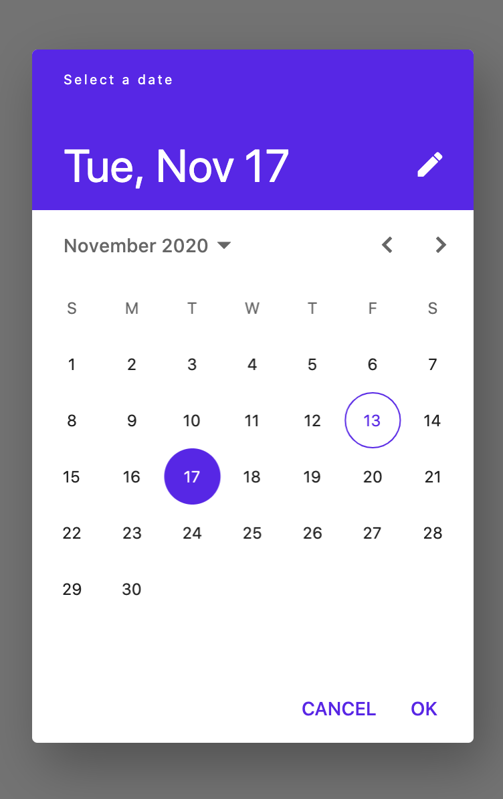
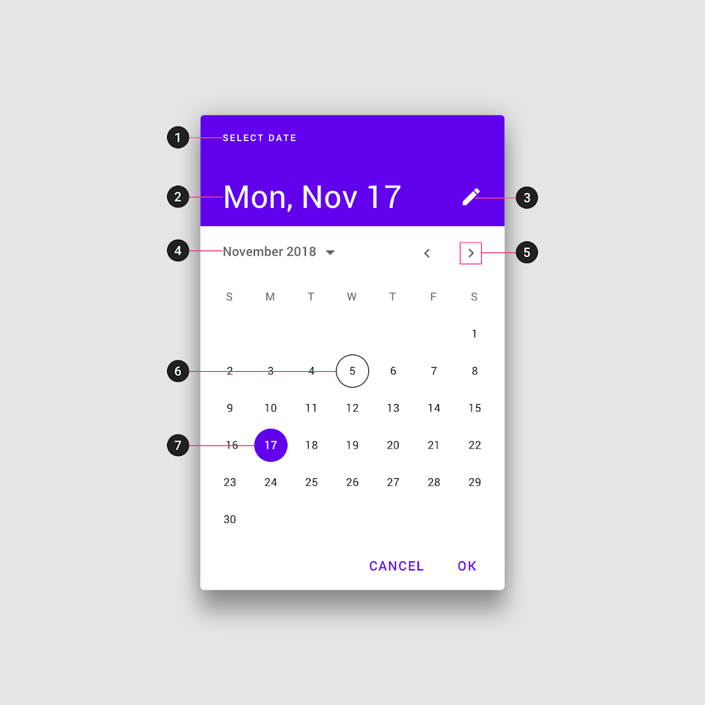
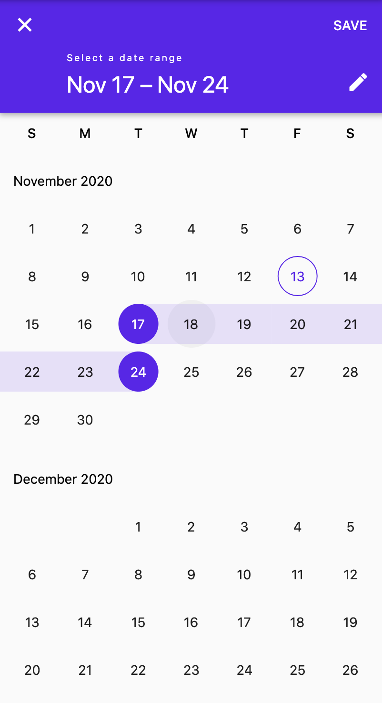
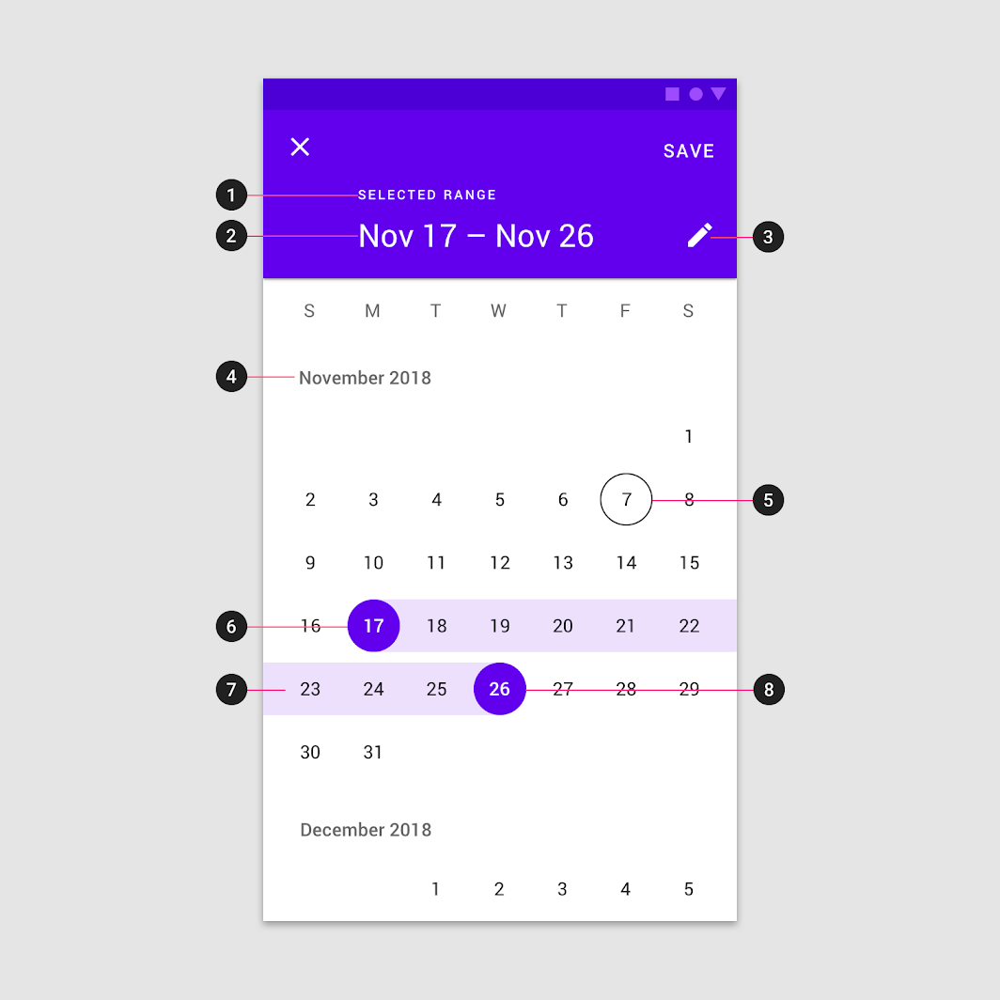
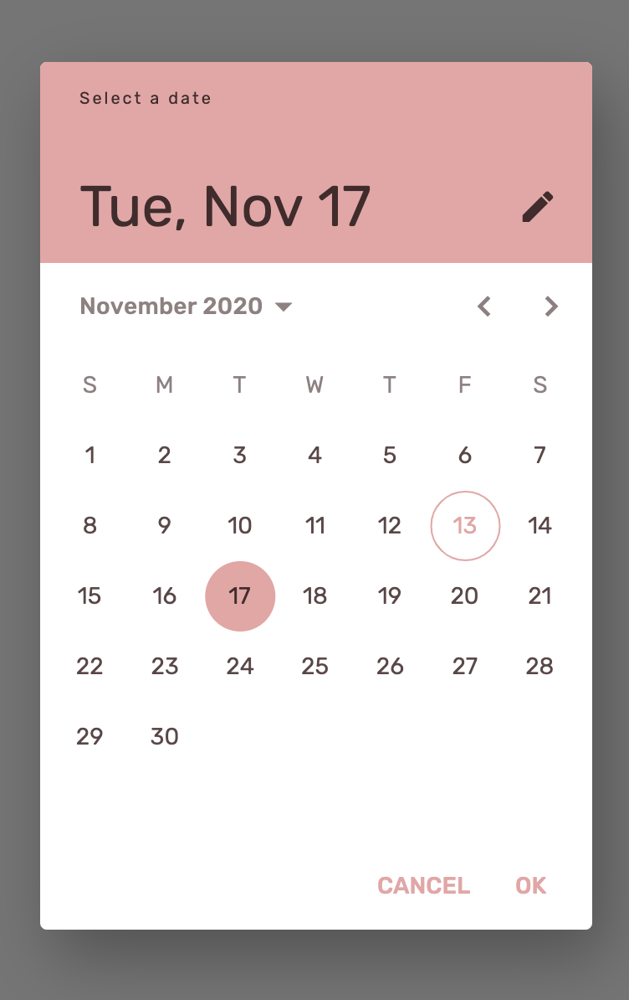

<!--docs:
title: "Material <component>"
layout: detail
section: components
excerpt: "Date pickers let users select a date or range of dates."
iconId: 
path: /catalog/date-pickers/
-->

# Date pickers

[Date pickers](https://material.io/components/date-pickers) let users select a date or range of dates. 


**Contents**

- [Using date pickers](#using-pickers)
- [Making date pickers accessible](#making-pickers-accessible)
- [Date pickers](#date-pickers)
- [Date range pickers](#date-range-pickers)
- [Theming date pickers](#theming-pickers)

## Using date pickers

Date pickers let users select a date or range of dates. They should be suitable for the context in which they appear.

Date pickers can be embedded into:

- Dialogs on mobile
- Text field dropdowns on desktop

### Making date pickers accessible 

Flutter's APIs support accessibility setting for large fonts, screen readers, and sufficient contrast. For more information, go to Flutter's [accessibility](https://flutter.dev/docs/development/accessibility-and-localization/accessibility) and [internationalization](https://flutter.dev/docs/development/accessibility-and-localization/internationalization) pages.

## Date pickers

Mobile date pickers can be used to select dates in the near future or past, when it’s useful to see them in a calendar month format. They are displayed in a dialog.

Common use cases include:

- Making a restaurant reservation
- Scheduling a meeting

They aren’t ideal for selecting dates in the distant past or future that require more navigation, such as entering a birth date or expiration date.

Mobile date pickers allow selection of a single date and year.

### Date pickers example

`showDatePicker`
- [Class definition](https://api.flutter.dev/flutter/material/showDatePicker.html)
- [GitHub souce](https://github.com/flutter/flutter/blob/master/packages/flutter/lib/src/material/pickers/date_picker_dialog.dart)
- [Dartpad demo](https://dartpad.dev/embed-flutter.html?gh_owner=material-components&gh_repo=material-components-flutter&gh_path=docs/components/dartpad/date_pickers/regular&gh_ref=develop)

The following example shows a date picker with a selected date of November 17, 2020 and a current date of November 13, 2020.



```dart
final DateTime newDate = await showDatePicker(
  context: context,
  initialDate: DateTime(2020, 11, 17),
  firstDate: DateTime(2017, 1),
  lastDate: DateTime(2022, 7),
  helpText: 'Select a date',
);
```

### Anatomy and key properties

The following diagram shows the elements of a date picker:



1. Title
1. Selected date
1. Switch-to-keyboard input icon
1. Year selection menu
1. Month pagination
1. Current date
1. Selected date

#### Title

&nbsp;                                  | Attribute                
--------------------------------------- | ------------------------
**Text** | `helpText` property in `showDatePicker`

#### Selected date

&nbsp;                                  | Attribute                
--------------------------------------- | ------------------------
**Date** | `initialDate` property in `showDatePicker`

#### Current date

&nbsp;                                  | Attribute                
--------------------------------------- | ------------------------
**Date** | `currentDate` property in `showDatePicker`

## Date range pickers

Mobile date range pickers allow selection of a range of dates. They cover the entire screen.

Common use cases include:

- Booking a flight
- Reserving a hotel

### Date range picker example

`showDateRangePicker`
- [Class definition](https://api.flutter.dev/flutter/material/showDateRangePicker.html)
- [GitHub souce](https://github.com/flutter/flutter/blob/master/packages/flutter/lib/src/material/pickers/date_range_picker_dialog.dart)
- [Dartpad demo](https://dartpad.dev/embed-flutter.html?gh_owner=material-components&gh_repo=material-components-flutter&gh_path=docs/components/dartpad/date_pickers/range&gh_ref=develop)

The following example shows a date range picker.



```dart
final DateTimeRange newDateRange = await showDateRangePicker(
  context: context,
  initialDateRange: DateTimeRange(
    start: DateTime(2020, 11, 17),
    end: DateTime(2020, 11, 24),
  ),
  firstDate: DateTime(2017, 1),
  lastDate: DateTime(2022, 7),
  helpText: 'Select a date',
);
```

### Anatomy and key properties

The following diagram shows the elements of a date range picker:



1. Title
1. Selected date range
1. Switch to keyboard input icon
1. Month and year label
1. Current date
1. Start date
1. Selected range
1. End date

#### Title

&nbsp;                                  | Attribute                
--------------------------------------- | ------------------------
**Text** | `helpText` property in `showDateRangePicker`


#### Selected date range

&nbsp;                                  | Attribute                
--------------------------------------- | ------------------------
**Date range** | `initialDateRange` property in `showDateRangePicker`

#### Current date

&nbsp;                                  | Attribute                
--------------------------------------- | ------------------------
**Date** | `currentDate` property in `showDateRangePicker`

## Theming date pickers

The following example shows a date picker that uses the [Shrine theme](https://material.io/design/material-studies/shrine.html):

- [Dartpad demo](https://dartpad.dev/embed-flutter.html?gh_owner=material-components&gh_repo=material-components-flutter&gh_path=docs/components/dartpad/date_pickers/theme&gh_ref=develop)



```dart
import 'package:flutter/material.dart';

void main() => runApp(MyApp());

class MyApp extends StatelessWidget {
  @override
  Widget build(BuildContext context) {
    return MaterialApp(
      title: 'Time Picker Themed Demo',
      debugShowCheckedModeBanner: false,
      theme: _buildShrineTheme(),
      home: MyHomePage(),
    );
  }
}

class MyHomePage extends StatefulWidget {
  @override
  _MyHomePageState createState() => _MyHomePageState();
}

class _MyHomePageState extends State<MyHomePage> {
  DateTime _date = DateTime(2020, 11, 17);

  void _selectDate() async {
    final DateTime newDate = await showDatePicker(
      context: context,
      initialDate: _date,
      firstDate: DateTime(2017, 1),
      lastDate: DateTime(2022, 7),
      helpText: 'Select a date',
    );
    if (newDate != null) {
      setState(() {
        _date = newDate;
      });
    }
  }

  @override
  Widget build(BuildContext context) {
    return Scaffold(
      body: Center(
        child: Column(
          mainAxisAlignment: MainAxisAlignment.center,
          children: [
            ElevatedButton(
              onPressed: _selectDate,
              child: Text('SELECT DATE'),
            ),
            SizedBox(height: 8),
            Text(
              'Selected date: $_date',
            ),
          ],
        ),
      ),
    );
  }
}

ThemeData _buildShrineTheme() {
  final ThemeData base = ThemeData.light();
  return base.copyWith(
    colorScheme: _shrineColorScheme,
    toggleableActiveColor: shrinePink400,
    accentColor: shrineBrown900,
    primaryColor: shrinePink100,
    buttonColor: shrinePink100,
    scaffoldBackgroundColor: shrineBackgroundWhite,
    cardColor: shrineBackgroundWhite,
    textSelectionColor: shrinePink100,
    errorColor: shrineErrorRed,
    buttonTheme: const ButtonThemeData(
      colorScheme: _shrineColorScheme,
      textTheme: ButtonTextTheme.normal,
    ),
    primaryIconTheme: _customIconTheme(base.iconTheme),
    textTheme: _buildShrineTextTheme(base.textTheme),
    primaryTextTheme: _buildShrineTextTheme(base.primaryTextTheme),
    accentTextTheme: _buildShrineTextTheme(base.accentTextTheme),
    iconTheme: _customIconTheme(base.iconTheme),
  );
}

IconThemeData _customIconTheme(IconThemeData original) {
  return original.copyWith(color: shrineBrown900);
}

TextTheme _buildShrineTextTheme(TextTheme base) {
  return base
      .copyWith(
        caption: base.caption.copyWith(
          fontWeight: FontWeight.w400,
          fontSize: 14,
          letterSpacing: defaultLetterSpacing,
        ),
        button: base.button.copyWith(
          fontWeight: FontWeight.w500,
          fontSize: 14,
          letterSpacing: defaultLetterSpacing,
        ),
      )
      .apply(
        fontFamily: 'Rubik',
        displayColor: shrineBrown900,
        bodyColor: shrineBrown900,
      );
}

const ColorScheme _shrineColorScheme = ColorScheme(
  primary: shrinePink400,
  primaryVariant: shrineBrown900,
  secondary: shrinePink50,
  secondaryVariant: shrineBrown900,
  surface: shrineSurfaceWhite,
  background: shrineBackgroundWhite,
  error: shrineErrorRed,
  onPrimary: shrineBrown900,
  onSecondary: shrineBrown900,
  onSurface: shrineBrown900,
  onBackground: shrineBrown900,
  onError: shrineSurfaceWhite,
  brightness: Brightness.light,
);

const Color shrinePink50 = Color(0xFFFEEAE6);
const Color shrinePink100 = Color(0xFFFEDBD0);
const Color shrinePink300 = Color(0xFFFBB8AC);
const Color shrinePink400 = Color(0xFFEAA4A4);

const Color shrineBrown900 = Color(0xFF442B2D);
const Color shrineBrown600 = Color(0xFF7D4F52);

const Color shrineErrorRed = Color(0xFFC5032B);

const Color shrineSurfaceWhite = Color(0xFFFFFBFA);
const Color shrineBackgroundWhite = Colors.white;

const defaultLetterSpacing = 0.03;
```

