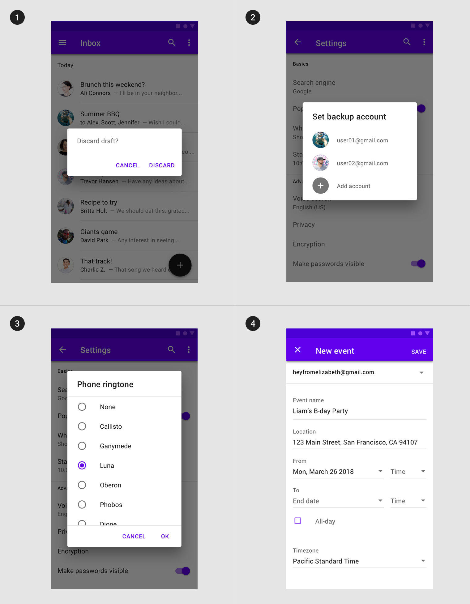
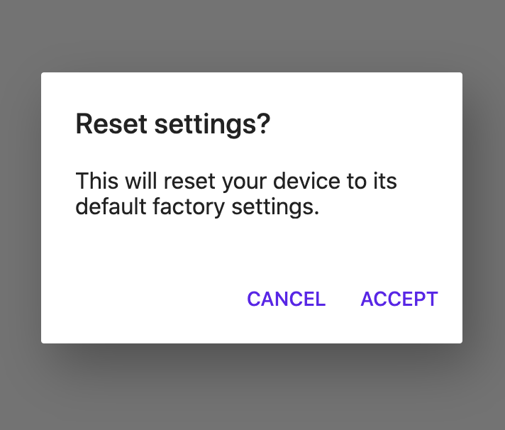
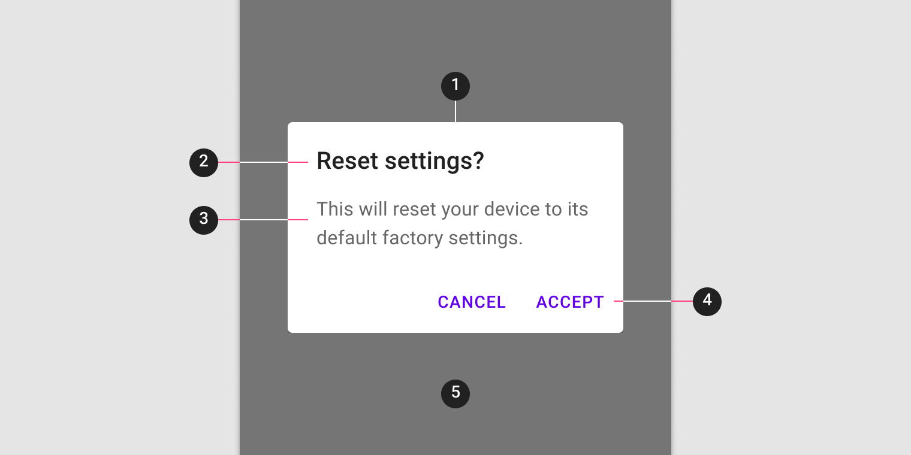
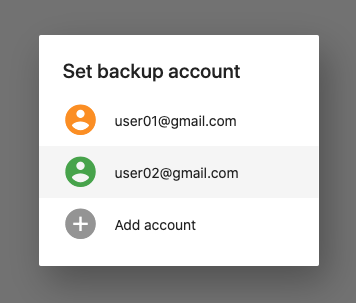
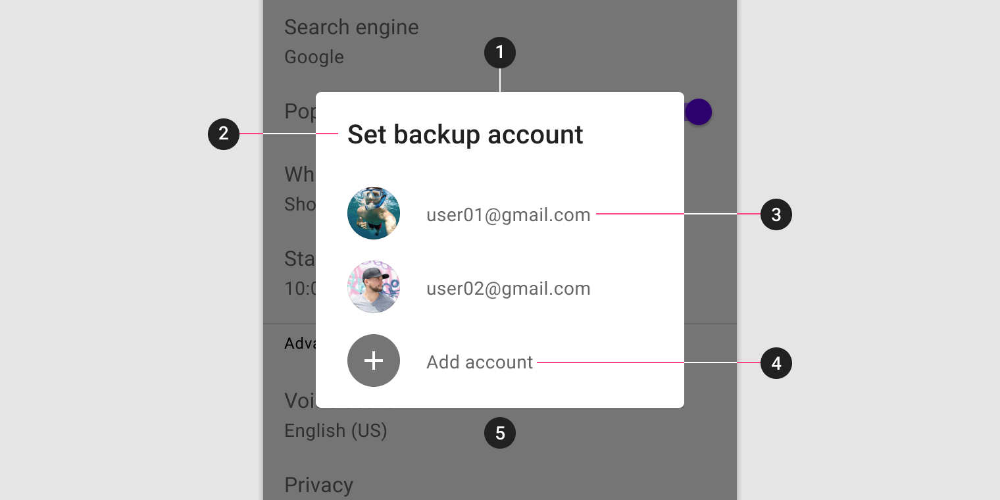
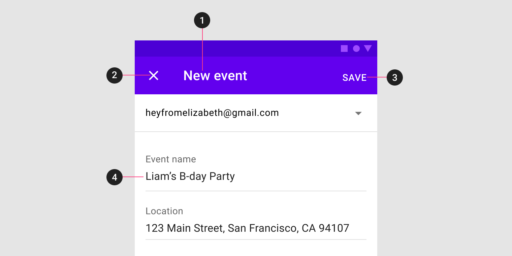
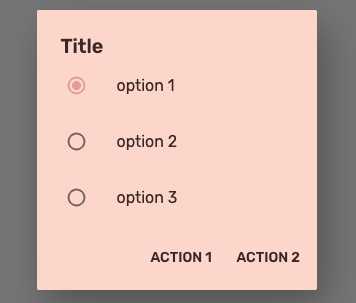

<!--docs:
title: "Dialogs"
layout: detail
section: components
excerpt: "Dialogs are modal windows that require interaction."
iconId:
path: /catalog/dialog/
-->

# Dialogs

[Dialogs](https://material.io/components/dialogs) inform users about a task and can contain critical information, require decisions, or involve multiple tasks.


**Contents**

- [Using dialogs](#using-dialogs)
- [Alert](#alert-dialog)
- [Simple](#simple-dialog)
- [Confirmation](#confirmation-dialog)
- [Full-screen](#full-screen-dialog)
- [Dialog theming](#dialog-theming)

## Using dialogs

A dialog is a type of modal window that appears in front of app content to provide critical information or ask for a decision. Dialogs disable all app functionality when they appear, and remain on screen until confirmed, dismissed, or a required action has been taken.

Dialogs are purposefully interruptive, so they should be used sparingly.

Before you can use Material dialogs, you need to import the Material Components package for Flutter: `package:flutter/material.dart`.

You need to use a [`MaterialApp`](https://api.flutter.dev/flutter/material/MaterialApp-class.html).

For more information on getting started with the Material for Flutter, go to the Flutter [Material library](https://api.flutter.dev/flutter/material/material-library.html) page.

### Types

There are four types of dialogs: 1. [Alert](#alert-dialog), 2. [Simple](#simple-dialog), 3. [Confirmation](#confirmation-dialog), 4. [Full-screen](#full-screen-dialog)



### Making dialogs accessible

Flutter's APIs support accessibility setting for large fonts, screen readers, and sufficient contrast. For more information, go to Flutter's [accessibility](https://flutter.dev/docs/development/accessibility-and-localization/accessibility) and [internationalization](https://flutter.dev/docs/development/accessibility-and-localization/internationalization) pages.

For more guidance on writing labels, go to [our page on how to write a good accessibility label](https://material.io/design/usability/accessibility.html#writing).

## Alert dialog

Alert dialogs interrupt users with urgent information, details, or actions.

### Alert dialog example

`AlertDialog`

- [Class description](https://api.flutter.dev/flutter/material/AlertDialog-class.html)
- [Github source](https://github.com/flutter/flutter/blob/master/packages/flutter/lib/src/material/dialog.dart)
- [Dartpad demo](https://dartpad.dev/embed-flutter.html?gh_owner=material-components&gh_repo=material-components-flutter&gh_path=docs/components/dartpad/dialogs/alert&gh_ref=develop)
- [YouTube video](https://www.youtube.com/watch?v=75CsnyRXf5I&list=PLjxrf2q8roU23XGwz3Km7sQZFTdB996iG&index=59&ab_channel=Flutter)

The following example shows an alert dialog.



```dart
AlertDialog(
  title: Text('Reset settings?'),
  content: Text('This will reset your device to its default factory settings.'),
  actions: [
    FlatButton(
      textColor: Color(0xFF6200EE),
      onPressed: () {},
      child: Text('CANCEL'),
    ),
    FlatButton(
      textColor: Color(0xFF6200EE),
      onPressed: () {},
      child: Text('ACCEPT'),
    ),
  ],
)
```

### Alert dialog anatomy and key properties

The alert dialog contains the following:



1. Container
1. Title (optional)
1. Supporting text
1. Buttons
1. Scrim

#### Container attributes

| &nbsp; | **Properties** |
| --- | --- |
| **Color** | `backgroundColor` |
| **Shape** | `shape` |
| **Elevation** | `elevation` |

#### Title attributes

| &nbsp; | **Properties** |
| --- | --- |
| **Text label** | `title` |
| **Color** | `style` on `title` when using a `Text` |
| **Typography** | `style` on `title` when using a `Text` |

#### Supporting text attributes

| &nbsp; | **Properties** |
| --- | --- |
| **Text label** | `content` |
| **Color** | `style` on `content` when using a `Text` |
| **Typography** | `style` on `content` when using a `Text` |

#### Buttons attributes

| &nbsp; | **Properties** |
| --- | --- |
| **Buttons**| `actions` |

## Simple dialog

Simple dialogs can display items that are immediately actionable when selected. They don’t have text buttons.

As simple dialogs are interruptive, they should be used sparingly. Alternatively, dropdown menus provide options in a non-modal, less disruptive way.

### Simple dialog example

`SimpleDialog`

- [Class description](https://api.flutter.dev/flutter/material/SimpleDialog-class.html)
- [Github source](https://github.com/flutter/flutter/blob/master/packages/flutter/lib/src/material/dialog.dart)
- [Dartpad demo](https://dartpad.dev/embed-flutter.html?gh_owner=material-components&gh_repo=material-components-flutter&gh_path=docs/components/dartpad/dialogs/simple&gh_ref=develop)

The following example shows a simple dialog.



```dart
SimpleDialog(
  title: Text('Set backup account'),
  children: [
    SimpleDialogItem(
      icon: Icons.account_circle,
      color: Colors.orange,
      text: 'user01@gmail.com',
      onPressed: () {
        Navigator.pop(context, 'user01@gmail.com');
      },
    ),
    SimpleDialogItem(
      icon: Icons.account_circle,
      color: Colors.green,
      text: 'user02@gmail.com',
      onPressed: () {
        Navigator.pop(context, 'user02@gmail.com');
      },
    ),
    SimpleDialogItem(
      icon: Icons.add_circle,
      color: Colors.grey,
      text: 'Add account',
      onPressed: () {
        Navigator.pop(context, 'user02@gmail.com');
      },
    ),
  ],
)

class SimpleDialogItem extends StatelessWidget {
  const SimpleDialogItem({Key key, this.icon, this.color, this.text, this.onPressed})
      : super(key: key);

  final IconData icon;
  final Color color;
  final String text;
  final VoidCallback onPressed;

  @override
  Widget build(BuildContext context) {
    return SimpleDialogOption(
      onPressed: onPressed,
      child: Row(
        mainAxisAlignment: MainAxisAlignment.start,
        crossAxisAlignment: CrossAxisAlignment.center,
        children: [
          Icon(icon, size: 36.0, color: color),
          Padding(
            padding: const EdgeInsetsDirectional.only(start: 16.0),
            child: Text(text),
          ),
        ],
      ),
    );
  }
}
```

### Simple dialog anatomy and key properties

A simple dialog contains the following:



1. Container
1. Title
1. List item
    1. Supporting visual
    1. Primary text
1. Button
1. Scrim

**Container attributes**

| &nbsp; | **Properties** |
| --- | --- |
| **Color** | `backgroundColor` |
| **Shape** | `shape` |
| **Elevation** | `elevation` |

**Title attributes**

| &nbsp; | **Properties** |
| --- | --- |
| **Text label** | `title` |
| **Color** | `style` on `title` when using a `Text` |
| **Typography** | `style` on `title` when using a `Text` |

**List item supporting visual attributes**

| &nbsp; | **Properties** |
| --- | --- |
| **Options** | `children` (Use `SimpleDialogOption` and customize its `child` parameter as needed.) |

## Confirmation dialog

Confirmation dialogs give users the ability to provide final confirmation of a choice before committing to it, so they have a chance to change their minds if necessary.

If the user confirms a choice, it’s carried out. Otherwise, the user can dismiss the dialog. For example, users can listen to multiple ringtones but only make a final selection upon tapping “OK.”

_**NOTE: There is no explicit confirmation dialog in Flutter but this can be built using the `Dialog` widget as a blank slate and providing your own custom `child`.**_

## Full-screen dialog

Full-screen dialogs group a series of tasks, such as creating a calendar entry with the event title, date, location, and time. Because they take up the entire screen, full-screen dialogs are the only dialogs over which other dialogs can appear.

### Full-screen dialog example

`MaterialPageRoute`

- [Class description](https://api.flutter.dev/flutter/material/MaterialPageRoute-class.html)
- [Github source](https://github.com/flutter/flutter/blob/master/packages/flutter/lib/src/material/page.dart)
- [Dartpad demo](https://dartpad.dev/embed-flutter.html?gh_owner=material-components&gh_repo=material-components-flutter&gh_path=docs/components/dartpad/dialogs/fullscreen&gh_ref=develop)

To use a full-screen dialog, simply set the `fullscreenDialog` to true when pushing a new `MaterialPageRoute`.

### Full-screen dialog anatomy

The full-screen dialog contains the following properties:



1. Title
1. Icon Button
1. Buttons
1. Scrim

## Dialog theming

### Dialog theming example

The following example shows a simple dialog with the [Material Shrine Theme](https://material.io/design/material-studies/shrine.html).

- [Dartpad Demo](https://dartpad.dev/embed-flutter.html?gh_owner=material-components&gh_repo=material-components-flutter&gh_path=docs/components/dartpad/dialogs/theme&gh_ref=develop)



```dart
import 'package:flutter/material.dart';

void main() => runApp(MyApp());

class MyApp extends StatelessWidget {
  @override
  Widget build(BuildContext context) {
    return MaterialApp(
      title: 'Flutter Demo',
      debugShowCheckedModeBanner: false,
      home: MyHomePage(),
      theme: _buildShrineTheme(),
    );
  }
}

class MyHomePage extends StatelessWidget {
  @override
  Widget build(BuildContext context) {
    final AlertDialog dialog = AlertDialog(
      title: Text('Title'),
      contentPadding: EdgeInsets.zero,
      content: Column(
        mainAxisSize: MainAxisSize.min,
        children: [
          for (int i = 1; i <= 3; i++)
            ListTile(
              title: Text(
                'option $i',
                style: Theme.of(context)
                    .textTheme
                    .subtitle1
                    .copyWith(color: shrineBrown900),
              ),
              leading: Radio(
                value: i,
                groupValue: 1,
                onChanged: (_) {},
              ),
            ),
        ],
      ),
      actions: [
        FlatButton(
          textColor: shrineBrown900,
          onPressed: () => Navigator.pop(context),
          child: Text('ACTION 1'),
        ),
        FlatButton(
          textColor: shrineBrown900,
          onPressed: () => Navigator.pop(context),
          child: Text('ACTION 2'),
        ),
      ],
    );

    return Scaffold(
      body: Center(
        child: FlatButton(
          onPressed: () {
            showDialog<void>(context: context, builder: (context) => dialog);
          },
          child: Text("SHOW DIALOG"),
        ),
      ),
    );
  }
}

ThemeData _buildShrineTheme() {
  final ThemeData base = ThemeData.light();
  return base.copyWith(
    colorScheme: _shrineColorScheme,
    toggleableActiveColor: shrinePink400,
    accentColor: shrineBrown900,
    primaryColor: shrinePink100,
    buttonColor: shrinePink100,
    scaffoldBackgroundColor: shrineBackgroundWhite,
    cardColor: shrineBackgroundWhite,
    textSelectionTheme: TextSelectionThemeData(selectionColor: shrinePink100),
    errorColor: shrineErrorRed,
    buttonTheme: const ButtonThemeData(
      colorScheme: _shrineColorScheme,
      textTheme: ButtonTextTheme.normal,
    ),
    primaryIconTheme: _customIconTheme(base.iconTheme),
    textTheme: _buildShrineTextTheme(base.textTheme),
    primaryTextTheme: _buildShrineTextTheme(base.primaryTextTheme),
    accentTextTheme: _buildShrineTextTheme(base.accentTextTheme),
    iconTheme: _customIconTheme(base.iconTheme),
    dialogTheme: DialogTheme(
      backgroundColor: shrinePink100,
    ),
  );
}

IconThemeData _customIconTheme(IconThemeData original) {
  return original.copyWith(color: shrineBrown900);
}

TextTheme _buildShrineTextTheme(TextTheme base) {
  return base
      .copyWith(
        caption: base.caption.copyWith(
          fontWeight: FontWeight.w400,
          fontSize: 14,
          letterSpacing: defaultLetterSpacing,
        ),
        button: base.button.copyWith(
          fontWeight: FontWeight.w500,
          fontSize: 14,
          letterSpacing: defaultLetterSpacing,
        ),
      )
      .apply(
        fontFamily: 'Rubik',
        displayColor: shrineBrown900,
        bodyColor: shrineBrown900,
      );
}

const ColorScheme _shrineColorScheme = ColorScheme(
  primary: shrinePink100,
  primaryVariant: shrineBrown900,
  secondary: shrineBrown900,
  secondaryVariant: shrineBrown900,
  surface: shrineSurfaceWhite,
  background: shrineBackgroundWhite,
  error: shrineErrorRed,
  onPrimary: shrineBrown900,
  onSecondary: shrineBrown900,
  onSurface: shrineBrown900,
  onBackground: shrineBrown900,
  onError: shrineSurfaceWhite,
  brightness: Brightness.light,
);

const Color shrinePink50 = Color(0xFFFEEAE6);
const Color shrinePink100 = Color(0xFFFEDBD0);
const Color shrinePink300 = Color(0xFFFBB8AC);
const Color shrinePink400 = Color(0xFFEAA4A4);

const Color shrineBrown900 = Color(0xFF442B2D);
const Color shrineBrown600 = Color(0xFF7D4F52);

const Color shrineErrorRed = Color(0xFFC5032B);

const Color shrineSurfaceWhite = Color(0xFFFFFBFA);
const Color shrineBackgroundWhite = Colors.white;

const defaultLetterSpacing = 0.03;
```
