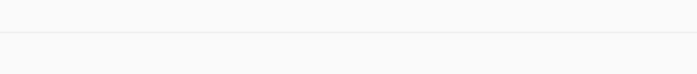
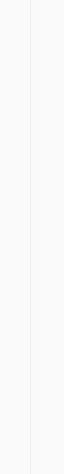

<!--docs:
title: "Material dividers"
layout: detail
section: components
excerpt: "A divider is a thin line that groups content in lists and layouts."
iconId:
path: /catalog/material-dividers/
-->

# Dividers

A [divider](https://material.io/components/dividers) is a thin line that groups content in lists and layouts.


## Contents

- [Making dividers accessible](#making-dividers-accessible)
- [Anatomy and key properties](#anatomy-and-key-properties)
- [Types](#types)
- [Theming dividers](#theming-dividers)

## Making dividers accessible

Flutter's APIs support accessibility setting for large fonts, screen readers, and sufficient contrast. For more information, go to Flutter's [accessibility](https://flutter.dev/docs/development/accessibility-and-localization/accessibility) and [internationalization](https://flutter.dev/docs/development/accessibility-and-localization/internationalization) pages.

For more guidance on writing labels, go to [our page on how to write a good accessibility label](https://material.io/design/usability/accessibility.html#writing).

## Anatomy and key properties

The following shows the anatomy of a divider:


### Divider

| &nbsp; | Property |
|---|---|
| Color | Within the `Divider` widget use the `color` parameter |
| Space | Within the `Divider` widget use the `height` parameter. Within the `VerticalDivider` widget use the  `width` parameter.|
| Indent | Within the `Divider` widget use the `indent` parameter |
| End Indent | Within the `Divider` widget use the `endIndent` parameter |
| Thickness | Within the `Divider` widget use the `thickness` parameter |

## Types

There are 3 types of dividers:

1. [horizontal divider](#horizontal-divider)
2. [vertical divider](#vertical-divider)

### Horizontal Divider

Full-bleed dividers separate content into sections and span the entire length of a layout.

`Divider`

- [Class definition](https://api.flutter.dev/flutter/material/Divider-class.html)
- [GitHub source](https://github.com/flutter/flutter/blob/master/packages/flutter/lib/src/material/divider.dart)
- [Dartpad demo](https://dartpad.dev/embed-flutter.html?gh_owner=material-components&gh_repo=material-components-flutter&gh_path=docs/components/dartpad/dividers/divider&gh_ref=develop)



```dart
Divider()
```

### Vertical Divider

Inset dividers separate related content, anchored by elements that align with the app bar title.

`VerticalDivider`

- [Class definition](https://api.flutter.dev/flutter/material/VerticalDivider-class.html)
- [GitHub source](https://github.com/flutter/flutter/blob/master/packages/flutter/lib/src/material/divider.dart)
- [Dartpad demo](https://dartpad.dev/embed-flutter.html?gh_owner=material-components&gh_repo=material-components-flutter&gh_path=docs/components/dartpad/dividers/vertical_divider&gh_ref=develop)



```dart
VerticalDivider()
```

## Theming dividers

`Divider`

- [Class definition](https://api.flutter.dev/flutter/material/Divider-class.html)
- [GitHub source](https://github.com/flutter/flutter/blob/master/packages/flutter/lib/src/material/divider.dart)
- [Dartpad demo](https://dartpad.dev/embed-flutter.html?gh_owner=material-components&gh_repo=material-components-flutter&gh_path=docs/components/dartpad/dividers/theme&gh_ref=develop)

The following shows an inset divider with [Shrine theming](https://material.io/design/material-studies/shrine.html):0

```dart
import 'package:flutter/material.dart';

void main() => runApp(MyApp());

class MyApp extends StatefulWidget {
  @override
  _MyAppState createState() => _MyAppState();
}

class _MyAppState extends State<MyApp> {
  @override
  Widget build(BuildContext context) {
    return MaterialApp(
      theme: _buildShrineTheme(),
      home: Scaffold(
        body: DividerThemeDemo(),
      ),
    );
  }
}

class DividerThemeDemo extends StatelessWidget {
  @override
  Widget build(BuildContext context) {
    return Center(
      child: Column(
        children: <Widget>[
          Expanded(
            child: Container(
              color: Colors.amber,
              child: const Center(
                child: Text('Start'),
              ),
            ),
          ),
          const Divider(),
          Expanded(
            child: Container(
              color: Colors.blue,
              child: const Center(
                child: Text('End'),
              ),
            ),
          ),
        ],
      ),
    );
  }
}

ThemeData _buildShrineTheme() {
  final ThemeData base = ThemeData.light();
  return base.copyWith(
    colorScheme: _shrineColorScheme,
    accentColor: shrineBrown900,
    primaryColor: shrinePink100,
    buttonColor: shrinePink100,
    scaffoldBackgroundColor: shrineBackgroundWhite,
    cardColor: shrineBackgroundWhite,
    textSelectionColor: shrinePink100,
    errorColor: shrineErrorRed,
    buttonTheme: const ButtonThemeData(
      colorScheme: _shrineColorScheme,
      textTheme: ButtonTextTheme.normal,
    ),
    primaryIconTheme: _customIconTheme(base.iconTheme),
    textTheme: _buildShrineTextTheme(base.textTheme),
    primaryTextTheme: _buildShrineTextTheme(base.primaryTextTheme),
    accentTextTheme: _buildShrineTextTheme(base.accentTextTheme),
    iconTheme: _customIconTheme(base.iconTheme),
  );
}

IconThemeData _customIconTheme(IconThemeData original) {
  return original.copyWith(color: shrineBrown900);
}

TextTheme _buildShrineTextTheme(TextTheme base) {
  return base
      .copyWith(
        caption: base.caption.copyWith(
          fontWeight: FontWeight.w400,
          fontSize: 14,
          letterSpacing: defaultLetterSpacing,
        ),
        button: base.button.copyWith(
          fontWeight: FontWeight.w500,
          fontSize: 14,
          letterSpacing: defaultLetterSpacing,
        ),
      )
      .apply(
        fontFamily: 'Rubik',
        displayColor: shrineBrown900,
        bodyColor: shrineBrown900,
      );
}

const ColorScheme _shrineColorScheme = ColorScheme(
  primary: shrinePink100,
  primaryVariant: shrineBrown900,
  secondary: shrinePink50,
  secondaryVariant: shrineBrown900,
  surface: shrineSurfaceWhite,
  background: shrineBackgroundWhite,
  error: shrineErrorRed,
  onPrimary: shrineBrown900,
  onSecondary: shrineBrown900,
  onSurface: shrineBrown900,
  onBackground: shrineBrown900,
  onError: shrineSurfaceWhite,
  brightness: Brightness.light,
);

const Color shrinePink50 = Color(0xFFFEEAE6);
const Color shrinePink100 = Color(0xFFFEDBD0);
const Color shrinePink300 = Color(0xFFFBB8AC);
const Color shrinePink400 = Color(0xFFEAA4A4);

const Color shrineBrown900 = Color(0xFF442B2D);
const Color shrineBrown600 = Color(0xFF7D4F52);

const Color shrineErrorRed = Color(0xFFC5032B);

const Color shrineSurfaceWhite = Color(0xFFFFFBFA);
const Color shrineBackgroundWhite = Colors.white;

const defaultLetterSpacing = 0.03;

```
