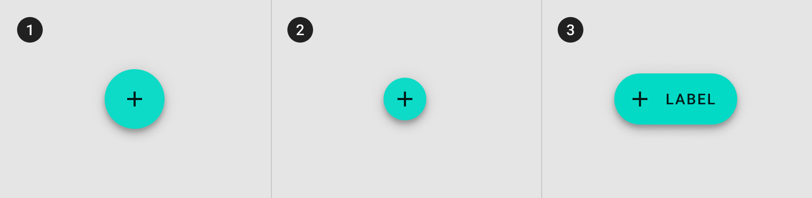
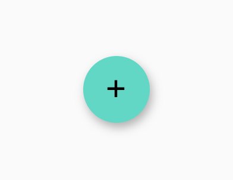

<!--docs:
title: "Floating action button"
layout: detail
section: components
excerpt: "A floating action button (FAB) represents the primary action of a screen."
iconId:
path: /catalog/floating-action-button/
-->

# Floating action buttons

A floating action button (FAB) represents the primary action of a screen.


## Contents

- [Using FABs](#using-fabs)
- [Regular FABs](#regular-fabs)
- [Mini FABs](#mini-fabs)
- [Extended FABs](#extended-fabs)
- [Theming FAB](#theming-fab)

## Using FABs

A FAB performs the primary, or most common, action on a screen. It appears in front of all screen content, typically as a circular shape with an icon in its center.

Before you can use Material FABs, you need to import the Material Components package for Flutter:

```dart
package:flutter/material.dart.
```

You need to be using a [`MaterialApp`](https://api.flutter.dev/flutter/material/MaterialApp-class.html).

For more information on getting started with the Material for Flutter, go to the Flutter [Material library](https://api.flutter.dev/flutter/material/material-library.html) page.

### Making FABs accessible

Flutter's APIs support accessibility setting for large fonts, screen readers, and sufficient contrast. For more information, go to Flutter's [accessibility](https://flutter.dev/docs/development/accessibility-and-localization/accessibility) and [internationalization](https://flutter.dev/docs/development/accessibility-and-localization/internationalization) pages.

For more guidance on writing labels, go to [our page on how to write a good accessibility label](https://material.io/design/usability/accessibility.html#writing).

### Types

There are three types of FABS: 1. [Regular FABs](#regular-fabs), 2. [Mini FABs](#mini-fabs), 3. [Extended FABs](#extended-fabs)



## Regular FABs

Regular FABs are FABs that are not expanded and are a regular size.

`FloatingActionButton`

- [Class description](https://api.flutter.dev/flutter/material/FloatingActionButton-class.html)
- [GitHub source](https://github.com/flutter/flutter/blob/master/packages/flutter/lib/src/material/floating_action_button.dart)
- [Dartpad Demo](https://dartpad.dev/embed-flutter.html?gh_owner=material-components&gh_repo=material-components-flutter&gh_path=docs/components/dartpad/fabs/regular&gh_ref=develop)

The following example shows a regular FAB.



```dart
FloatingActionButton(
  backgroundColor: const Color(0xff03dac6),
  foregroundColor: Colors.black,
  onPressed: () {
    // Respond to button press
  },
  child: Icon(Icons.add),
)
```

### Anatomy and key properties for regular FAB


A regular FAB has a container and an icon.

1. Container
1. Icon

#### Container attributes for regular FAB

&nbsp;         | Property
-------------- | -----------------------
**Color** | `backgroundColor`
**Stroke color** | `color` of `side` on a custom `shape`
**Stroke width** | `width` of `side` on a custom `shape`
**Shape** | `shape`
**Elevation** | `elevation`
**Ripple color** | `splashColor`

#### Icon attributes for regular FAB

&nbsp;         | Property
-------------- | ------------------------
**Icon** | `child`
**Color** | `foregroundColor`
**Size** | `size` on `child` when using an `Icon`

## Mini FABs

A mini FAB should be used on smaller screens.

Mini FABs can also be used to create visual continuity with other screen elements.

### Mini FABs example

`FloatingActionButton`

- [Class description](https://api.flutter.dev/flutter/material/FloatingActionButton-class.html)
- [GitHub source](https://github.com/flutter/flutter/blob/master/packages/flutter/lib/src/material/floating_action_button.dart)
- [Dartpad Demo](https://dartpad.dev/embed-flutter.html?gh_owner=material-components&gh_repo=material-components-flutter&gh_path=docs/components/dartpad/fabs/mini&gh_ref=develop)

The following example shows a mini FAB.


```dart
FloatingActionButton(
  backgroundColor: const Color(0xff03dac6),
  foregroundColor: Colors.black,
  mini: true,
  onPressed: () {
    // Respond to button press
  },
  child: Icon(Icons.add),
)
```

### Anatomy and key properties for mini FAB


A mini FAB has a container and an icon.

1. Container
1. Icon

#### Container attributes for mini FAB

&nbsp;         | Property
-------------- | -----------------------
**Color** | `backgroundColor`
**Stroke color** | `color` of `side` on a custom `shape`
**Stroke width** | `width` of `side` on a custom `shape`
**Shape** | `shape`
**Elevation** | `elevation`
**Ripple color** | `splashColor`

#### Icon attributes for mini FAB

&nbsp;         | Property
-------------- | ------------------------
**Icon** | `child`
**Color** | `foregroundColor`
**Size** | `size` on `child` when using an `Icon`

## Extended FABs

The extended FAB is wider, and it includes a text label.

### Extended FABs example

`FloatingActionButton`

- [Class description](https://api.flutter.dev/flutter/material/FloatingActionButton-class.html)
- [GitHub source](https://github.com/flutter/flutter/blob/master/packages/flutter/lib/src/material/floating_action_button.dart)
- [Dartpad Demo](https://dartpad.dev/embed-flutter.html?gh_owner=material-components&gh_repo=material-components-flutter&gh_path=docs/components/dartpad/fabs/extended&gh_ref=develop)

The following examples shows an extended FAB.


```dart
FloatingActionButton.extended(
  backgroundColor: const Color(0xff03dac6),
  foregroundColor: Colors.black,
  onPressed: () {
    // Respond to button press
  },
  icon: Icon(Icons.add),
  label: Text('EXTENDED'),
)
```

### Anatomy and key properties


An extended FAB has a text label, a transparent container and an optional icon.

1. Container
1. Icon
1. Text label

#### Container attributes for extended FAB

&nbsp;         | Property
-------------- | -----------------------
**Color** | `backgroundColor`
**Stroke color** | `color` of `side` on a custom `shape`
**Stroke width** | `width` of `side` on a custom `shape`
**Shape** | `shape`
**Elevation** | `elevation`
**Ripple color** | `splashColor`

#### Icon attributes for extended FAB

&nbsp;         | Property
-------------- | ------------------------
**Icon** | `icon`
**Color** | `foregroundColor`
**Size** | `size` on `child` when using an `Icon`

#### Text label attributes for extended FAB

&nbsp;         | Property
-------------- | ------------------------
**Text label** | `label`
**Color** | `foregroundColor`
**Typography** | `style` on `label` when using a `Text`

## Theming FAB

FABs supports [Material Theming](https://material.io/components/app-bars-top/#theming) and can be customized in terms of color, typography and shape.

### FAB theming example

The following example shows regular, mini, and extended FABs with the [Material Shrine Theme](https://material.io/design/material-studies/shrine.html).

- [Dartpad Demo](https://dartpad.dev/embed-flutter.html?gh_owner=material-components&gh_repo=material-components-flutter&gh_path=docs/components/dartpad/fabs/theme&gh_ref=develop)


```dart
import 'package:flutter/material.dart';

void main() => runApp(MyApp());

class MyApp extends StatelessWidget {
  @override
  Widget build(BuildContext context) {
    return MaterialApp(
      title: 'Flutter Demo',
      home: MyHomePage(),
      theme: _buildShrineTheme(),
    );
  }
}

class MyHomePage extends StatelessWidget {
  Widget build(BuildContext context) {
    return Scaffold(
      body: Center(
        child: Column(
          mainAxisAlignment: MainAxisAlignment.center,
          children: <Widget>[
            FloatingActionButton(
              onPressed: () {
                // Respond to button press
              },
              child: Icon(Icons.add),
            ),
            SizedBox(height: 8.0),
            FloatingActionButton(
              mini: true,
              onPressed: () {
                // Respond to button press
              },
              child: Icon(Icons.add),
            ),
            SizedBox(height: 8.0),
            FloatingActionButton.extended(
              onPressed: () {
                // Respond to button press
              },
              icon: Icon(Icons.add),
              label: Text('EXTENDED'),
            ),
          ],
        ),
      ),
    );
  }
}

ThemeData _buildShrineTheme() {
  final ThemeData base = ThemeData.light();
  return base.copyWith(
    colorScheme: _shrineColorScheme,
    accentColor: shrineBrown900,
    primaryColor: shrinePink100,
    buttonColor: shrinePink100,
    scaffoldBackgroundColor: shrineBackgroundWhite,
    cardColor: shrineBackgroundWhite,
    textSelectionColor: shrinePink100,
    errorColor: shrineErrorRed,
    buttonTheme: const ButtonThemeData(
      colorScheme: _shrineColorScheme,
      textTheme: ButtonTextTheme.normal,
    ),
    primaryIconTheme: _customIconTheme(base.iconTheme),
    textTheme: _buildShrineTextTheme(base.textTheme),
    primaryTextTheme: _buildShrineTextTheme(base.primaryTextTheme),
    accentTextTheme: _buildShrineTextTheme(base.accentTextTheme),
    iconTheme: _customIconTheme(base.iconTheme),
  );
}

IconThemeData _customIconTheme(IconThemeData original) {
  return original.copyWith(color: shrineBrown900);
}

TextTheme _buildShrineTextTheme(TextTheme base) {
  return base
      .copyWith(
        caption: base.caption.copyWith(
          fontWeight: FontWeight.w400,
          fontSize: 14,
          letterSpacing: defaultLetterSpacing,
        ),
        button: base.button.copyWith(
          fontWeight: FontWeight.w500,
          fontSize: 14,
          letterSpacing: defaultLetterSpacing,
        ),
      )
      .apply(
        fontFamily: 'Rubik',
        displayColor: shrineBrown900,
        bodyColor: shrineBrown900,
      );
}

const ColorScheme _shrineColorScheme = ColorScheme(
  primary: shrinePink100,
  primaryVariant: shrineBrown900,
  secondary: shrinePink50,
  secondaryVariant: shrineBrown900,
  surface: shrineSurfaceWhite,
  background: shrineBackgroundWhite,
  error: shrineErrorRed,
  onPrimary: shrineBrown900,
  onSecondary: shrineBrown900,
  onSurface: shrineBrown900,
  onBackground: shrineBrown900,
  onError: shrineSurfaceWhite,
  brightness: Brightness.light,
);

const Color shrinePink50 = Color(0xFFFEEAE6);
const Color shrinePink100 = Color(0xFFFEDBD0);
const Color shrinePink300 = Color(0xFFFBB8AC);
const Color shrinePink400 = Color(0xFFEAA4A4);

const Color shrineBrown900 = Color(0xFF442B2D);
const Color shrineBrown600 = Color(0xFF7D4F52);

const Color shrineErrorRed = Color(0xFFC5032B);

const Color shrineSurfaceWhite = Color(0xFFFFFBFA);
const Color shrineBackgroundWhite = Colors.white;

const defaultLetterSpacing = 0.03;

```
