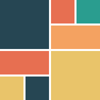

<!--docs:
title: "Image lists"
layout: detail
section: components
excerpt: "Image lists display a collection of images in an organized grid."
iconId:
path: /catalog/image-lists/
-->

# Image lists

[Image lists](https://material.io/components/image-lists/) display a collection of images in an organized grid.

We recommend the https://pub.dev/packages/flutter_staggered_grid_view package, which supports the following types of image lists:

### Masonry

### Quilted

### Woven

