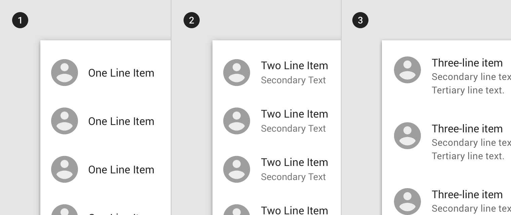
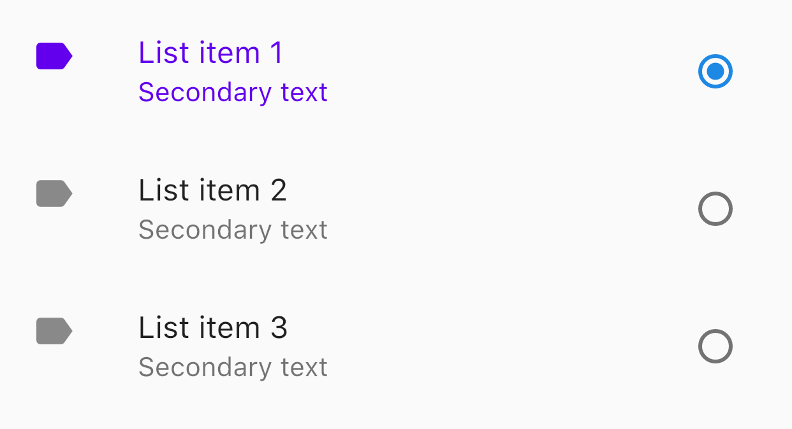
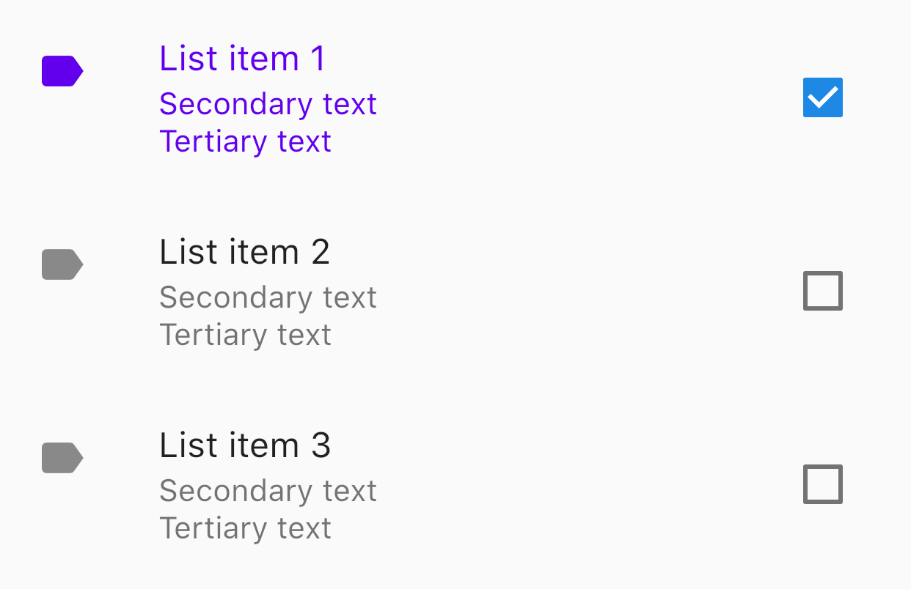
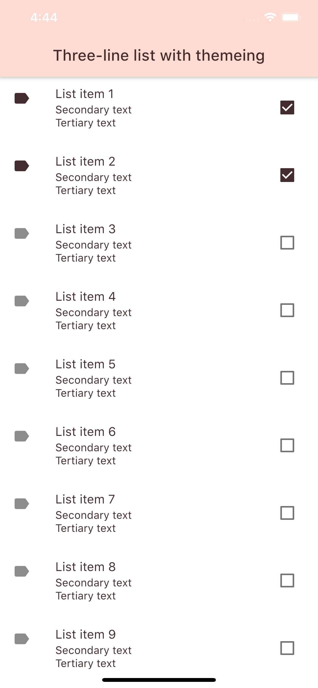

<!--docs:
title: "Lists"
layout: detail
section: components
excerpt: "Lists are continuous, vertical indexes of text or images."
iconId:
path: /catalog/lists/
-->

# Lists

[Lists](https://material.io/components/lists/) are continuous, vertical indexes of text or images.

There are three list types:
1. [Single-line list](#single-line-list)
1. [Two-line list](#two-line-list)
1. [Three-line list](#three-line-list)



## Using lists

### Making lists accessible

Flutter's list component APIs support labeling for accessibility. For more guidance on writing labels, go to [our page on how to write a good accessibility label](https://material.io/design/usability/accessibility.html#writing).


## List anatomy

The following anatomy diagram applies to all three list types:


The following anatomy diagrams apply  to the list item content:


A list consists of the following attributes:
1. List
2. Row
3. List item content
    1. Supporting visuals
    2. Primary text
    3. Metadata
    4. Controls


## Single-line list

Single-line list items contain a maximum of one line of text.


### Single-line list example

Source code API:
`ListTile`
* [Class definition](https://api.flutter.dev/flutter/material/ListTile-class.html)
* [GitHub source](https://github.com/flutter/flutter/blob/master/packages/flutter/lib/src/material/list_tile.dart)
* [Dartpad Demo](https://dartpad.dev/embed-flutter.html?gh_owner=material-components&gh_repo=material-components-flutter&gh_path=docs/components/dartpad/lists/single)


```dart
ListView(
  children: [
    ListTile(
      title: Text('Primary text'),
      leading: Icon(Icons.label),
      trailing: Text('Metadata'),
    ),
  ],
)
```

### Single-line list key properties


#### List properties

| &nbsp; | Property |
|---|---|
| Padding around the list | `padding` on `ListView` |

#### Row properties

| &nbsp; | Property |
|---|---|
| Enabled row | `enabled` on `ListTile` |
| Selected row | `selected` on `ListTile` |
| Padding on rows | `padding` on `ListTile` |


#### List item content

The following are tables of the list item contents:


##### Supporting visuals

| &nbsp; | Property |
|---|---|
| Icon | `leading` on `ListTile` |


##### Primary text

| &nbsp; | Property |
|---|---|
| Text label | `title` on `ListTile` |
| Text color | Within `title` property you can customize the Text color by using the `style` property. The `style` property uses a `TextStyle` property and within that class use the `color` property. |
| Typography | Within `title` property you can customize the typography by using the `style property`. The `style` property uses a `TextStyle` property and within that class use the `fontFamily` property. |


##### Metadata

| &nbsp; | Property |
|---|---|
| Text label | `trailing` on `ListTile` |
| Text color | Within `trailing` property you can customize the Text color by using the `style` property. The `style` property uses a `TextStyle` property and within that class use the `color` property. |
| Typography | Within `trailing` property you can customize the typography by using the `style property`. The `style` property uses a `TextStyle` property and within that class use the `fontFamily` property. |


##### Controls

| &nbsp; | Property |
|---|---|
| Primary action | Add interactive widget to `leading` on `ListTile` |
| Secondary action | Add interactive widget to `trailing` on `ListTile` |


## Two-line list

Two-line list items contain a maximum of two lines of text.


### Two-line list example


Source code API:
`ListTile`
* [Class definition](https://api.flutter.dev/flutter/material/ListTile-class.html)
* [GitHub source](https://github.com/flutter/flutter/blob/master/packages/flutter/lib/src/material/list_tile.dart)
* [Dartpad Demo](https://dartpad.dev/embed-flutter.html?gh_owner=material-components&gh_repo=material-components-flutter&gh_path=docs/components/dartpad/lists/two-line)



```dart
ListView(
  children: [
    ListTile(
      title: Text('List item 1'),
      subtitle: Text('Secondary text'),
      leading: Icon(Icons.label),
      trailing: Radio(
        value: 1,
        groupValue: groupValue,
        onChanged: (value) {
          // Update value.
        },
      ),
    ),
  ],
)
```

### Two-line list key properties

The following are tables of the list item contents:


#### List item content

The following are tables of the list item contents:


##### Supporting visuals

| &nbsp; | Property |
|---|---|
| Icon | `leading` on `ListTile` |


##### Primary text

| &nbsp; | Property |
|---|---|
| Text label | `title` on `ListTile` |
| Text color | Within `title` property you can customize the Text color by using the `style` property. The `style` property uses a `TextStyle` property and within that class use the `color` property. |
| Typography | Within `title` property you can customize the typography by using the `style property`. The `style` property uses a `TextStyle` property and within that class use the `fontFamily` property. |

##### Secondary text

| &nbsp; | Property |
|---|---|
| Text label | `subtitle` on `ListTile` |
| Text color | Within `subtitle` property you can customize the Text color by using the `style` property. The `style` property uses a `TextStyle` property and within that class use the `color` property. |
| Typography | Within `subtitle` property you can customize the typography by using the `style property`. The `style` property uses a `TextStyle` property and within that class use the `fontFamily` property. |

##### Metadata

| &nbsp; | Property |
|---|---|
| Text label | `trailing` on `ListTile` |
| Text color | Within `trailing` property you can customize the Text color by using the `style` property. The `style` property uses a `TextStyle` property and within that class use the `color` property. |
| Typography | Within `trailing` property you can customize the typography by using the `style property`. The `style` property uses a `TextStyle` property and within that class use the `fontFamily` property. |


##### Controls

| &nbsp; | Property |
|---|---|
| Primary action | Add interactive widget to `leading` on `ListTile` |
| Secondary action | Add interactive widget to `trailing` on `ListTile` |

### Three-line list

Three-line list items contains a maximum of three lines of text.


### Three-line list example


Source code API:
`ListTile`
* [Class definition](https://api.flutter.dev/flutter/material/ListTile-class.html)
* [GitHub source](https://github.com/flutter/flutter/blob/master/packages/flutter/lib/src/material/list_tile.dart)
* [Dartpad Demo](https://dartpad.dev/embed-flutter.html?gh_owner=material-components&gh_repo=material-components-flutter&gh_path=docs/components/dartpad/lists/three-line)



```dart
ListView(
  children: [
    ListTile(
      title: Text('List item 1'),
      isThreeLine: true,
      subtitle: Text('Secondary text\nTertiary text'),
      leading: Icon(Icons.label),
      trailing: Checkbox(
        value: false,
        onChanged: (value) {
          // Update value.
        },
      ),
    ),
  ],
)
```

### Three-line list key properties

The following are tables of the list item contents:


##### Supporting visuals

| &nbsp; | Property |
|---|---|
| Icon | `leading` on `ListTile` |

##### Primary text

| &nbsp; | Property |
|---|---|
| Text label | `title` on `ListTile` |
| Text color | Within `title` property you can customize the Text color by using the `style` property. The `style` property uses a `TextStyle` property and within that class use the `color` property. |
| Typography | Within `title` property you can customize the typography by using the `style property`. The `style` property uses a `TextStyle` property and within that class use the `fontFamily` property. |

##### Secondary text

| &nbsp; | Property |
|---|---|
| Text label | `subtitle` on `ListTile` |
| Text color | Within `subtitle` property you can customize the Text color by using the `style` property. The `style` property uses a `TextStyle` property and within that class use the `color` property. |
| Typography | Within `subtitle` property you can customize the typography by using the `style property`. The `style` property uses a `TextStyle` property and within that class use the `fontFamily` property. |


##### Tertiary text

| &nbsp; | Property |
|---|---|
| Text label | `subtitle` on `ListTile` with `isThreeLine` set to true |
| Text color | Within `subtitle` property you can customize the Text color by using the `style` property. The `style` property uses a `TextStyle` property and within that class use the `color` property. |
| Typography | Within `subtitle` property you can customize the typography by using the `style property`. The `style` property uses a `TextStyle` property and within that class use the `fontFamily` property. |


##### Metadata

| &nbsp; | Property |
|---|---|
| Text label | `trailing` on `ListTile` |
| Text label | Not by default but can be made by using `ListTile()` and use property `trailing` |
| Text color | Within `trailing` property you can customize the Text color by using the `style` property. The `style` property uses a `TextStyle` property and within that class use the `color` property. |
| Typography | Within `trailing` property you can customize the typography by using the `style property`. The `style` property uses a `TextStyle` property and within that class use the `fontFamily` property. |


##### Controls

| &nbsp; | Property |
|---|---|
| Primary action | Add interactive widget to `leading` on `ListTile` |
| Secondary action | Add interactive widget to `trailing` on `ListTile` |

### Theming lists

Lists support [Material Theming](https://material.io/components/lists/#theming) and can be
customized in terms of color and typography.

* [Dartpad Demo](https://dartpad.dev/embed-flutter.html?gh_owner=material-components&gh_repo=material-components-flutter&gh_path=docs/components/dartpad/lists/theme)




```dart
import 'package:flutter/material.dart';

void main() => runApp(MyApp());

class MyApp extends StatelessWidget {
  @override
  Widget build(BuildContext context) {
    return MaterialApp(
      title: 'Flutter Demo',
      home: ListDemo(),
      theme: _buildShrineTheme(),
    );
  }
}

class ListDemo extends StatefulWidget {
  @override
  _ListDemoState createState() => _ListDemoState();
}

class _ListDemoState extends State<ListDemo> {
  Map<int, bool> countToValue = <int, bool>{};

  @override
  Widget build(BuildContext context) {
    return Scaffold(
      appBar: AppBar(
        title: Text('Three-line list with theming'),
      ),
      body: ListTileTheme(
        selectedColor: shrineBrown900,
        child: ListView(
          children: [
            for (int count in List.generate(9, (index) => index + 1))
              ListTile(
                title: Text('List item $count'),
                isThreeLine: true,
                subtitle: Text('Secondary text\nTertiary text'),
                leading: Icon(Icons.label),
                selected: countToValue[count] ?? false,
                trailing: Checkbox(
                  value: countToValue[count] ?? false,
                  onChanged: (bool value) {
                    setState(() {
                      countToValue[count] = value;
                    });
                  },
                  activeColor: shrineBrown900,
                ),
              ),
          ],
        ),
      ),
    );
  }
}

ThemeData _buildShrineTheme() {
  final ThemeData base = ThemeData.light();
  return base.copyWith(
    colorScheme: _shrineColorScheme,
    accentColor: shrineBrown900,
    primaryColor: shrinePink100,
    buttonColor: shrinePink100,
    scaffoldBackgroundColor: shrineBackgroundWhite,
    cardColor: shrineBackgroundWhite,
    textSelectionColor: shrinePink100,
    errorColor: shrineErrorRed,
    buttonTheme: const ButtonThemeData(
      colorScheme: _shrineColorScheme,
      textTheme: ButtonTextTheme.normal,
    ),
    primaryIconTheme: _customIconTheme(base.iconTheme),
    textTheme: _buildShrineTextTheme(base.textTheme),
    primaryTextTheme: _buildShrineTextTheme(base.primaryTextTheme),
    accentTextTheme: _buildShrineTextTheme(base.accentTextTheme),
    iconTheme: _customIconTheme(base.iconTheme),
  );
}

IconThemeData _customIconTheme(IconThemeData original) {
  return original.copyWith(color: shrineBrown900);
}

TextTheme _buildShrineTextTheme(TextTheme base) {
  return base
      .copyWith(
        caption: base.caption.copyWith(
          fontWeight: FontWeight.w400,
          fontSize: 14,
          letterSpacing: defaultLetterSpacing,
        ),
        button: base.button.copyWith(
          fontWeight: FontWeight.w500,
          fontSize: 14,
          letterSpacing: defaultLetterSpacing,
        ),
      )
      .apply(
        fontFamily: 'Rubik',
        displayColor: shrineBrown900,
        bodyColor: shrineBrown900,
      );
}

const ColorScheme _shrineColorScheme = ColorScheme(
  primary: shrinePink100,
  primaryVariant: shrineBrown900,
  secondary: shrinePink50,
  secondaryVariant: shrineBrown900,
  surface: shrineSurfaceWhite,
  background: shrineBackgroundWhite,
  error: shrineErrorRed,
  onPrimary: shrineBrown900,
  onSecondary: shrineBrown900,
  onSurface: shrineBrown900,
  onBackground: shrineBrown900,
  onError: shrineSurfaceWhite,
  brightness: Brightness.light,
);

const Color shrinePink50 = Color(0xFFFEEAE6);
const Color shrinePink100 = Color(0xFFFEDBD0);
const Color shrinePink300 = Color(0xFFFBB8AC);
const Color shrinePink400 = Color(0xFFEAA4A4);

const Color shrineBrown900 = Color(0xFF442B2D);
const Color shrineBrown600 = Color(0xFF7D4F52);

const Color shrineErrorRed = Color(0xFFC5032B);

const Color shrineSurfaceWhite = Color(0xFFFFFBFA);
const Color shrineBackgroundWhite = Colors.white;

const defaultLetterSpacing = 0.03;
```
