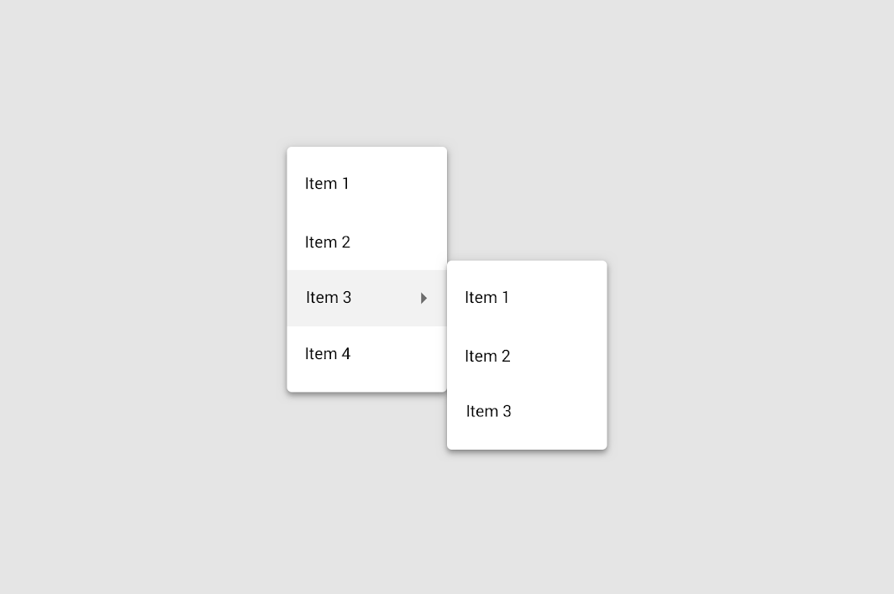

<!--docs:
title: "Menus"
layout: detail
section: components
excerpt: "Menus display a list of choices on temporary surfaces."
iconId:
path: /catalog/menus/
api_doc_root: true
-->

# Menus

[Menus](https://material.io/components/menus/#) display a list of choices on temporary surfaces.



**Contents**

- [Using menus](#using-menus)
- [Anatomy](#anatomy)
- [Types](#types)
- [Theming](#theming)

## Using menus

A menu displays a list of choices on a temporary surface. They appear when users interact with a button, action, or other control.

### Making menus accessible

Flutter's list component APIs support labeling for accessibility. For more guidance on writing labels, go to [our page on how to write a good accessibility label](https://material.io/design/usability/accessibility.html#writing).

## Anatomy

The following are menu anatomy diagrams showing all possible elements:


1. Container
1. Leading icon (optional)
1. Text
1. Divider (optional)
1. Command (optional)
1. Cascading menu indicator (optional)
1. Selection state (optional)

### Container attributes

&nbsp; | Property
------ | ---------
**Color** | Use the `PopupMenuButton` widget. Within this widget use the `Colors` property
**Height** | Use the `PopupMenuButton` widget. Within this widget use the `padding` property.

### Leading icon attributes

&nbsp;         | Property
-------------- | ------------------------
Adding Icon | Use the `PopupMenuButton` widget. Within this widget use `itemBuilder`. Within the list of itemBuilder add a `PopupMenuItem`. Within the child parameter add a `ListTile` widget and set the `leading` parameter to an `Icon`.

### Text attributes

&nbsp;         | Property
-------------- | ------------------------
**Text label** | Use the `PopupMenuButton` widget. Within this widget use `itemBuilder`. Within the list of itemBuilder add a `PopupMenuItem`. Within the child parameter add a `ListTile` widget and set the `title` parameter to a `Text` widget.
**Color**      | Follow the steps above and then within the Text widget fill out the `style` parameter.
**Typography** | Follow the steps above and then within the Text widget fill out the `style` parameter.

### Divider attributes

&nbsp;         | Property
-------------- | ------------------------
Add Divider | Use the `PopupMenuButton` widget. Within this widget use `itemBuilder`. Within the list of itemBuilder add a `PopupMenuDivider`.

### Command attributes

&nbsp;         | Property
-------------- | ------------------------
Adding Icon | Use the `PopupMenuButton` widget. Within this widget use `itemBuilder`. Within the list of itemBuilder add a `PopupMenuItem`. Within the child parameter add a `ListTile` widget and set the `trailing` parameter to an `Icon`.

### Cascading menu indicator attributes

&nbsp;         | Property
-------------- | ------------------------
Adding cascading menu | Not currently supported.

### Selection state attributes

&nbsp;         | Property
-------------- | ------------------------
Adding selection state attributes | Use the `PopupMenuButton` widget. Within this widget use `itemBuilder`. Within the list of itemBuilder add a `CheckedPopupMenuItem`.

## Types

Menus allow users to make a selection from multiple options. They are less prominent and take up less space than selection controls, such as a set of radio buttons.

There are two types of menus: 1\. [dropdown menus](#dropdown-menus), 2\. [exposed dropdown menus](#exposed-dropdown-menus).


### Dropdown menus

Dropdown menus display a list of options, triggered by an icon, button, or action. Their placement varies based on the element that opens them.

#### Dropdown menu example

The following is an example of a dropdown menu:

- [Class definition](https://api.flutter.dev/flutter/material/PopupMenuButton-class.html)
- [GitHub source](https://github.com/flutter/flutter/blob/master/packages/flutter/lib/src/material/popup_menu.dart)
- [Dartpad demo](https://dartpad.dev/embed-flutter.html?gh_owner=material-components&gh_repo=material-components-flutter&gh_path=docs/components/dartpad/menus/dropdown&gh_ref=develop)


```dart
PopupMenuButton(
  icon: Icon(Icons.more_vert),
  itemBuilder: (BuildContext context) => <PopupMenuEntry>[
    const PopupMenuItem(
      child: ListTile(
        leading: Icon(Icons.add),
        title: Text('Item 1'),
      ),
    ),
    const PopupMenuItem(
      child: ListTile(
        leading: Icon(Icons.anchor),
        title: Text('Item 2'),
      ),
    ),
    const PopupMenuItem(
      child: ListTile(
        leading: Icon(Icons.article),
        title: Text('Item 3'),
      ),
    ),
    const PopupMenuDivider(),
    const PopupMenuItem(child: Text('Item A')),
    const PopupMenuItem(child: Text('Item B')),
  ],
),
```

### Exposed dropdown menus

Exposed dropdown menus display the currently selected menu item above the list of options. Some variations can accept user-entered input.

#### Exposed dropdown menu example

The following is an example of a dropdown menu:

- [Class definition](https://api.flutter.dev/flutter/material/DropdownButton-class.html)
- [GitHub source](https://github.com/flutter/flutter/blob/master/packages/flutter/lib/src/material/dropdown.dart)
- [Dartpad demo](https://dartpad.dev/embed-flutter.html?gh_owner=material-components&gh_repo=material-components-flutter&gh_path=docs/components/dartpad/menus/exposed_dropdown&gh_ref=develop)


```dart
DropdownButton(
  value: dropdownValue,
  items: <DropdownMenuItem>[
    DropdownMenuItem(
      value: 'Option 1',
      child: Text('Option 1'),
    ),
    DropdownMenuItem(
      value: 'Option 2',
      child: Text('Option 2'),
    ),
    DropdownMenuItem(
      value: 'Option 3',
      child: Text('Option 3'),
    ),
    DropdownMenuItem(
      value: 'Option 4',
      child: Text('Option 4'),
    ),
    DropdownMenuItem(
      value: 'Option 5',
      child: Text('Option 5'),
    ),
    DropdownMenuItem(
      value: 'Option 6',
      child: Text('Option 6'),
    ),
],
  onChanged: (value) {
    setState(() {
      dropdownValue = value;
    });
  },
),
```

## Theming

Menus support [Material Theming](https://material.io/components/menus#theming) and can be customized in terms of color, typography and shape.

### Theming example

The following is an example of a dropdown menu:

- [Dartpad demo](https://dartpad.dev/embed-flutter.html?gh_owner=material-components&gh_repo=material-components-flutter&gh_path=docs/components/dartpad/menus/theme&gh_ref=develop)


```dart
import 'package:flutter/material.dart';

void main() => runApp(MyApp());

class MyApp extends StatelessWidget {
  @override
  Widget build(BuildContext context) {
    return MaterialApp(
      title: 'Dropdown Menu Themed Demo',
      debugShowCheckedModeBanner: false,
      home: DropdownMenuDemo(),
      theme: _buildShrineTheme(),
    );
  }
}

class DropdownMenuDemo extends StatelessWidget {
  @override
  Widget build(BuildContext context) {
    return Scaffold(
      appBar: AppBar(
        title: Text('Dropdown Menu Themed Demo'),
        actions: [
          PopupMenuButton(
            icon: Icon(Icons.more_vert),
            itemBuilder: (BuildContext context) => <PopupMenuEntry>[
              const PopupMenuItem(
                child: ListTile(
                  leading: Icon(Icons.add),
                  title: Text('Item 1'),
                ),
              ),
              const PopupMenuItem(
                child: ListTile(
                  leading: Icon(Icons.anchor),
                  title: Text('Item 2'),
                ),
              ),
              const PopupMenuItem(
                child: ListTile(
                  leading: Icon(Icons.article),
                  title: Text('Item 3'),
                ),
              ),
              const PopupMenuDivider(),
              const PopupMenuItem(child: Text('Item A')),
              const PopupMenuItem(child: Text('Item B')),
            ],
          ),
        ],
      ),
      body: Center(),
    );
  }
}

ThemeData _buildShrineTheme() {
  final ThemeData base = ThemeData.light();
  return base.copyWith(
    colorScheme: _shrineColorScheme,
    accentColor: shrineBrown900,
    primaryColor: shrinePink100,
    buttonColor: shrinePink100,
    scaffoldBackgroundColor: shrineBackgroundWhite,
    cardColor: shrineBackgroundWhite,
    textSelectionColor: shrinePink100,
    errorColor: shrineErrorRed,
    buttonTheme: const ButtonThemeData(
      colorScheme: _shrineColorScheme,
      textTheme: ButtonTextTheme.normal,
    ),
    primaryIconTheme: _customIconTheme(base.iconTheme),
    textTheme: _buildShrineTextTheme(base.textTheme),
    primaryTextTheme: _buildShrineTextTheme(base.primaryTextTheme),
    accentTextTheme: _buildShrineTextTheme(base.accentTextTheme),
    iconTheme: _customIconTheme(base.iconTheme),
  );
}

IconThemeData _customIconTheme(IconThemeData original) {
  return original.copyWith(color: shrineBrown900);
}

TextTheme _buildShrineTextTheme(TextTheme base) {
  return base
      .copyWith(
        caption: base.caption.copyWith(
          fontWeight: FontWeight.w400,
          fontSize: 14,
          letterSpacing: defaultLetterSpacing,
        ),
        button: base.button.copyWith(
          fontWeight: FontWeight.w500,
          fontSize: 14,
          letterSpacing: defaultLetterSpacing,
        ),
      )
      .apply(
        fontFamily: 'Rubik',
        displayColor: shrineBrown900,
        bodyColor: shrineBrown900,
      );
}

const ColorScheme _shrineColorScheme = ColorScheme(
  primary: shrinePink100,
  primaryVariant: shrineBrown900,
  secondary: shrinePink50,
  secondaryVariant: shrineBrown900,
  surface: shrineSurfaceWhite,
  background: shrineBackgroundWhite,
  error: shrineErrorRed,
  onPrimary: shrineBrown900,
  onSecondary: shrineBrown900,
  onSurface: shrineBrown900,
  onBackground: shrineBrown900,
  onError: shrineSurfaceWhite,
  brightness: Brightness.light,
);

const Color shrinePink50 = Color(0xFFFEEAE6);
const Color shrinePink100 = Color(0xFFFEDBD0);
const Color shrinePink300 = Color(0xFFFBB8AC);
const Color shrinePink400 = Color(0xFFEAA4A4);

const Color shrineBrown900 = Color(0xFF442B2D);
const Color shrineBrown600 = Color(0xFF7D4F52);

const Color shrineErrorRed = Color(0xFFC5032B);

const Color shrineSurfaceWhite = Color(0xFFFFFBFA);
const Color shrineBackgroundWhite = Colors.white;

const defaultLetterSpacing = 0.03;

```
