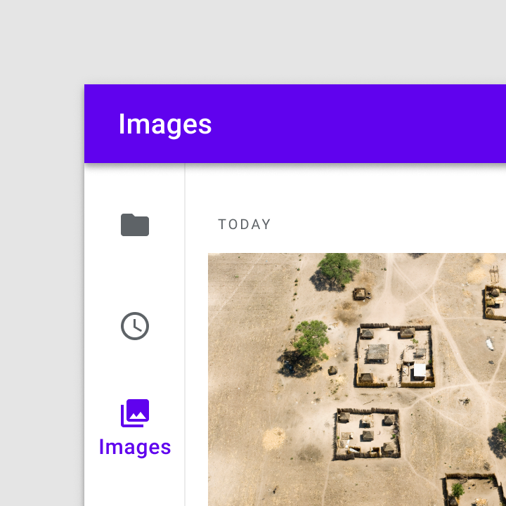
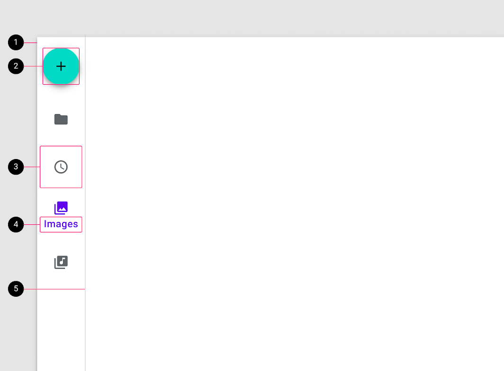

<!--docs:
title: "Navigation Rail"
layout: detail
section: components
excerpt: "Navigation rails provide ergonomic movement between primary destinations in apps running on a large screen device"
iconId: navigation_rail
path: /catalog/navigation-rail/
-->

# Navigation Rail

[Navigation rail](https://material.io/components/navigation-rail/#) allows
movement between primary destinations in an app.



**Contents**

*   [Using navigation rail](#using-navigation-rail)
*   [Navigation rail example](#navigation-rail-example)
*   [Theming](#theming-a-navigation-rail)

## Using navigation rail

Before you can a navigation rail, you need to import the Material Components package for Flutter:

```dart
package:flutter/material.dart.
```

You need to be using a [`MaterialApp`](https://api.flutter.dev/flutter/material/MaterialApp-class.html).

For more information on getting started with the Material for Flutter, go to the Flutter [Material library](https://api.flutter.dev/flutter/material/material-library.html) page.

### Making navigation rail accessible

Flutter's navigation component APIs support labeling for accessibility via the `semanticLabel` property. The content within `child` can have additional accessibility labeling.

For more guidance on writing labels, go to [our page on how to write a good accessibility label](https://material.io/design/usability/accessibility.html#writing).

## Navigation rail example

API and source code:

- [Class definition](https://api.flutter.dev/flutter/material/NavigationRail-class.html)
- [GitHub source](https://github.com/flutter/flutter/blob/master/packages/flutter/lib/src/material/navigation_rail.dart)
- [Dartpad demo](https://api.flutter.dev/flutter/material/NavigationRail-class.html#material.NavigationRail.1)

### Anatomy and key properties

The following is an anatomy diagram for the navigation rail:



1.  Container
2.  Header (eg. Floating action button) (optional)
3.  Destination icon
4.  Destination text label
5.  Divider (optional)

#### Container attributes

| &nbsp; | Property |
| --- | --- |
**Color**     | `backgroundColor`
**Elevation** | `elevation`
**Width** | `minWidth` OR `extended` and `minExtendedWidth`.

#### Header (eg. Floating action button) attributes

Specify a `FloatingActionButton` for `leading`. See the
[FAB documentation](https://github.com/material-components/material-components-flutter/blob/develop/docs/components/fab.md)
for customizing the FAB.

#### Destination attributes
| &nbsp; | Property |
| --- | --- |
**Icon** | `icon` or `selectedIcon`
**Label** | `label`
**Padding** | `padding`

#### Destination icon attributes

| &nbsp; | Property |
| --- | --- |
**Opacity** | `selectedIconTheme` or `unselectedIconTheme`
**Color** | `selectedIconTheme` or `unselectedIconTheme`
**Size** | `selectedIconTheme` or `unselectedIconTheme`

#### Destination text label attributes

| &nbsp; | Property |
| --- | --- |
**Text style** | `selectedLabelTextStyle` or `unselectedLabelTextStyle`
**Label visibility mode** | `labelType`

#### Divider attributes

Specify a `Divider` for `trailing`.

## Theming a navigation rail

Navigation rail supports
[Material Theming](https://material.io/components/navigation-rail#theming) and
can be customized in terms of background color, elevation, text style, and icon themes using `NavigationRailTheme`.

See the [`NavigationRailThemeData` class definition](https://api.flutter.dev/flutter/material/NavigationRailThemeData-class.html) for details.
