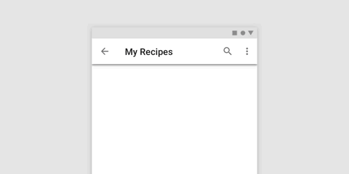
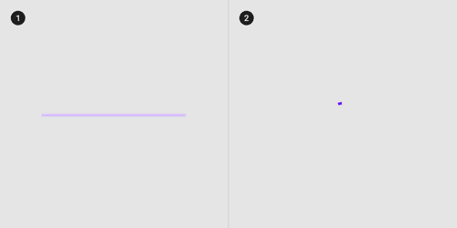
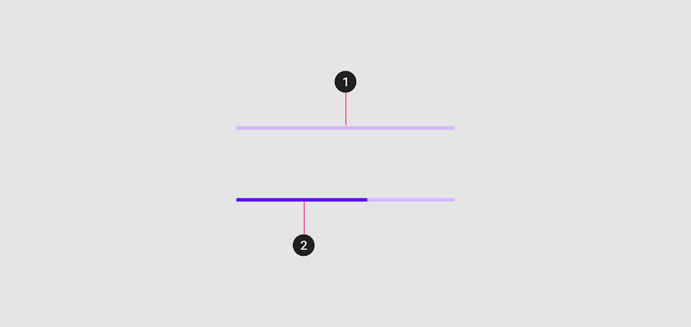
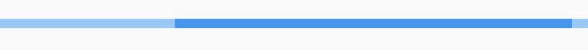
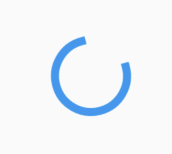
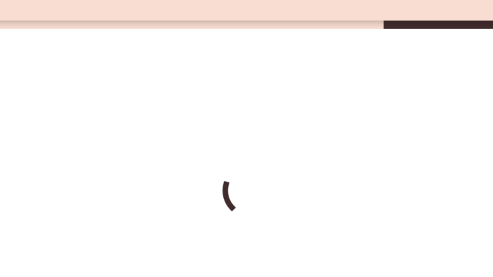

<!--docs:
title: "Material progress indicators"
layout: detail
section: components
excerpt: "Progress indicators express an unspecified wait time or display the length of a process."
iconId:
path: /catalog/material-progress-indicators/
-->

# Progress indicators

[Progress indicators](https://material.io/components/progress-indicators) express an unspecified wait time or display the length of a process.



## Contents

- [Using progress indicators](#using-progress-indicators)
- [Types](#types)
- [Anatomy and key properties](#anatomy-and-key-properties)
- [Linear progress indicators](#linear-progress-indicators)
- [Circular progress indicators](#circular-progress-indicators)
- [Theming progress indicators](#theming-progress-indicators)

## Using progress indicators

Progress indicators inform users about the status of ongoing processes, such as loading an app, submitting a form, or saving updates. They communicate an app’s state and indicate available actions, such as whether users can navigate away from the current screen.

### Making progress indicators accessible

Flutter's APIs support accessibility setting for large fonts, screen readers, and sufficient contrast. For more information, go to Flutter's [accessibility](https://flutter.dev/docs/development/accessibility-and-localization/accessibility) and [internationalization](https://flutter.dev/docs/development/accessibility-and-localization/internationalization) pages.

## Types

Material Design offers two visually distinct types of progress indicators:  1. [linear](#linear-progress-indicators) 2. [circular](#circular-progress-indicators) progress indicators. Only one type should represent each kind of activity in an app. For example, if a refresh action displays a circular indicator on one screen, that same action shouldn’t use a linear indicator elsewhere in the app.



Flutter implements these as subtypes of the [`ProgressIndicator`](https://api.flutter.dev/flutter/material/ProgressIndicator-class.html) class.

## Anatomy and key properties

The following is an anatomy diagram of a linear progress indicator:



A linear progress indicator consists of the following:

1. Track
1. Indicator

### Linear track

The track is a fixed width rule, with set boundaries for the indicator to travel along.

&nbsp;         | Property
-------------- | ------------------------
**Color**| backgroundColor

### Linear indicator

The indicator animates along the length of the track.

&nbsp;         | Property
-------------- | ------------------------
**Color** | valueColor and use the class AlwaysStoppedAnimation<>()

## Linear progress indicators

Linear progress indicators display progress by animating an indicator along the length of a fixed, visible track. The behavior of the indicator is dependent on whether the progress of a process is known.

- Linear progress indicators support both determinate and indeterminate operations.
- Determinate operations display the indicator increasing in width from 0 to 100% of the track, in sync with the process’s progress.
- Indeterminate operations display the indicator continually growing and shrinking along the track until the process is complete.

### Linear progress indicator example

`LinearProgressIndicator`

- [Class definition](https://api.flutter.dev/flutter/material/LinearProgressIndicator-class.html)
- [GitHub source](https://github.com/flutter/flutter/blob/master/packages/flutter/lib/src/material/progress_indicator.dart)
- [Dartpad demo](https://dartpad.dev/embed-flutter.html?gh_owner=material-components&gh_repo=material-components-flutter&gh_path=docs/components/dartpad/progress_indicators/linear&gh_ref=develop)

The following example shows an indeterminate linear progress indicator:



```dart
body: Center(
    child: LinearProgressIndicator(),
),
```

## Circular progress indicators

Circular progress indicators display progress by animating an indicator along an invisible circular track in a clockwise direction. They can be applied directly to a surface, such as a button or card.

- Circular progress indicators support both determinate and indeterminate processes.
- Determinate circular indicators fill the invisible, circular track with color, as the indicator moves from 0 to 360 degrees.
- Indeterminate circular indicators grow and shrink in size while moving along the invisible track.



### Circular progress indicator example

`CircularProgressIndicator`

- [Class definition](https://api.flutter.dev/flutter/material/CircularProgressIndicator-class.html)
- [GitHub source](https://github.com/flutter/flutter/blob/master/packages/flutter/lib/src/material/progress_indicator.dart)
- [Dartpad demo](https://dartpad.dev/embed-flutter.html?gh_owner=material-components&gh_repo=material-components-flutter&gh_path=docs/components/dartpad/progress_indicators/circular&gh_ref=develop)

The following shows an determinate circular progress indicator

```dart
body: Center(
    child: CircularProgressIndicator(),
),
```

## Theming progress indicators

`LinearProgressIndicator`

- [Class definition](https://api.flutter.dev/flutter/material/LinearProgressIndicator-class.html)
- [GitHub source](https://github.com/flutter/flutter/blob/master/packages/flutter/lib/src/material/progress_indicator.dart)
- [Dartpad demo](https://dartpad.dev/embed-flutter.html?gh_owner=material-components&gh_repo=material-components-flutter&gh_path=docs/components/dartpad/progress_indicators/theme&gh_ref=develop)

`CircularProgressIndicator`

- [Class definition](https://api.flutter.dev/flutter/material/CircularProgressIndicator-class.html)
- [GitHub source](https://github.com/flutter/flutter/blob/master/packages/flutter/lib/src/material/progress_indicator.dart)
- [Dartpad demo](https://dartpad.dev/embed-flutter.html?gh_owner=material-components&gh_repo=material-components-flutter&gh_path=docs/components/dartpad/progress_indicators/theme&gh_ref=develop)

The following shows an indeterminate linear progress indicator and a determinate circular progress indicator with [Shrine theming](https://material.io/design/material-studies/shrine.html):



```dart
import 'package:flutter/material.dart';

void main() {
  runApp(App());
}

class App extends StatelessWidget {
  @override
  Widget build(BuildContext context) {
    return MaterialApp(
      title: 'Theme Progress Indicator Demo',
      debugShowCheckedModeBanner: false,
      theme: _buildShrineTheme(),
      home: Scaffold(
        appBar: AppBar(
          title: Text('Theme Progress Indicator Demo'),
        ),
        body: Center(
          child: Column(
            children: [
              Divider(),
              LinearProgressIndicator(),
              CircularProgressIndicator(),
            ],
          ),
        ),
      ),
    );
  }
}

ThemeData _buildShrineTheme() {
  final ThemeData base = ThemeData.light();
  return base.copyWith(
    colorScheme: _shrineColorScheme,
    toggleableActiveColor: shrinePink400,
    accentColor: shrineBrown900,
    primaryColor: shrinePink100,
    buttonColor: shrinePink100,
    scaffoldBackgroundColor: shrineBackgroundWhite,
    cardColor: shrineBackgroundWhite,
    textSelectionColor: shrinePink100,
    errorColor: shrineErrorRed,
    primaryIconTheme: _customIconTheme(base.iconTheme),
    textTheme: _buildShrineTextTheme(base.textTheme),
    primaryTextTheme: _buildShrineTextTheme(base.primaryTextTheme),
    accentTextTheme: _buildShrineTextTheme(base.accentTextTheme),
    iconTheme: _customIconTheme(base.iconTheme),
  );
}

IconThemeData _customIconTheme(IconThemeData original) {
  return original.copyWith(color: shrineBrown900);
}

TextTheme _buildShrineTextTheme(TextTheme base) {
  return base.apply(
    fontFamily: 'Rubik',
    displayColor: shrineBrown900,
    bodyColor: shrineBrown900,
  );
}

const ColorScheme _shrineColorScheme = ColorScheme(
  primary: shrinePink100,
  primaryVariant: shrineBrown900,
  secondary: shrinePink50,
  secondaryVariant: shrineBrown900,
  surface: shrineSurfaceWhite,
  background: shrineBackgroundWhite,
  error: shrineErrorRed,
  onPrimary: shrineBrown900,
  onSecondary: shrineBrown900,
  onSurface: shrineBrown900,
  onBackground: shrineBrown900,
  onError: shrineSurfaceWhite,
  brightness: Brightness.light,
);

const Color shrinePink50 = Color(0xFFFEEAE6);
const Color shrinePink100 = Color(0xFFFEDBD0);
const Color shrinePink300 = Color(0xFFFBB8AC);
const Color shrinePink400 = Color(0xFFEAA4A4);

const Color shrineBrown900 = Color(0xFF442B2D);
const Color shrineBrown600 = Color(0xFF7D4F52);

const Color shrineErrorRed = Color(0xFFC5032B);

const Color shrineSurfaceWhite = Color(0xFFFFFBFA);
const Color shrineBackgroundWhite = Colors.white;

```
