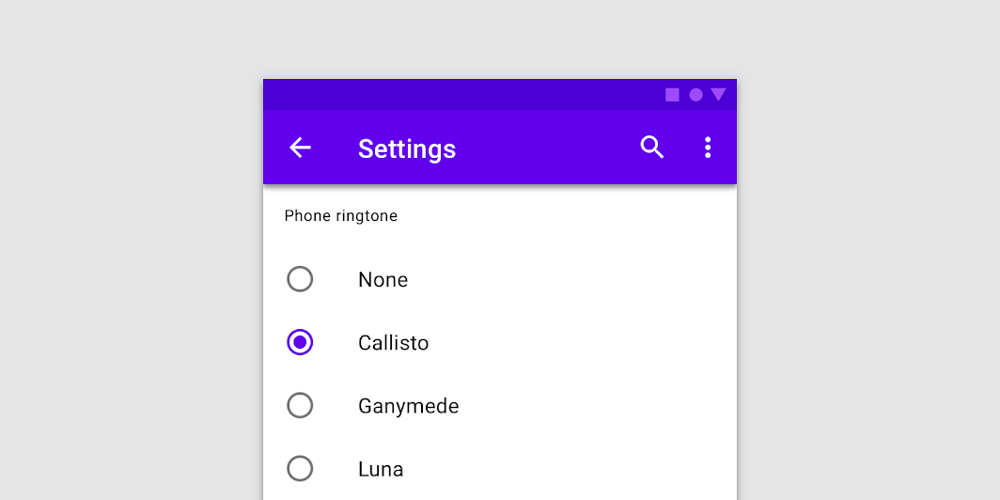
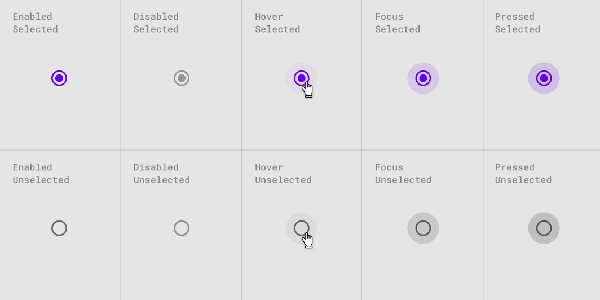

<!--docs:
title: "Material selection controls: Radio buttons"
layout: detail
section: components
excerpt: "Selection controls allow the user to select options."
iconId: 
path: /catalog/SelectionControlsRadioButtons/
-->

# Selection controls: radio buttons

[Selection controls](https://material.io/components/selection-controls#usage) allow the user to select options.

Use radio buttons to:

- Select a single option from a list
- Expose all available options
- If available options can be collapsed, consider using a dropdown menu instead, as it uses less space.



## Contents

- [Contents](#contents)
- [Using radio buttons](#using-radio-buttons)
- [Import radio buttons](#import-radio-buttons)
- [Making radio buttons accessible](#making-radio-buttons-accessible)
- [Radio buttons example](#radio-buttons-example)
- [Theming](#theming)

## Using radio buttons

Radio buttons allow the user to select one option from a set. Use radio buttons when the user needs to see all available options. If available options can be collapsed, consider using a dropdown menu because it uses less space.

### Import radio buttons

Before you can use radio buttons, you need to import the Material Components package for Flutter:

```dart
package:flutter/material.dart.
```

You need to be using a [`MaterialApp`](https://api.flutter.dev/flutter/material/MaterialApp-class.html).

For more information on getting started with the Material for Flutter, go to the Flutter [Material library](https://api.flutter.dev/flutter/material/material-library.html) page.

### Making radio buttons accessible

Flutter's APIs support accessibility setting for large fonts, screen readers, and sufficient contrast. For more information, go to Flutter's [accessibility](https://flutter.dev/docs/development/accessibility-and-localization/accessibility) and [internationalization](https://flutter.dev/docs/development/accessibility-and-localization/internationalization) pages.

For more guidance on writing labels, go to [our page on how to write a good accessibility label](https://material.io/design/usability/accessibility.html#writing).

## Radio buttons

### Radio buttons example

'Radio'
- [Class definition](https://api.flutter.dev/flutter/material/Radio-class.html)
- [GitHub source](https://github.com/flutter/flutter/blob/master/packages/flutter/lib/src/material/radio.dart)
- [Dartpad demo](https://dartpad.dev/embed-flutter.html?gh_owner=material-components&gh_repo=material-components-flutter&gh_path=docs/components/dartpad/radio_buttons/regular)

The following example shows radio buttons being used in a list with the last row disabled.


```dart
Column(
  children: <Widget>[
    for (int i = 1; i <= 5; i++)
      ListTile(
        title: Text(
          'Radio $i',
          style: Theme.of(context).textTheme.subtitle1.copyWith(color: i == 5 ? Colors.black38 : Colors.black),
        ),
        leading: Radio(
          value: i,
          groupValue: _value,
          activeColor: Color(0xFF6200EE),
          onChanged: i == 5 ? null : (int value) {
            setState(() {
              _value = value;
            });
          },
        ),
      ),
  ],
)
```

### Radio button states

Radio buttons can be selected or unselected. Radio buttons have enabled, disabled, hover, focused, and pressed states.



## Theming


- [Class definition](https://api.flutter.dev/flutter/material/Radio-class.html)
- [GitHub source](https://github.com/flutter/flutter/blob/master/packages/flutter/lib/src/material/radio.dart)
- [Dartpad demo](https://dartpad.dev/embed-flutter.html?gh_owner=material-components&gh_repo=material-components-flutter&gh_path=docs/components/dartpad/radio_buttons/theme)


Radio buttons support [Material Theming](https://material.io/components/buttons/#theming) and can be
customized in terms of color.

The following example shows radio buttons with the [Material Shrine Theme](https://material.io/design/material-studies/shrine.html).


```dart
import 'package:flutter/material.dart';

void main() => runApp(MyApp());

class MyApp extends StatelessWidget {
  @override
  Widget build(BuildContext context) {
    return MaterialApp(
      title: 'Flutter Demo',
      home: MyHomePage(),
      theme: _buildShrineTheme(),
    );
  }
}

class MyHomePage extends StatefulWidget {
  @override
  _MyHomePageState createState() => _MyHomePageState();
}

class _MyHomePageState extends State<MyHomePage> {
  int _value = 1;

  Widget build(BuildContext context) {
    return Scaffold(
      body: Column(
        children: <Widget>[
          for (int i = 1; i <= 5; i++)
            ListTile(
              title: Text(
                'Radio $i',
                style: Theme.of(context).textTheme.subtitle1.copyWith(color: i == 5 ? Colors.black38 : shrineBrown900),
              ),
              leading: Radio(
                value: i,
                groupValue: _value,
                onChanged: i == 5 ? null : (int value) {
                  setState(() {
                    _value = value;
                  });
                },
              ),
            ),
        ],
      ),
    );
  }
}

ThemeData _buildShrineTheme() {
  final ThemeData base = ThemeData.light();
  return base.copyWith(
    colorScheme: _shrineColorScheme,
    toggleableActiveColor: shrinePink400,
    accentColor: shrineBrown900,
    primaryColor: shrinePink100,
    buttonColor: shrinePink100,
    scaffoldBackgroundColor: shrineBackgroundWhite,
    cardColor: shrineBackgroundWhite,
    textSelectionColor: shrinePink100,
    errorColor: shrineErrorRed,
    buttonTheme: const ButtonThemeData(
      colorScheme: _shrineColorScheme,
      textTheme: ButtonTextTheme.normal,
    ),
    primaryIconTheme: _customIconTheme(base.iconTheme),
    textTheme: _buildShrineTextTheme(base.textTheme),
    primaryTextTheme: _buildShrineTextTheme(base.primaryTextTheme),
    accentTextTheme: _buildShrineTextTheme(base.accentTextTheme),
    iconTheme: _customIconTheme(base.iconTheme),
  );
}

IconThemeData _customIconTheme(IconThemeData original) {
  return original.copyWith(color: shrineBrown900);
}

TextTheme _buildShrineTextTheme(TextTheme base) {
  return base
      .copyWith(
        caption: base.caption.copyWith(
          fontWeight: FontWeight.w400,
          fontSize: 14,
          letterSpacing: defaultLetterSpacing,
        ),
        button: base.button.copyWith(
          fontWeight: FontWeight.w500,
          fontSize: 14,
          letterSpacing: defaultLetterSpacing,
        ),
      )
      .apply(
        fontFamily: 'Rubik',
        displayColor: shrineBrown900,
        bodyColor: shrineBrown900,
      );
}

const ColorScheme _shrineColorScheme = ColorScheme(
  primary: shrinePink100,
  primaryVariant: shrineBrown900,
  secondary: shrinePink50,
  secondaryVariant: shrineBrown900,
  surface: shrineSurfaceWhite,
  background: shrineBackgroundWhite,
  error: shrineErrorRed,
  onPrimary: shrineBrown900,
  onSecondary: shrineBrown900,
  onSurface: shrineBrown900,
  onBackground: shrineBrown900,
  onError: shrineSurfaceWhite,
  brightness: Brightness.light,
);

const Color shrinePink50 = Color(0xFFFEEAE6);
const Color shrinePink100 = Color(0xFFFEDBD0);
const Color shrinePink300 = Color(0xFFFBB8AC);
const Color shrinePink400 = Color(0xFFEAA4A4);

const Color shrineBrown900 = Color(0xFF442B2D);
const Color shrineBrown600 = Color(0xFF7D4F52);

const Color shrineErrorRed = Color(0xFFC5032B);

const Color shrineSurfaceWhite = Color(0xFFFFFBFA);
const Color shrineBackgroundWhite = Colors.white;

const defaultLetterSpacing = 0.03;

import 'package:flutter/material.dart';
​
void main() => runApp(MyApp());
​
class MyApp extends StatelessWidget {
  @override
  Widget build(BuildContext context) {
    return MaterialApp(
      title: 'Flutter Demo',
      debugShowCheckedModeBanner: false,
      home: MyHomePage(),
      theme: _buildShrineTheme(),
    );
  }
}
​
class MyHomePage extends StatefulWidget {
  @override
  _MyHomePageState createState() => _MyHomePageState();
}
​
class _MyHomePageState extends State<MyHomePage> {
  int _value = 1;
​
  Widget build(BuildContext context) {
    return Scaffold(
      body: Column(
        children: <Widget>[
          for (int i = 1; i <= 5; i++)
            ListTile(
              title: Text(
                'Radio $i',
                style: Theme.of(context).textTheme.subtitle1.copyWith(color: i == 5 ? Colors.black38 : shrineBrown900),
              ),
              leading: Radio(
                value: i,
                groupValue: _value,
                onChanged: i == 5 ? null : (int value) {
                  setState(() {
                    _value = value;
                  });
                },
              ),
            ),
        ],
      ),
    );
  }
}
​
ThemeData _buildShrineTheme() {
  final ThemeData base = ThemeData.light();
  return base.copyWith(
    colorScheme: _shrineColorScheme,
    toggleableActiveColor: shrinePink400,
    accentColor: shrineBrown900,
    primaryColor: shrinePink100,
    buttonColor: shrinePink100,
    scaffoldBackgroundColor: shrineBackgroundWhite,
    cardColor: shrineBackgroundWhite,
    textSelectionColor: shrinePink100,
    errorColor: shrineErrorRed,
    buttonTheme: const ButtonThemeData(
      colorScheme: _shrineColorScheme,
      textTheme: ButtonTextTheme.normal,
    ),
    primaryIconTheme: _customIconTheme(base.iconTheme),
    textTheme: _buildShrineTextTheme(base.textTheme),
    primaryTextTheme: _buildShrineTextTheme(base.primaryTextTheme),
    accentTextTheme: _buildShrineTextTheme(base.accentTextTheme),
    iconTheme: _customIconTheme(base.iconTheme),
  );
}
​
IconThemeData _customIconTheme(IconThemeData original) {
  return original.copyWith(color: shrineBrown900);
}
​
TextTheme _buildShrineTextTheme(TextTheme base) {
  return base
      .copyWith(
        caption: base.caption.copyWith(
          fontWeight: FontWeight.w400,
          fontSize: 14,
          letterSpacing: defaultLetterSpacing,
        ),
        button: base.button.copyWith(
          fontWeight: FontWeight.w500,
          fontSize: 14,
          letterSpacing: defaultLetterSpacing,
        ),
      )
      .apply(
        fontFamily: 'Rubik',
        displayColor: shrineBrown900,
        bodyColor: shrineBrown900,
      );
}
​
const ColorScheme _shrineColorScheme = ColorScheme(
  primary: shrinePink100,
  primaryVariant: shrineBrown900,
  secondary: shrinePink50,
  secondaryVariant: shrineBrown900,
  surface: shrineSurfaceWhite,
  background: shrineBackgroundWhite,
  error: shrineErrorRed,
  onPrimary: shrineBrown900,
  onSecondary: shrineBrown900,
  onSurface: shrineBrown900,
  onBackground: shrineBrown900,
  onError: shrineSurfaceWhite,
  brightness: Brightness.light,
);
​
const Color shrinePink50 = Color(0xFFFEEAE6);
const Color shrinePink100 = Color(0xFFFEDBD0);
const Color shrinePink300 = Color(0xFFFBB8AC);
const Color shrinePink400 = Color(0xFFEAA4A4);
​
const Color shrineBrown900 = Color(0xFF442B2D);
const Color shrineBrown600 = Color(0xFF7D4F52);
​
const Color shrineErrorRed = Color(0xFFC5032B);
​
const Color shrineSurfaceWhite = Color(0xFFFFFBFA);
const Color shrineBackgroundWhite = Colors.white;
​
const defaultLetterSpacing = 0.03;
```
