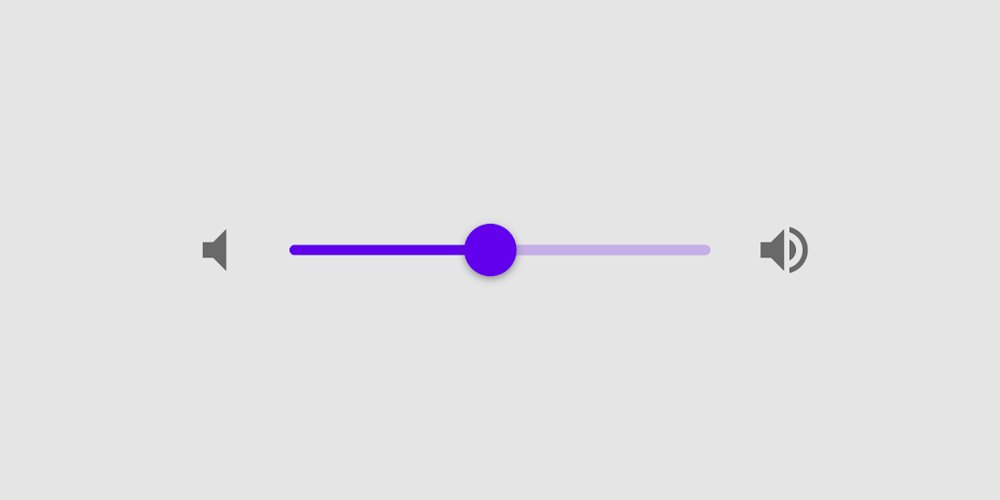
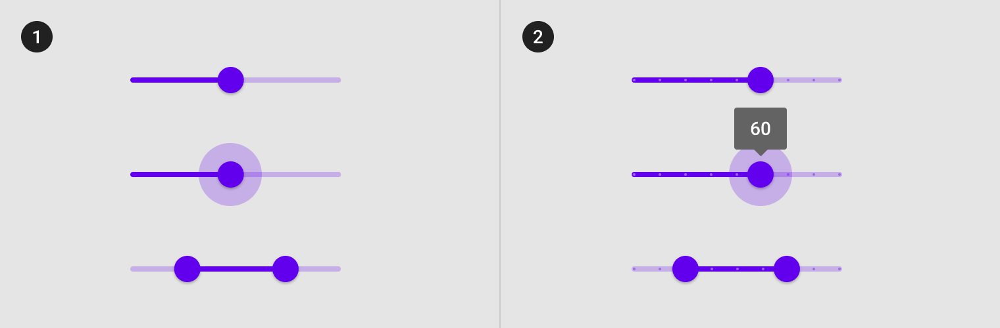
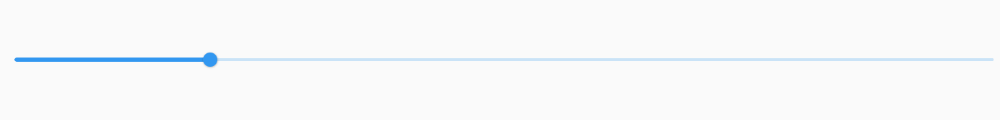
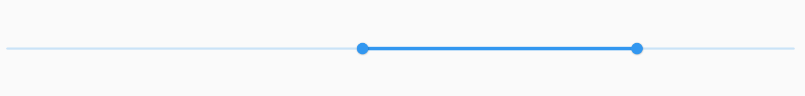
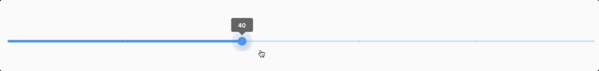
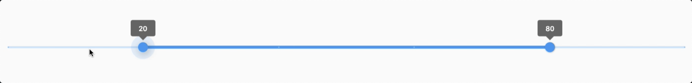
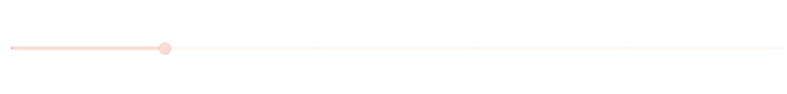
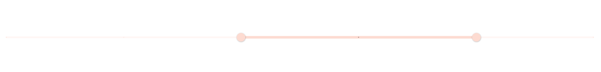

<!--docs:
title: "Sliders"
layout: detail
section: components
excerpt: "Sliders allow users to make selections from a range of values."
iconId: slider
path: /catalog/sliders/
-->

# Slider

[Sliders](https://material.io/components/sliders/) allow users to make
selections from a range of values.



**Contents**

- [Using sliders](#using-sliders)
- [Continuous slider](#continuous-slider)
- [Discrete slider](#discrete-slider)
- [Theming sliders](#theming-sliders)

## Using sliders

Sliders reflect a range of values along a bar, from which users may select a single value. They are ideal for adjusting settings such as volume, brightness, or applying image filters.

Sliders can have icons on both ends of the bar that reflect a range of values.

### Making sliders accessible

Flutter's APIs support accessibility setting for large fonts, screen readers, and sufficient contrast. For more information, go to Flutter's [accessibility](https://flutter.dev/docs/development/accessibility-and-localization/accessibility) and [internationalization](https://flutter.dev/docs/development/accessibility-and-localization/internationalization) pages.

For more guidance on writing labels, go to [our page on how to write a good accessibility label](https://material.io/design/usability/accessibility.html#writing).

### Types

There are two types of sliders: 1\. [Continuous](#continuous-sliders) 2\. [Discrete](#discrete-sliders)



A slider with one thumb is called a single point slider, and a slider with two thumbs is called a range slider.

### Anatomy and key properties

A slider has a track, one or two thumbs, and optional value label. A discrete slider also has tick marks.


1. Track
1. Thumb
1. Value label (optional)
1. Tick mark (discrete sliders)

#### Track attributes

| &nbsp; | Attribute |
|---|---|
| Track Shape | Wrap your `Slider` widget with a `SliderTheme` widget. Use the `SliderThemeData` widget for the SliderTheme.data parameter with the `SliderThemeData.trackShape` parameter set. |
| Range Track Shape | Wrap your `RangeSlider` widget with a `SliderTheme` widget within the data parameter use the `SliderThemeData` widget. Within this widget set the `rangeTrackShape` parameter. |
| Active Track Color | Wrap your `Slider` widget with a `SliderTheme` widget within the data parameter use the `SliderThemeData` widget. Within this widget set the `activeTrackColor` parameter. |
| InActive Track Color | Wrap your `Slider` widget with a `SliderTheme` widget within the data parameter use the `SliderThemeData` widget. Within this widget set the `inactiveTrackColor` parameter. |
| Track Height | Wrap your `Slider` widget with a `SliderTheme` widget within the data parameter use the `SliderThemeData` widget. Within this widget set the `trackHeight` parameter. |
| Disabled Active Track Color | Wrap your `Slider` widget with a `SliderTheme` widget within the data parameter use the `SliderThemeData` widget. Within this widget set the `disabledActiveTrackColor` parameter. |
| Disabled InActive Track Color | Wrap your `Slider` widget with a `SliderTheme` widget within the data parameter use the `SliderThemeData` widget. Within this widget set the `disabledInactiveTrackColor` parameter. |

#### Thumb attributes

| &nbsp; | Attribute |
|---|---|
| Thumb Shape | Wrap your `Slider` widget with a `SliderTheme` widget within the data parameter use the `SliderThemeData` widget. Within this widget set the `thumbShape` parameter. |
| Range Thumb Shape | Wrap your `RangeSlider` widget with a `SliderTheme` widget within the data parameter use the `SliderThemeData` widget. Within this widget set the `rangeThumbShape` parameter. |
| Thumb Color | Wrap your `Slider` widget with a `SliderTheme` widget within the data parameter use the `SliderThemeData` widget. Within this widget set the `thumbColor` parameter. |
| Disabled Thumb Color | Wrap your `Slider` widget with a `SliderTheme` widget within the data parameter use the `SliderThemeData` widget. Within this widget set the `disabledThumbColor` parameter. |
| Minimum Thumb Separtation| Wrap your `Slider` widget with a `SliderTheme` widget within the data parameter use the `SliderThemeData` widget. Within this widget set the `minThumbSeparation` parameter. |
| Thumb Selector | Wrap your `Slider` widget with a `SliderTheme` widget within the data parameter use the `SliderThemeData` widget. Within this widget set the `thumbSelector` parameter. |

#### Value label attributes

| &nbsp; | Attribute |
|---|---|
| Value Indicator Shape | Wrap your `Slider` widget with a `SliderTheme` widget within the data parameter use the `SliderThemeData` widget. Within this widget set the `valueIndicatorShape` parameter. |
| Range Value Indicator Color | Wrap your `RangeSlider` widget with a `SliderTheme` widget within the data parameter use the `SliderThemeData` widget. Within this widget set the `rangeValueIndicatorColor` parameter. |
| Value Indicator Color | Wrap your `Slider` widget with a `SliderTheme` widget within the data parameter use the `SliderThemeData` widget. Within this widget set the `valueIndicatorColor` parameter. |
| Value Indicator Text Style| Wrap your `Slider` widget with a `SliderTheme` widget within the data parameter use the `SliderThemeData` widget. Within this widget set the `valueIndicatorTextStyle` parameter. |
| Show Value Indicator Shape | Wrap your `Slider` widget with a `SliderTheme` widget within the data parameter use the `SliderThemeData` widget. Within this widget set the `showValueIndicatorShape` parameter. |

#### Tick mark attributes

| &nbsp; | Attribute |
|---|---|
| Tick Mark Shape | Wrap your `Slider` widget with a `SliderTheme` widget within the data parameter use the `SliderThemeData` widget. Within this widget set the `tickMarkShape` parameter. |
| Range Tick Mark Shape | Wrap your `RangeSlider` widget with a `SliderTheme` widget within the data parameter use the `SliderThemeData` widget. Within this widget set the `rangeTickMarkShape` parameter. |
| Active Tick Mark Color | Wrap your `Slider` widget with a `SliderTheme` widget within the data parameter use the `SliderThemeData` widget. Within this widget set the `activeTickMarkColor` parameter. |
| Inactive Tick Mark Color | Wrap your `Slider` widget with a `SliderTheme` widget within the data parameter use the `SliderThemeData` widget. Within this widget set the `inactiveTickMarkColor` parameter. |
| Disabled Active Tick Mark Color | Wrap your `Slider` widget with a `SliderTheme` widget within the data parameter use the `SliderThemeData` widget. Within this widget set the `mi` parameter. |
| Thumb Selector | Wrap your `Slider` widget with a `SliderTheme` widget within the data parameter use the `SliderThemeData` widget. Within this widget set the `thumbSelector` parameter. |

## Continuous sliders

Continuous sliders allow users to make meaningful selections that don’t require
a specific value.

### Continuous single point slider example

API and source code:

- [Class definition](https://api.flutter.dev/flutter/material/Slider-class.html)
- [GitHub source](https://github.com/flutter/flutter/blob/master/packages/flutter/lib/src/material/slider.dart)
- [Dartpad demo](https://dartpad.dev/embed-flutter.html?gh_owner=material-components&gh_repo=material-components-flutter&gh_path=docs/components/dartpad/sliders/continous_slider&gh_ref=develop)
- [YouTube video](https://www.youtube.com/watch?v=ufb4gIPDmEs&list=PLjxrf2q8roU23XGwz3Km7sQZFTdB996iG&index=58&ab_channel=Flutter)



```dart
double _sliderValue = 20;


Slider(
    value: _sliderValue,
    min: 0,
    max: 100,
    label: _sliderValue.round().toString(),
    onChanged: (value) {
        setState(() {
            _sliderValue = value;
        });
    },
),
```

### Continuous range slider example

API and source code:

- [Class definition](https://api.flutter.dev/flutter/material/Slider-class.html)
- [GitHub source](https://github.com/flutter/flutter/blob/master/packages/flutter/lib/src/material/range_slider.dart)
- [Dartpad demo](https://dartpad.dev/embed-flutter.html?gh_owner=material-components&gh_repo=material-components-flutter&gh_path=docs/components/dartpad/sliders/continous_range_slider&gh_ref=develop)

API and source code:



```dart
  RangeValues _rangeSliderDiscreteValues = const RangeValues(40, 80);
RangeSlider(
    values: _rangeSliderDiscreteValues,
    min: 0,
    max: 100,
    labels: RangeLabels(
        _rangeSliderDiscreteValues.start.round().toString(),
        _rangeSliderDiscreteValues.end.round().toString(),
    ),
    onChanged: (values) {
        setState(() {
            _rangeSliderDiscreteValues = values;
        });
    },
),

```

## Discrete sliders

Discrete sliders display a numeric value label upon pressing the thumb, which allows a user to input an exact value.

### Discrete single point slider example

API and source code:

- [Class definition](https://api.flutter.dev/flutter/material/Slider-class.html)
- [GitHub source](https://github.com/flutter/flutter/blob/master/packages/flutter/lib/src/material/slider.dart)
- [Dartpad demo](https://dartpad.dev/embed-flutter.html?gh_owner=material-components&gh_repo=material-components-flutter&gh_path=docs/components/dartpad/sliders/discrete_slider&gh_ref=develop)



```dart
double _sliderDiscreteValue = 20;
Slider(
    value: _sliderDiscreteValue,
    min: 0,
    max: 100,
    divisions: 5,
    label: _sliderDiscreteValue.round().toString(),
    onChanged: (value) {
        setState(() {
           _sliderDiscreteValue = value;
        });
    },
),
```

### Discrete range slider example

API and source code:

- [Class definition](https://api.flutter.dev/flutter/material/Slider-class.html)
- [GitHub source](https://github.com/flutter/flutter/blob/master/packages/flutter/lib/src/material/range_slider.dart)
- [Dartpad demo](https://dartpad.dev/embed-flutter.html?gh_owner=material-components&gh_repo=material-components-flutter&gh_path=docs/components/dartpad/sliders/discrete_range_slider&gh_ref=develop)



```dart
RangeValues _rangeSliderDiscreteValues = const RangeValues(40, 80);
RangeSlider(
    values: _rangeSliderDiscreteValues,
    min: 0,
    max: 100,
    divisions: 5,
    labels: RangeLabels(
        _rangeSliderDiscreteValues.start.round().toString(),
        _rangeSliderDiscreteValues.end.round().toString(),
    ),
    onChanged: (values) {
        setState(() {
            _rangeSliderDiscreteValues = values;
        });
    },
),
```

## Theming sliders

Sliders support
[Material Theming](https://material.io/components/sliders#theming) and can be
customized in terms of color and typography.

### Slider theming example

API and source code:

- [Class definition](https://api.flutter.dev/flutter/material/Slider-class.html)
- [GitHub source](https://github.com/flutter/flutter/blob/master/packages/flutter/lib/src/material/slider.dart)
- [Dartpad demo](https://dartpad.dev/embed-flutter.html?gh_owner=material-components&gh_repo=material-components-flutter&gh_path=docs/components/dartpad/sliders/theme&gh_ref=develop)

The following example shows a discrete range slider with Material's [Shrine](https://material.io/design/material-studies/shrine.html) theme.




```dart
import 'package:flutter/material.dart';

void main() => runApp(MyApp());

class MyApp extends StatefulWidget {
  @override
  _MyAppState createState() => _MyAppState();
}

class _MyAppState extends State<MyApp> {
  @override
  Widget build(BuildContext context) {
    return MaterialApp(
      theme: _buildShrineTheme(),
      home: Scaffold(
        body: SliderThemeDemo(),
      ),
    );
  }
}

class SliderThemeDemo extends StatefulWidget {
  @override
  _SliderThemeDemoState createState() => _SliderThemeDemoState();
}

class _SliderThemeDemoState extends State<SliderThemeDemo> {
  double _sliderDiscreteValue = 20;
  RangeValues _rangeSliderDiscreteValues = const RangeValues(40, 80);

  @override
  Widget build(BuildContext context) {
    return Column(
      children: [
        Expanded(
          child: Slider(
            value: _sliderDiscreteValue,
            min: 0,
            max: 100,
            divisions: 5,
            label: _sliderDiscreteValue.round().toString(),
            onChanged: (value) {
              setState(() {
                _sliderDiscreteValue = value;
              });
            },
          ),
        ),
        Expanded(
          child: RangeSlider(
            values: _rangeSliderDiscreteValues,
            min: 0,
            max: 100,
            divisions: 5,
            labels: RangeLabels(
              _rangeSliderDiscreteValues.start.round().toString(),
              _rangeSliderDiscreteValues.end.round().toString(),
            ),
            onChanged: (values) {
              setState(() {
                _rangeSliderDiscreteValues = values;
              });
            },
          ),
        )
      ],
    );
  }
}

ThemeData _buildShrineTheme() {
  final ThemeData base = ThemeData.light();
  return base.copyWith(
    colorScheme: _shrineColorScheme,
    accentColor: shrineBrown900,
    primaryColor: shrinePink100,
    buttonColor: shrinePink100,
    scaffoldBackgroundColor: shrineBackgroundWhite,
    cardColor: shrineBackgroundWhite,
    textSelectionTheme: TextSelectionThemeData(selectionColor: shrinePink100),
    errorColor: shrineErrorRed,
    buttonTheme: const ButtonThemeData(
      colorScheme: _shrineColorScheme,
      textTheme: ButtonTextTheme.normal,
    ),
    primaryIconTheme: _customIconTheme(base.iconTheme),
    textTheme: _buildShrineTextTheme(base.textTheme),
    primaryTextTheme: _buildShrineTextTheme(base.primaryTextTheme),
    accentTextTheme: _buildShrineTextTheme(base.accentTextTheme),
    iconTheme: _customIconTheme(base.iconTheme),
  );
}

IconThemeData _customIconTheme(IconThemeData original) {
  return original.copyWith(color: shrineBrown900);
}

TextTheme _buildShrineTextTheme(TextTheme base) {
  return base
      .copyWith(
        caption: base.caption.copyWith(
          fontWeight: FontWeight.w400,
          fontSize: 14,
          letterSpacing: defaultLetterSpacing,
        ),
        button: base.button.copyWith(
          fontWeight: FontWeight.w500,
          fontSize: 14,
          letterSpacing: defaultLetterSpacing,
        ),
      )
      .apply(
        fontFamily: 'Rubik',
        displayColor: shrineBrown900,
        bodyColor: shrineBrown900,
      );
}

const ColorScheme _shrineColorScheme = ColorScheme(
  primary: shrinePink100,
  primaryVariant: shrineBrown900,
  secondary: shrinePink50,
  secondaryVariant: shrineBrown900,
  surface: shrineSurfaceWhite,
  background: shrineBackgroundWhite,
  error: shrineErrorRed,
  onPrimary: shrineBrown900,
  onSecondary: shrineBrown900,
  onSurface: shrineBrown900,
  onBackground: shrineBrown900,
  onError: shrineSurfaceWhite,
  brightness: Brightness.light,
);

const Color shrinePink50 = Color(0xFFFEEAE6);
const Color shrinePink100 = Color(0xFFFEDBD0);
const Color shrinePink300 = Color(0xFFFBB8AC);
const Color shrinePink400 = Color(0xFFEAA4A4);

const Color shrineBrown900 = Color(0xFF442B2D);
const Color shrineBrown600 = Color(0xFF7D4F52);

const Color shrineErrorRed = Color(0xFFC5032B);

const Color shrineSurfaceWhite = Color(0xFFFFFBFA);
const Color shrineBackgroundWhite = Colors.white;

const defaultLetterSpacing = 0.03;

```
