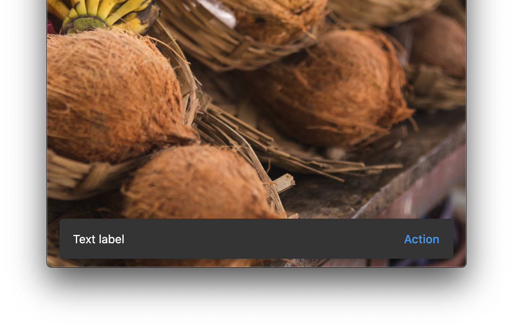

<!--docs:
title: "Material Snackbars"
layout: detail
section: components
excerpt: "Snackbars provide brief messages about app processes at the bottom of the screen."
iconId:
path: /catalog/Snackbars/
-->

# Snackbars

[Snackbars](https://material.io/components/snackbars) provide brief messages about app processes at the bottom of the screen.


## Contents

- [Using snackbars](#using-snackbars)
- [Snackbars example](#snackbar-example)
- [Theming snackbars](#theming-example)

## Using snackbars

Snackbars inform users of a process that an app has performed or will perform. They appear temporarily, towards the bottom of the screen. They shouldn’t interrupt the user experience, and they don’t require user input to disappear.

### Making snackbars accessible

A SnackBar with an action will not time out when TalkBack or VoiceOver are enabled. This is controlled by [`AccessibilityFeatures.accessibleNavigation`](https://api.flutter.dev/flutter/dart-ui/AccessibilityFeatures/accessibleNavigation.html).

### Anatomy and key properties

The following is an anatomy diagram of a snackbar:


1. Text label
1. Container
1. Action (optional)

#### Text label properties

| &nbsp; | Property |
|---|---|
| **Text label** | pass a Widget to `content`|
| **Text color** | pass a Widget to `content`|
| **Typography** | pass a Widget to `content`|

#### Container properties

&nbsp; | Property
------ | ---------
**Color** | `backgroundColor`
**Elevation** | `elevation`
**Shape border** | `shape`

#### Action properties

&nbsp;         | Property
-------------- | ------------------------
**Color** | `color` on `action`
**Text label** | `label` on `action`
**Text color** | `textColor` on `action`

## Snackbar example

`SnackBar`

- [Class definition](https://api.flutter.dev/flutter/material/SnackBar-class.html)
- [GitHub source](https://github.com/flutter/flutter/blob/master/packages/flutter/lib/src/material/snack_bar.dart)
- [Dartpad Demo](https://dartpad.dev/embed-flutter.html?gh_owner=material-components&gh_repo=material-components-flutter&gh_path=docs/components/dartpad/snackbars/regular)

The following is an example of a snackbar with an action button:



```dart
SnackBar(
  behavior: SnackBarBehavior.floating,
  content: Text('Text label'),
  action: SnackBarAction(
    label: 'Action',
    onPressed: () {},
  ),
)
```

## Theming example

`SnackBar`

- [Class definition](https://api.flutter.dev/flutter/material/SnackBar-class.html)
- [GitHub source](https://github.com/flutter/flutter/blob/master/packages/flutter/lib/src/material/snack_bar.dart)
- [Dartpad Demo](https://dartpad.dev/embed-flutter.html?gh_owner=material-components&gh_repo=material-components-flutter&gh_path=docs/components/dartpad/snackbars/theme)

The following is an example of a snackbar with an action button that uses the Material.io [Shrine](https://material.io/design/material-studies/shrine.html) color theming::


```dart
import 'package:flutter/material.dart';

void main() => runApp(MyApp());

class MyApp extends StatelessWidget {
  @override
  Widget build(BuildContext context) {
    return MaterialApp(
      title: 'Flutter Demo',
      debugShowCheckedModeBanner: false,
      home: SnackBarsDemo(),
      theme: buildShrineTheme(),
    );
  }
}

class SnackBarsDemo extends StatelessWidget {
  Widget build(BuildContext context) {
    return Scaffold(
      appBar: AppBar(
        title: Text('Snackbars'),
        actions: [SnackbarButton()],
      ),
      body: Container(
        decoration: BoxDecoration(
          image: DecorationImage(
            image: NetworkImage(
                'replace with url for snackbars-background.jpg after merge'),
            fit: BoxFit.cover,
          ),
        ),
      ),
    );
  }
}

class SnackbarButton extends StatelessWidget {
  Widget build(BuildContext context) {
    return RaisedButton(
      onPressed: () {
        final snackBar = SnackBar(
          behavior: SnackBarBehavior.floating,
          content: Text('Text label'),
          action: SnackBarAction(
            label: 'Action',
            onPressed: () {},
          ),
        );

        // Find the Scaffold in the widget tree and use
        // it to show a SnackBar.
        Scaffold.of(context).showSnackBar(snackBar);
      },
      child: Text('Show SnackBar'),
    );
  }
}

ThemeData _buildShrineTheme() {
  final ThemeData base = ThemeData.light();
  return base.copyWith(
    colorScheme: _shrineColorScheme,
    accentColor: shrineBrown900,
    primaryColor: shrinePink100,
    buttonColor: shrinePink100,
    scaffoldBackgroundColor: shrineBackgroundWhite,
    cardColor: shrineBackgroundWhite,
    textSelectionColor: shrinePink100,
    errorColor: shrineErrorRed,
    buttonTheme: const ButtonThemeData(
      colorScheme: _shrineColorScheme,
      textTheme: ButtonTextTheme.normal,
    ),
    primaryIconTheme: _customIconTheme(base.iconTheme),
    textTheme: _buildShrineTextTheme(base.textTheme),
    primaryTextTheme: _buildShrineTextTheme(base.primaryTextTheme),
    accentTextTheme: _buildShrineTextTheme(base.accentTextTheme),
    iconTheme: _customIconTheme(base.iconTheme),
  );
}

IconThemeData _customIconTheme(IconThemeData original) {
  return original.copyWith(color: shrineBrown900);
}

TextTheme _buildShrineTextTheme(TextTheme base) {
  return base
      .copyWith(
        caption: base.caption.copyWith(
          fontWeight: FontWeight.w400,
          fontSize: 14,
          letterSpacing: defaultLetterSpacing,
        ),
        button: base.button.copyWith(
          fontWeight: FontWeight.w500,
          fontSize: 14,
          letterSpacing: defaultLetterSpacing,
        ),
      )
      .apply(
        fontFamily: 'Rubik',
        displayColor: shrineBrown900,
        bodyColor: shrineBrown900,
      );
}

const ColorScheme _shrineColorScheme = ColorScheme(
  primary: shrinePink100,
  primaryVariant: shrineBrown900,
  secondary: shrinePink50,
  secondaryVariant: shrineBrown900,
  surface: shrineSurfaceWhite,
  background: shrineBackgroundWhite,
  error: shrineErrorRed,
  onPrimary: shrineBrown900,
  onSecondary: shrineBrown900,
  onSurface: shrineBrown900,
  onBackground: shrineBrown900,
  onError: shrineSurfaceWhite,
  brightness: Brightness.light,
);

const Color shrinePink50 = Color(0xFFFEEAE6);
const Color shrinePink100 = Color(0xFFFEDBD0);
const Color shrinePink300 = Color(0xFFFBB8AC);
const Color shrinePink400 = Color(0xFFEAA4A4);

const Color shrineBrown900 = Color(0xFF442B2D);
const Color shrineBrown600 = Color(0xFF7D4F52);

const Color shrineErrorRed = Color(0xFFC5032B);

const Color shrineSurfaceWhite = Color(0xFFFFFBFA);
const Color shrineBackgroundWhite = Colors.white;

const defaultLetterSpacing = 0.03;

```
