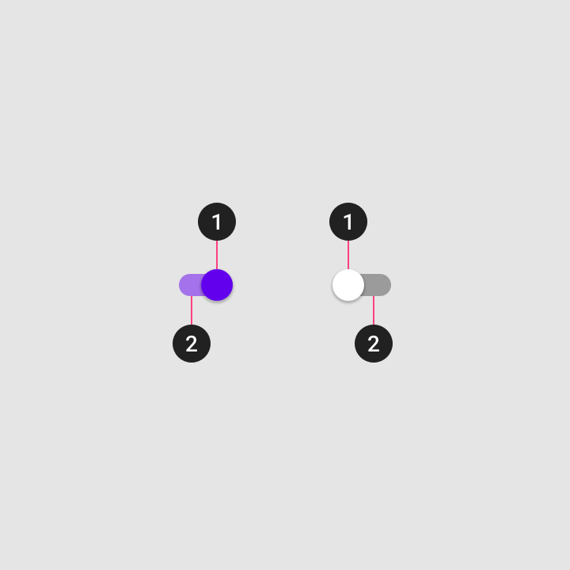
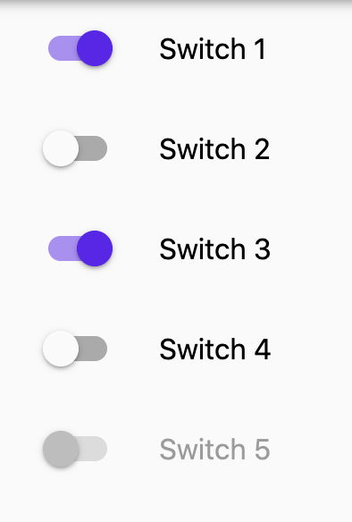
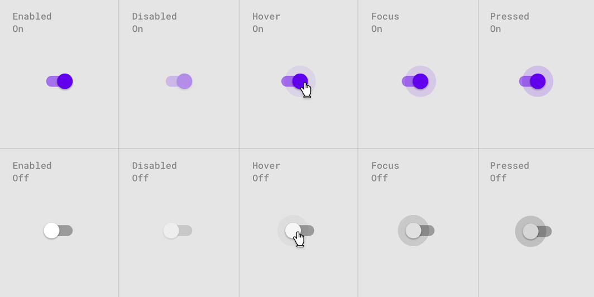
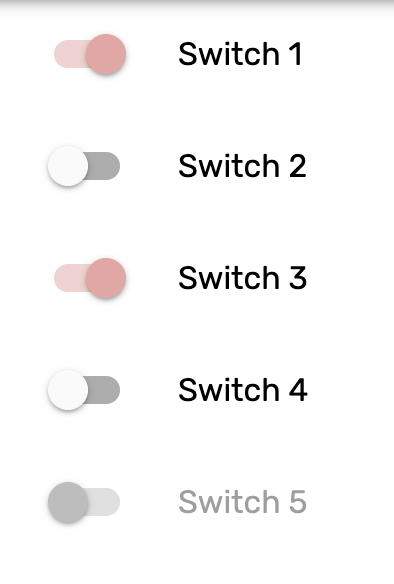

<!--docs:
title: "Material selection controls: Switches"
layout: detail
section: components
excerpt: "Selection controls allow the user to select options."
iconId: 
path: /catalog/SelectionControlSwitches/
-->

# Selection controls: switches

[Selection controls](https://material.io/components/selection-controls#usage) allow the user to select options.

Switches toggle the state of a single setting on or off. They are the preferred way to adjust settings on mobile.


**Contents**

- [Using switches](#using-switches)
- [Switch anatomy](#switch-anatomy)
- [Switch example](#switch-example)
- [Theming](#theming)

## Using switches

Use switches to:

- Toggle a single item on or off, on mobile and tablet
- Immediately activate or deactivate something


### Making switches accessible

Flutter's APIs support accessibility setting for large fonts, screen readers, and sufficient contrast. For more information, go to Flutter's [accessibility](https://flutter.dev/docs/development/accessibility-and-localization/accessibility) and [internationalization](https://flutter.dev/docs/development/accessibility-and-localization/internationalization) pages.

For more guidance on writing labels, go to [our page on how to write a good accessibility label](https://material.io/design/usability/accessibility.html#writing).

## Switch Anatomy

The following is an anatomy diagram that shows a switch thumb and a switch track:



1. Thumb
1. Track

### Thumb attributes

&nbsp;         | Property
-------------- | ------------------------ 
**Active Color** | `activeColor`
**Inactive Color** | `inactiveThumbColor` 

### Track attributes

&nbsp;         | Property
-------------- | ------------------------ 
**Active Color** | `activeTrackColor`
**Inactive Color** | `inactiveTrackColor` 

## Switch example

`Switch`
- [Class definition](https://api.flutter.dev/flutter/material/Switch-class.html)
- [GitHub source](https://github.com/flutter/flutter/blob/fabf4e3d0d311181178d2c601d29a2f739ea543a/packages/flutter/lib/src/material/switch.dart)
- [Dartpad demo](https://dartpad.dev/embed-flutter.html?gh_owner=material-components&gh_repo=material-components-flutter&gh_path=docs/components/dartpad/switches/regular&gh_ref=develop)

The following example shows switches being used in a list with the last row disabled.



```dart
Column(
  children: <Widget>[
    for (int i = 0; i <= count; i++)
      ListTile(
        title: Text(
          'Switch ${i + 1}',
          style: Theme.of(context).textTheme.subtitle1.copyWith(
              color: i == count ? Colors.black38 : Colors.black),
        ),
        leading: Switch(
          value: _values[i],
          activeColor: Color(0xFF6200EE),
          onChanged: i == count
              ? null
              : (bool value) {
                  setState(() {
                    _values[i] = value;
                  });
                },
        ),
      ),
  ],
)
```

### Switch states

Switches can be on or off. Switches have enabled, hover, focused, and pressed states.

Display the outer radial reaction only on form factors that use touch, where interaction may obstruct the element completely.

For desktop, the radial reaction isn't needed.



## Theming

Switches support [Material Theming](https://material.io/components/buttons/#theming) and can be
customized in terms of color.


`Switch`
- [Class definition](https://api.flutter.dev/flutter/material/Switch-class.html)
- [GitHub source](https://github.com/flutter/flutter/blob/fabf4e3d0d311181178d2c601d29a2f739ea543a/packages/flutter/lib/src/material/switch.dart)
- [Dartpad demo](https://dartpad.dev/embed-flutter.html?gh_owner=material-components&gh_repo=material-components-flutter&gh_path=docs/components/dartpad/switches/theming&gh_ref=develop)


The following example shows switches with the [Material Shrine Theme](https://material.io/design/material-studies/shrine.html).



```dart
import 'package:flutter/material.dart';

void main() => runApp(MyApp());

class MyApp extends StatelessWidget {
  @override
  Widget build(BuildContext context) {
    return MaterialApp(
      title: 'Flutter Demo',
      debugShowCheckedModeBanner: false,
      home: MyHomePage(),
      theme: _buildShrineTheme(),
    );
  }
}

class MyHomePage extends StatefulWidget {
  @override
  _MyHomePageState createState() => _MyHomePageState();
}

class _MyHomePageState extends State<MyHomePage> {
  List<bool> _values = [true, false, true, false, false];

  Widget build(BuildContext context) {
    final int count = 4;

    return Scaffold(
      body: Column(
        children: <Widget>[
          for (int i = 0; i <= count; i++)
            ListTile(
              title: Text(
                'Switch ${i + 1}',
                style: Theme.of(context).textTheme.subtitle1.copyWith(
                    color: i == count ? Colors.black38 : Colors.black),
              ),
              leading: Switch(
                value: _values[i],
                onChanged: i == count
                    ? null
                    : (bool value) {
                        setState(() {
                          _values[i] = value;
                        });
                      },
              ),
            ),
        ],
      ),
    );
  }
}

ThemeData _buildShrineTheme() {
  final ThemeData base = ThemeData.light();
  return base.copyWith(
    colorScheme: _shrineColorScheme,
    toggleableActiveColor: shrinePink400,
    accentColor: shrineBrown900,
    primaryColor: shrinePink100,
    buttonColor: shrinePink100,
    scaffoldBackgroundColor: shrineBackgroundWhite,
    cardColor: shrineBackgroundWhite,
    textSelectionTheme: TextSelectionThemeData(selectionColor: shrinePink100),
    errorColor: shrineErrorRed,
    buttonTheme: const ButtonThemeData(
      colorScheme: _shrineColorScheme,
      textTheme: ButtonTextTheme.normal,
    ),
    primaryIconTheme: _customIconTheme(base.iconTheme),
    textTheme: _buildShrineTextTheme(base.textTheme),
    primaryTextTheme: _buildShrineTextTheme(base.primaryTextTheme),
    accentTextTheme: _buildShrineTextTheme(base.accentTextTheme),
    iconTheme: _customIconTheme(base.iconTheme),
  );
}

IconThemeData _customIconTheme(IconThemeData original) {
  return original.copyWith(color: shrineBrown900);
}

TextTheme _buildShrineTextTheme(TextTheme base) {
  return base
      .copyWith(
        caption: base.caption.copyWith(
          fontWeight: FontWeight.w400,
          fontSize: 14,
          letterSpacing: defaultLetterSpacing,
        ),
        button: base.button.copyWith(
          fontWeight: FontWeight.w500,
          fontSize: 14,
          letterSpacing: defaultLetterSpacing,
        ),
      )
      .apply(
        fontFamily: 'Rubik',
        displayColor: shrineBrown900,
        bodyColor: shrineBrown900,
      );
}

const ColorScheme _shrineColorScheme = ColorScheme(
  primary: shrinePink100,
  primaryVariant: shrineBrown900,
  secondary: shrinePink50,
  secondaryVariant: shrineBrown900,
  surface: shrineSurfaceWhite,
  background: shrineBackgroundWhite,
  error: shrineErrorRed,
  onPrimary: shrineBrown900,
  onSecondary: shrineBrown900,
  onSurface: shrineBrown900,
  onBackground: shrineBrown900,
  onError: shrineSurfaceWhite,
  brightness: Brightness.light,
);

const Color shrinePink50 = Color(0xFFFEEAE6);
const Color shrinePink100 = Color(0xFFFEDBD0);
const Color shrinePink300 = Color(0xFFFBB8AC);
const Color shrinePink400 = Color(0xFFEAA4A4);

const Color shrineBrown900 = Color(0xFF442B2D);
const Color shrineBrown600 = Color(0xFF7D4F52);

const Color shrineErrorRed = Color(0xFFC5032B);

const Color shrineSurfaceWhite = Color(0xFFFFFBFA);
const Color shrineBackgroundWhite = Colors.white;

const defaultLetterSpacing = 0.03;
```
