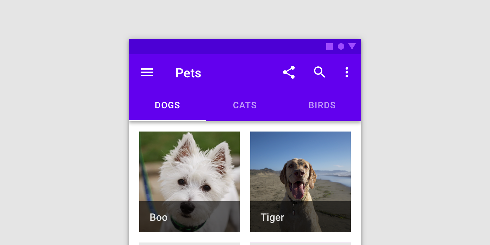
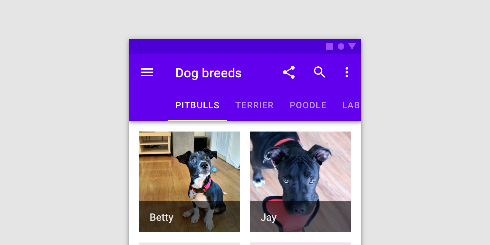
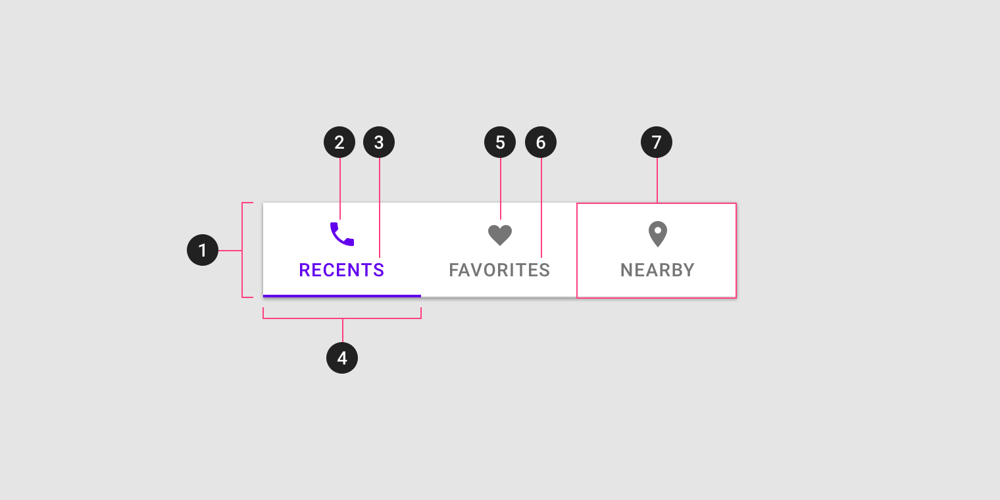
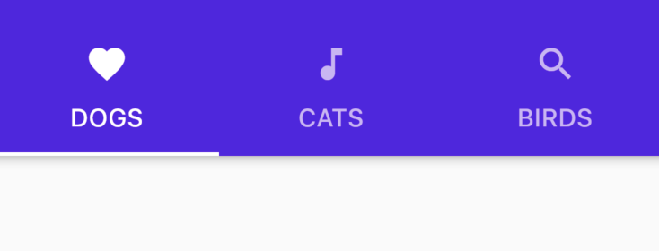
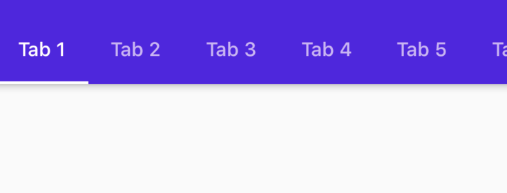
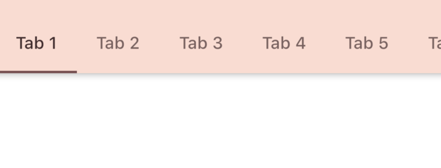

<!--docs:
title: "Tabs"
layout: detail
section: components
excerpt: "Tabs organize and allow navigation between groups of content that are related and at the same level of hierarchy."
iconId:
path: /catalog/tabs
-->

# Tabs

[Tabs](https://material.io/components/tabs/) organize content across different screens, data sets, and other interactions.



**Contents**

- [Using tabs](#using-tabs)
- [Fixed tabs](#fixed-tabs)
- [Scrollable tabs](#scrollable-tabs)
- [Theming tabs](#theming-tabs)

## Using tabs

Tabs organize and allow navigation between groups of content that are related and at the same level of hierarchy.

### Installing

To use Tabs in Flutter you need to import the Material package \
`import 'package:flutter/material.dart';`

### Making tabs accessible

Flutter's APIs support accessibility setting for large fonts, screen readers, and sufficient contrast. For more information, go to Flutter's [accessibility](https://flutter.dev/docs/development/accessibility-and-localization/accessibility) and [internationalization](https://flutter.dev/docs/development/accessibility-and-localization/internationalization) pages.

For more guidance on writing labels, go to [our page on how to write a good accessibility label](https://material.io/design/usability/accessibility.html#writing).

### Types

There are two types of tabs:

1. [Fixed tabs](#fixed-tabs)
1. [Scrollable tabs](#scrollable-tabs)



### Anatomy and key properties



1. Container
1. Active icon (Optional if there’s a label)
1. Active text label (Optional if there’s an icon)
1. Active tab indicator
1. Inactive icon (Optional if there’s a label)
1. Inactive text label (Optional if there’s an icon)
1. Tab item

#### Container attributes

&nbsp; | Property
------ | ---------
**Color** | In the parent widget,`AppBar` assign the `backgroundColor` property
**Height** |  Wrap your `TapBar` widget with a `PreferredSize` widget and assign `preferredSize` property

#### Active  icon attributes

&nbsp; | Property
------ | ---------
**`MaterialToolbar` icon** | In widget `Tab` assign the `icon` parameter
**`MaterialToolbar` icon color** |  In `TabBar` assign the `labelColor` parameter

#### Active text label attributes

&nbsp;         | Property
-------------- | ------------------------
**Text label** | In widget `Tab` assign the `text` parameter.
**Color**      | In `TabBar` assign the `labelColors` and `unselectedLabelColor` parameter
**Typography** | In `TabBar` assign the `labelStyle` and `unselectedLabelStyle` parameter

#### Active tab indicator attributes

&nbsp;         | Property
-------------- | ------------------------
**Indicatorg** | Indicat exist be default for custom indicator go to `TabBar` widget and fill out the `indicator` attribute.
**Indicator Padding** | In widget `TabBar` assign the `indicatorPadding` parameter.
**Indicator Size**      | In `TabBar` assign the `indicatorSize` parameter
**Indicator Weight** | In `TabBar` assign the `indicatorWeight` parameter

#### Inactive  icon attributes

&nbsp; | Property
------ | ---------
**`MaterialToolbar` icon** | In widget `Tab` assign the `icon` parameter
**`MaterialToolbar` icon color** |  In `TabBar` assign the `unselectedLabelColor` parameter

#### Inactive text label attributes

&nbsp;         | Property
-------------- | ------------------------
**Text label** | In widget `Tab` assign the `text` parameter.
**Color**      | In `TabBar` assign the `unselectedLabelColor` parameter
**Typography** | In `TabBar` assign the `unselectedLabelStyle` parameter

#### Tab item attributes

&nbsp;         | Property
-------------- | ------------------------
**child** | In widget `Tab` assign the `child` parameter. This is usually a `Text` widget, possibly wrapped in a `Semantics` widget for custom accessibility.

## Fixed tabs

Fixed tabs display all tabs on one screen, with each tab at a fixed width. The width of each tab is determined by dividing the number of tabs by the screen width. They don’t scroll to reveal more tabs; the visible tab set represents the only tabs available.

### Fixed tab example

`Tabs`

- [Class definition](https://api.flutter.dev/flutter/material/TabBar-class.html)
- [GitHub source](https://github.com/flutter/flutter/blob/master/packages/flutter/lib/src/material/tabs.dart)
- [Dartpad demo](https://dartpad.dev/embed-flutter.html?gh_owner=material-components&gh_repo=material-components-flutter&gh_path=docs/components/dartpad/tabs/fixed&gh_ref=develop)
- [YouTube video](https://www.youtube.com/watch?v=POtoEH-5l40&list=PLjxrf2q8roU23XGwz3Km7sQZFTdB996iG&index=67&ab_channel=Flutter)

The following example shows a row of of fixed tabs.



```dart
MaterialApp(
      title: 'Flutter Demo',
      home: DefaultTabController(
        length: 3,
        child: Scaffold(
          appBar: AppBar(
            title: Text('Fixed Tabs'),
            automaticallyImplyLeading: false,
            backgroundColor: Color(0xff5808e5),
            bottom: TabBar(
              indicatorColor: Colors.white,
              tabs: [
                Tab(text: 'DOGS', icon: Icon(Icons.favorite)),
                Tab(text: 'CATS', icon: Icon(Icons.music_note)),
                Tab(text: 'BIRDS', icon: Icon(Icons.search)),
              ],
            ),
          ),
          body: TabBarView(
            children: [
                Center(child: Text('DOGS')),
                Center(child: Text('CATS')),
                Center(child: Text('BIRDS')),
            ],
          ),
        ),
      ),
    );
```

## Scrollable tabs

Scrollable tabs are displayed without fixed widths. They are scrollable, such that some tabs will remain off-screen until scrolled.### Fixed tab example

`Tabs`

- [Class definition](https://api.flutter.dev/flutter/material/TabBar-class.html)
- [GitHub source](https://github.com/flutter/flutter/blob/master/packages/flutter/lib/src/material/tabs.dart)
- [Dartpad demo](https://dartpad.dev/embed-flutter.html?gh_owner=material-components&gh_repo=material-components-flutter&gh_path=docs/components/dartpad/tabs/scrollable&gh_ref=develop)
- [Demo site](https://gallery.flutter.dev/#/demo/tabs)

The following example shows a row of of scrollable tabs.



```dart
    final tabs = [
      'Tab 1',
      'Tab 2',
      'Tab 3',
      'Tab 4',
      'Tab 5',
      'Tab 6',
      'Tab 7',
      'Tab 8',
      'Tab 9',
    ];

    return MaterialApp(
      title: 'Flutter Demo',
      home: DefaultTabController(
        length: tabs.length,
        child: Scaffold(
          appBar: AppBar(
            title: Text('Scrollable Tabs'),
            automaticallyImplyLeading: false,
            backgroundColor: Color(0xff5808e5),
            bottom: TabBar(
              indicatorColor: Colors.white,
              isScrollable: true,
              tabs: [
                for (final tab in tabs) Tab(text: tab),
              ],
            ),
          ),
          body: TabBarView(
            children: [
              for (final tab in tabs)
                Center(
                  child: Text(tab),
                ),
            ],
          ),
        ),
      ),
    );
```

## Theming tabs

`Tabs`

The following is an example data table using the [Shrine theme](https://material.io/design/material-studies/shrine.html).

- [Class definition](https://api.flutter.dev/flutter/material/TabBar-class.html)
- [GitHub source](https://github.com/flutter/flutter/blob/master/packages/flutter/lib/src/material/tabs.dart)
- [Dartpad demo for Scrollable Theme](https://dartpad.dev/embed-flutter.html?gh_owner=material-components&gh_repo=material-components-flutter&gh_path=docs/components/dartpad/tabs/scrollable_theme&gh_ref=develop)
- [Dartpad demo for Fixed Theme](https://dartpad.dev/embed-flutter.html?gh_owner=material-components&gh_repo=material-components-flutter&gh_path=docs/components/dartpad/tabs/theme&gh_ref=develop)

The following example shows a row of of scrollable tabs.



```dart

import 'package:flutter/material.dart';

void main() => runApp(MyApp());

class MyApp extends StatelessWidget {
  @override
  Widget build(BuildContext context) {
    final tabs = [
      'Tab 1',
      'Tab 2',
      'Tab 3',
      'Tab 4',
      'Tab 5',
      'Tab 6',
      'Tab 7',
      'Tab 8',
      'Tab 9',
    ];

    return MaterialApp(
      title: 'Flutter Demo',
      theme: _buildShrineTheme(),
      home: DefaultTabController(
        length: tabs.length,
        child: Scaffold(
          appBar: AppBar(
            title: Text('Scrollable Tabs Theme'),
            automaticallyImplyLeading: false,
            bottom: TabBar(
              isScrollable: true,
              tabs: [
                for (final tab in tabs) Tab(text: tab),
              ],
            ),
          ),
          body: TabBarView(
            children: [
              for (final tab in tabs)
                Center(
                  child: Text(tab),
                ),
            ],
          ),
        ),
      ),
    );
  }
}

ThemeData _buildShrineTheme() {
  final ThemeData base = ThemeData.light();
  return base.copyWith(
    colorScheme: _shrineColorScheme,
    accentColor: shrineBrown900,
    primaryColor: shrinePink100,
    buttonColor: shrinePink100,
    scaffoldBackgroundColor: shrineBackgroundWhite,
    cardColor: shrineBackgroundWhite,
    textSelectionColor: shrinePink100,
    errorColor: shrineErrorRed,
    buttonTheme: const ButtonThemeData(
      colorScheme: _shrineColorScheme,
      textTheme: ButtonTextTheme.normal,
    ),
    primaryIconTheme: _customIconTheme(base.iconTheme),
    textTheme: _buildShrineTextTheme(base.textTheme),
    primaryTextTheme: _buildShrineTextTheme(base.primaryTextTheme),
    accentTextTheme: _buildShrineTextTheme(base.accentTextTheme),
    iconTheme: _customIconTheme(base.iconTheme),
    indicatorColor: shrineBrown600,
  );
}

IconThemeData _customIconTheme(IconThemeData original) {
  return original.copyWith(color: shrineBrown900);
}

TextTheme _buildShrineTextTheme(TextTheme base) {
  return base
      .copyWith(
        caption: base.caption.copyWith(
          fontWeight: FontWeight.w400,
          fontSize: 14,
          letterSpacing: defaultLetterSpacing,
        ),
        button: base.button.copyWith(
          fontWeight: FontWeight.w500,
          fontSize: 14,
          letterSpacing: defaultLetterSpacing,
        ),
      )
      .apply(
        fontFamily: 'Rubik',
        displayColor: shrineBrown900,
        bodyColor: shrineBrown900,
      );
}

const ColorScheme _shrineColorScheme = ColorScheme(
  primary: shrinePink100,
  primaryVariant: shrineBrown900,
  secondary: shrinePink50,
  secondaryVariant: shrineBrown900,
  surface: shrineSurfaceWhite,
  background: shrineBackgroundWhite,
  error: shrineErrorRed,
  onPrimary: shrineBrown900,
  onSecondary: shrineBrown900,
  onSurface: shrineBrown900,
  onBackground: shrineBrown900,
  onError: shrineSurfaceWhite,
  brightness: Brightness.light,
);

const Color shrinePink50 = Color(0xFFFEEAE6);
const Color shrinePink100 = Color(0xFFFEDBD0);
const Color shrinePink300 = Color(0xFFFBB8AC);
const Color shrinePink400 = Color(0xFFEAA4A4);

const Color shrineBrown900 = Color(0xFF442B2D);
const Color shrineBrown600 = Color(0xFF7D4F52);

const Color shrineErrorRed = Color(0xFFC5032B);

const Color shrineSurfaceWhite = Color(0xFFFFFBFA);
const Color shrineBackgroundWhite = Colors.white;

const defaultLetterSpacing = 0.03;

```
