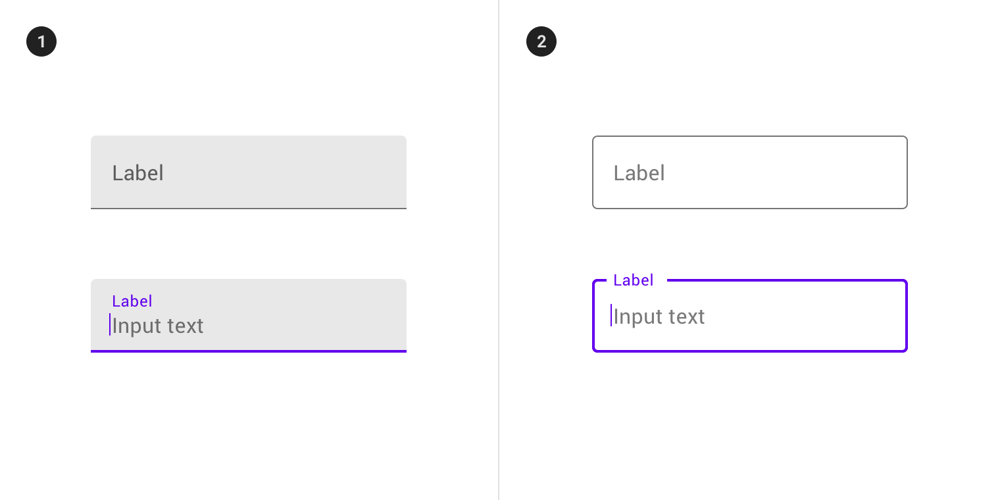
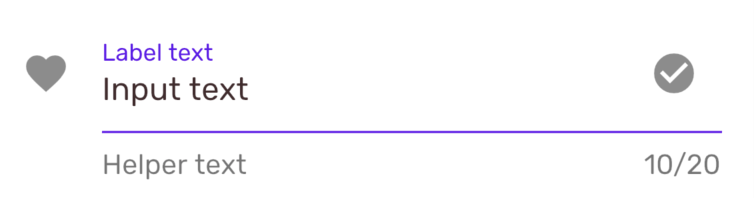
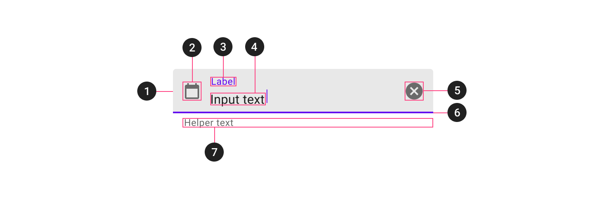
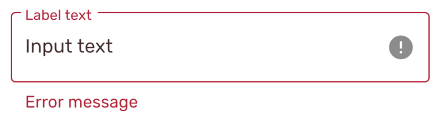
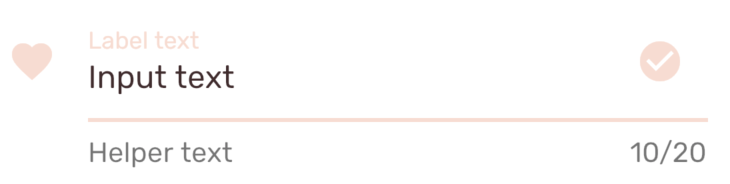

<!--docs:
title: "Material Text Field"
layout: detail
section: components
excerpt: "A customizable text field component with updated visual styles."
iconId:
path: /catalog/material-text-field/
-->

# Text field

[Text fields](https://material.io/components/text-fields) let users enter and edit text.


**Contents**

- [Using text fields](#using-text-fields)
- [Filled text](#filled-text)
- [Outlined button](#outlined-button)
- [Theming text fields](#theming-text-fields)

## Using text fields

Text fields allow users to enter text into a UI. They typically appear in forms and dialogs.

### Making text fields accessible

Flutter's text field component APIs supports both label text and helper text for accessibility.

For more guidance on writing labels, go to [our page on how to write a good accessibility label](https://material.io/design/usability/accessibility.html#writing).

### Types

There are two types of text fields: 1\. [filled text](#filled-text) 2\. [outlined text](#outlined-text)



## Filled text

[Filled text fields](https://material.io/components/text-fields/#filled-text-field) have more visual emphasis than outlined text fields, making them stand out when surrounded by other content and components.

### Filled text example

Source code API:

`TextFormField`

- [Class definition](https://api.flutter.dev/flutter/material/TextFormField-class.html)
- [GitHub source](https://github.com/flutter/flutter/blob/master/packages/flutter/lib/src/material/text_form_field.dart)
- [Dartpad demo](https://dartpad.dev/embed-flutter.html?gh_owner=material-components&gh_repo=material-components-flutter&gh_path=docs/components/dartpad/text_fields/outlined&gh_ref=develop)

The following example shows a filled text field.



```dart
 TextFormField(
   cursorColor: Theme.of(context).cursorColor,
   initialValue: 'Input text',
   maxLength: 20,
   decoration: InputDecoration(
     icon: Icon(Icons.favorite),
     labelText: 'Label text',
     labelStyle: TextStyle(
       color: Color(0xFF6200EE),
     ),
     helperText: 'Helper text',
     suffixIcon: Icon(
       Icons.check_circle,
     ),
     enabledBorder: UnderlineInputBorder(
       borderSide: BorderSide(color: Color(0xFF6200EE)),
     ),
   ),
 ),

```

### Anatomy and key properties for filled text



1. Container
1. Leading icon (optional)
1. Label text
1. Input text
1. Trailing icon (optional)
1. Activation indicator
1. Helper text (optional)

#### Container for filled text

| &nbsp; | Property |
| --- | --- |
| **Color** | style |
| **Stroke color** | `decoration`, inside `decoration` set the parameter `border`: `disabledBorder`, `enabledBorder`, `errorBorder`, `focusedBorder`, `focusedErrorBorder`|
| **Stroke width** | `decoration`, inside `decoration` set the parameter `border`: `disabledBorder`, `enabledBorder`, `errorBorder`, `focusedBorder`, `focusedErrorBorder`|
| **Shape** | decoration, inside `decoration` set the parameter `border`: `disabledBorder`, `enabledBorder`, `errorBorder`, `focusedBorder`, `focusedErrorBorder`|
| **Elevation** | N/A|
| **Ripple color** | N/A|

#### Leading icon (optional) for filled text

| &nbsp; | Property |
| --- | --- |
| **Icon** | Use `decoration`, within `decoration` set the `icon` property|
| **Color** | When creating the `icon` property you can set the `color` parameter|
| **Size** | When creating the `icon` property you can set the `size` parameter|
| **Gravity** | N/A |
| **Padding** | N/A |

#### Label text for filled text

| &nbsp; | Property |
| --- | --- |
| **Label text** | Use `decoration`, within `decoration` set `labelText` property |
| **Typography** | Use `decoration`, within `decoration` set `labelStyle` property |
| **Color** | Use `decoration`, within `decoration` set `labelStyle` property |

#### Input text for filled text

| &nbsp; | Property |
| --- | --- |
| **Label text** | `initialValue` |
| **Typography** | `style` |
| **Color** | `style` |

#### Trailing icon (optional) for filled text

| &nbsp; | Property |
| --- | --- |
| **Icon** | Use `decoration`, within `decoration` use `suffixIcon` property|
| **Color** | When creating the `suffixIcon` property you can set the `color` parameter|
| **Size** | When creating the `suffixIcon` property you can set the `size` parameter|
| **Gravity** | N/A |
| **Padding** | N/A |

#### Activation indicator for filled text

| &nbsp; | Property|
| --- | --- |
| **Stroke color** | Use `decoration`, within `decoration` set `FocusBorder`|
| **Stroke width** | Use `decoration`, within `decoration` set `FocusBorder`|
| **Ripple color** | N/A|

#### Helper text (optional) for filled text

| &nbsp; | Property|
| --- | --- |
| **Label text** | Use `decoration`, within `decoration` set `helperText` property |
| **Typography** | Use `decoration`, within `decoration` set `helperStyle` property |
| **Color** | Use `decoration`, within `decoration` set `helperStyle` property |

#### Styles for filled text

| &nbsp; | Property |
| --- | --- |
| **Default style** | `style` |
| **Icon style** | Within `style` set `icon` |

## Outlined text

[Outlined text fields](https://material.io/components/text-fields/#outlined-text-field) have less visual emphasis than filled text fields. When they appear in places like forms, where many text fields are placed together, their reduced emphasis helps simplify the layout.

### Outlined text example

Source code API:

`TextFormField`

- [Class definition](https://api.flutter.dev/flutter/material/TextFormField-class.html)
- [GitHub source](https://github.com/flutter/flutter/blob/master/packages/flutter/lib/src/material/text_form_field.dart)
- [Dartpad demo](https://dartpad.dev/embed-flutter.html?gh_owner=material-components&gh_repo=material-components-flutter&gh_path=docs/components/dartpad/text_fields/filled&gh_ref=develop)

The following examples shows an outlined text field.



```dart
TextFormField(
  initialValue: 'Input text',
  decoration: InputDecoration(
    labelText: 'Label text',
    errorText: 'Error message',
    border: OutlineInputBorder(),
    suffixIcon: Icon(
      Icons.error,
    ),
  ),
),
```

### Anatomy and key properties for outlined text


1. Container
1. Leading icon (optional)
1. Label text
1. Input text
1. Trailing icon (optional)
1. Activation indicator
1. Helper text (optional)

Note: If ThemeData has been declared in the MaterialApp widget it will override the theme that was manually input it like the activation indicator.

#### Container for outlined text

| &nbsp; | Property |
| --- | --- |
| **Color** | `style` |
| **Stroke color** | `decoration`, within `decoration` set the parameter `border`: `disabledBorder`, `enabledBorder`, `errorBorder`, `focusedBorder`, `focusedErrorBorder`|
| **Stroke width** | `decoration`, within `decoration` set the parameter `border`: `disabledBorder`, `enabledBorder`, `errorBorder`, `focusedBorder`, `focusedErrorBorder`|
| **Shape** | `decoration`, within `decoration` set the parameter `border`: `disabledBorder`, `enabledBorder`, `errorBorder`, `focusedBorder`, `focusedErrorBorder`|
| **Elevation** | N/A|
| **Ripple color** | N/A|

#### Leading icon (optional) for outlined text

| &nbsp; | Property |
| --- | --- |
| **Icon** | Use `decoration`, within `decoration` set `icon` property|
| **Color** | When creating the `icon` property set the `color` parameter|
| **Size** | When creating the `icon` property set the `size` parameter|
| **Gravity** | N/A |
| **Padding** | N/A |

#### Label text for outlined text

| &nbsp; | Property |
| --- | --- |
| **Label text** | Use `decoration`, within `decoration` set `labelText` property |
| **Typography** | Use `decoration`, within `decoration` set `labelStyle` property |
| **Color** | Use `decoration`, within `decoration` set `labelStyle` property |

#### Input text for outlined text

| &nbsp; | Property |
| --- | --- |
| **Label text** | `initialValue` |
| **Typography** | `style` |
| **Color** | `style` |

#### Trailing icon (optional) for outlined text

| &nbsp; | Property |
| --- | --- |
| **Icon** | Use `decoration`, within `decoration` set `suffixIcon` property|
| **Color** | When creating the `suffixIcon` property set the `color` parameter|
| **Size** | When creating the `suffixIcon` property set the `size` parameter|
| **Gravity** | N/A |
| **Padding** | N/A |

#### Activation indicator for outlined text

| &nbsp; | Property |
| --- | --- |
| **Stroke color** | Use `decoration`, within `decoration` set `FocusBorder`|
| **Stroke width** | Use `decoration`, within `decoration` set `FocusBorder`|
| **Ripple color** | N/A|

#### Helper text (optional) for outlined text

| &nbsp; | Property |
| --- | --- |
| **Label text** | Use `decoration`, within `decoration` set `helperText` property |
| **Typography** | Use `decoration`, within `decoration` set `helperStyle` property |
| **Color** | Use `decoration`, within `decoration` set `helperStyle` property |

#### Styles for outlined text

| &nbsp; | Property |
| --- | --- |
| **Default style** | `style` |
| **Icon style** | Within `style` set `icon` |

## Theming text fields

Text fields support [Material Theming](https://material.io/components/text-fields/#theming) and can be customized in terms of color, typography and shape.

### Text field theming example

API and source code:

`TextFormField`

- [Class definition](https://api.flutter.dev/flutter/material/TextFormField-class.html)
- [GitHub source](https://github.com/flutter/flutter/blob/master/packages/flutter/lib/src/material/text_form_field.dart)
- [Dartpad demo](https://dartpad.dev/embed-flutter.html?gh_owner=material-components&gh_repo=material-components-flutter&gh_path=docs/components/dartpad/text_fields/theme&gh_ref=develop)

The following example shows a filled text field with the [Material Shring Theme](ttps://material.io/design/material-studies/shrine.html).



To test code copy and paste code into [dartpad.dev](https://dartpad.dev/)

```dart
import 'package:flutter/material.dart';

void main() => runApp(MyApp());

class MyApp extends StatelessWidget {
  @override
  Widget build(BuildContext context) {
    return MaterialApp(
      title: 'Flutter Demo',
      debugShowCheckedModeBanner: false,
      theme: _buildShrineTheme(),
      home: MyHomePage(title: 'Flutter Demo Text Page'),
    );
  }
}

class MyHomePage extends StatefulWidget {
  MyHomePage({Key key, this.title}) : super(key: key);

  final String title;

  @override
  _MyHomePageState createState() => _MyHomePageState();
}

class _MyHomePageState extends State<MyHomePage> {
  Widget build(BuildContext context) {
    return Scaffold(
      body: Column(children: [
        TextFormField(
          cursorColor: Theme.of(context).cursorColor,
          initialValue: 'Input text',
          maxLength: 20,
          decoration: InputDecoration(
            icon: Icon(Icons.favorite),
            labelText: 'Label text',
            helperText: 'Helper text',
            suffixIcon: Icon(
              Icons.check_circle,
            ),
          ),
        ),
        TextFormField(
          cursorColor: Theme.of(context).cursorColor,
          initialValue: 'Input text',
          maxLength: 20,
          decoration: InputDecoration(
            icon: Icon(Icons.favorite),
            labelText: 'Label text',
            helperText: 'Helper text',
            errorText: 'Error message',
            suffixIcon: Icon(
              Icons.error,
            ),
          ),
        ),
      ]),
    );
  }
}

IconThemeData _customIconTheme(IconThemeData original) {
  return original.copyWith(color: shrineBrown900);
}

ThemeData _buildShrineTheme() {
  final ThemeData base = ThemeData.light();
  return base.copyWith(
    colorScheme: _shrineColorScheme,
    accentColor: shrineBrown900,
    primaryColor: shrinePink100,
    buttonColor: shrinePink100,
    scaffoldBackgroundColor: shrineBackgroundWhite,
    cardColor: shrineBackgroundWhite,
    textSelectionColor: shrinePink100,
    errorColor: shrineErrorRed,
    buttonTheme: const ButtonThemeData(
      colorScheme: _shrineColorScheme,
      textTheme: ButtonTextTheme.normal,
    ),
    primaryIconTheme: _customIconTheme(base.iconTheme),
    textTheme: _buildShrineTextTheme(base.textTheme),
    primaryTextTheme: _buildShrineTextTheme(base.primaryTextTheme),
    accentTextTheme: _buildShrineTextTheme(base.accentTextTheme),
    iconTheme: _customIconTheme(base.iconTheme),
  );
}

TextTheme _buildShrineTextTheme(TextTheme base) {
  return base
      .copyWith(
        headline: base.headline.copyWith(
          fontWeight: FontWeight.w500,
          letterSpacing: defaultLetterSpacing,
        ),
        title: base.title.copyWith(
          fontSize: 18,
          letterSpacing: defaultLetterSpacing,
        ),
        caption: base.caption.copyWith(
          fontWeight: FontWeight.w400,
          fontSize: 14,
          letterSpacing: defaultLetterSpacing,
        ),
        body2: base.body2.copyWith(
          fontWeight: FontWeight.w500,
          fontSize: 16,
          letterSpacing: defaultLetterSpacing,
        ),
        body1: base.body1.copyWith(
          letterSpacing: defaultLetterSpacing,
        ),
        subhead: base.subhead.copyWith(
          letterSpacing: defaultLetterSpacing,
        ),
        display1: base.display1.copyWith(
          letterSpacing: defaultLetterSpacing,
        ),
        button: base.button.copyWith(
          fontWeight: FontWeight.w500,
          fontSize: 14,
          letterSpacing: defaultLetterSpacing,
        ),
      )
      .apply(
        fontFamily: 'Rubik',
        displayColor: shrineBrown900,
        bodyColor: shrineBrown900,
      );
}

const ColorScheme _shrineColorScheme = ColorScheme(
  primary: shrinePink100,
  primaryVariant: shrineBrown900,
  secondary: shrinePink50,
  secondaryVariant: shrineBrown900,
  surface: shrineSurfaceWhite,
  background: shrineBackgroundWhite,
  error: shrineErrorRed,
  onPrimary: shrineBrown900,
  onSecondary: shrineBrown900,
  onSurface: shrineBrown900,
  onBackground: shrineBrown900,
  onError: shrineSurfaceWhite,
  brightness: Brightness.light,
);

const Color shrinePink50 = Color(0xFFFEEAE6);
const Color shrinePink100 = Color(0xFFFEDBD0);
const Color shrinePink300 = Color(0xFFFBB8AC);
const Color shrinePink400 = Color(0xFFEAA4A4);

const Color shrineBrown900 = Color(0xFF442B2D);
const Color shrineBrown600 = Color(0xFF7D4F52);

const Color shrineErrorRed = Color(0xFFC5032B);

const Color shrineSurfaceWhite = Color(0xFFFFFBFA);
const Color shrineBackgroundWhite = Colors.white;

const defaultLetterSpacing = 0.03;

```
