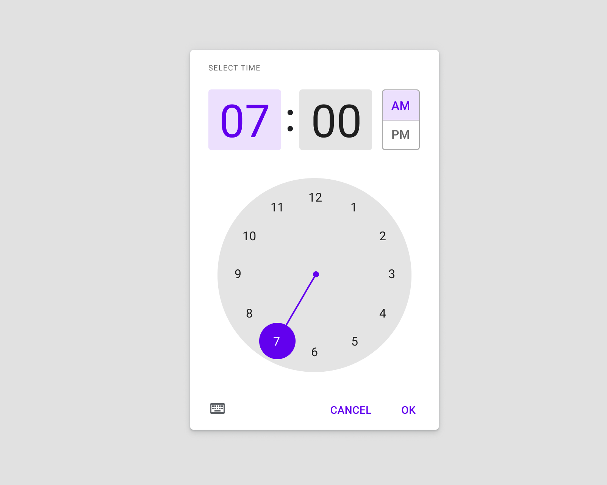
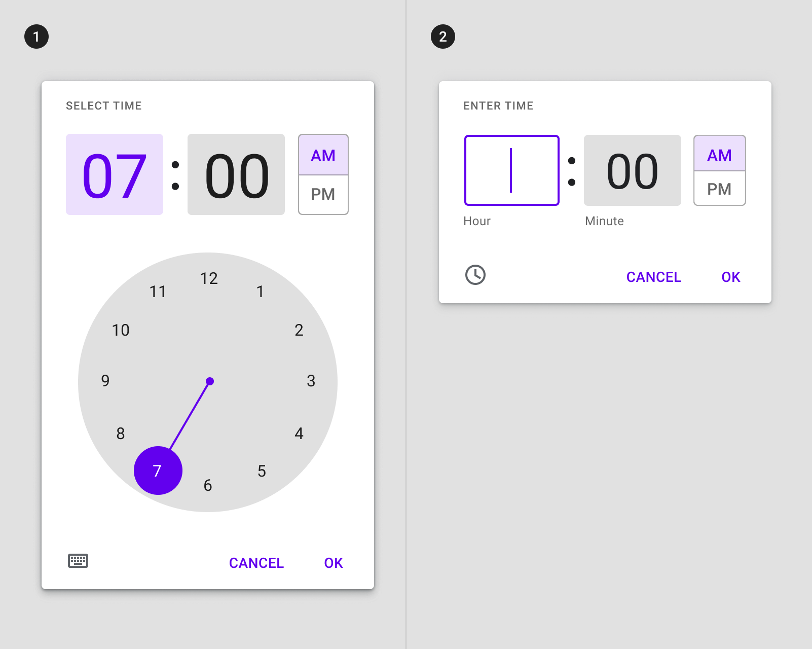
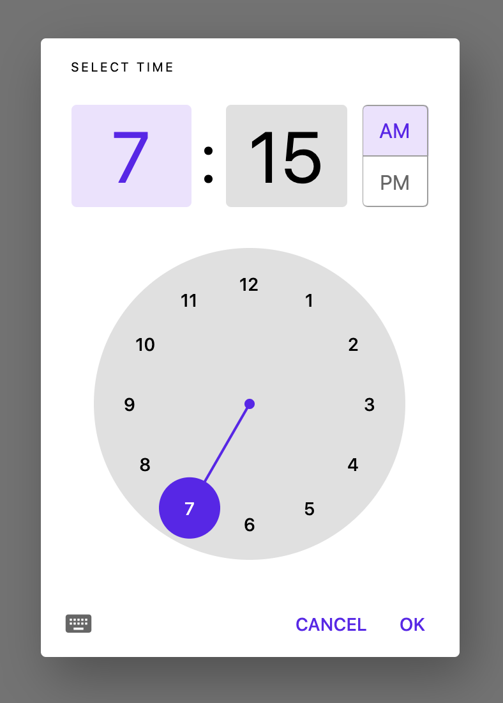
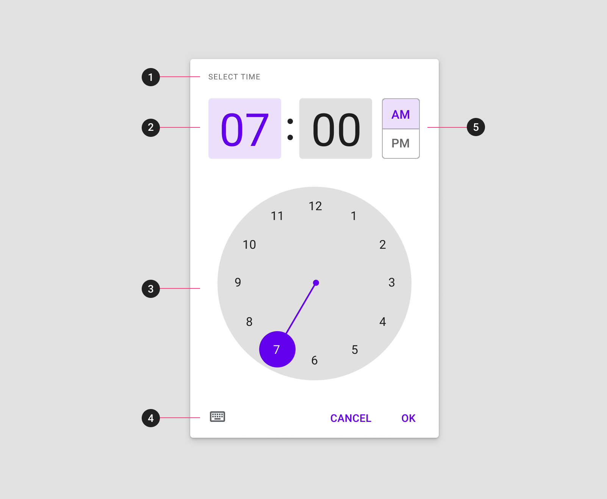
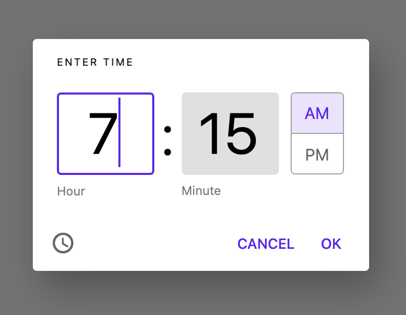
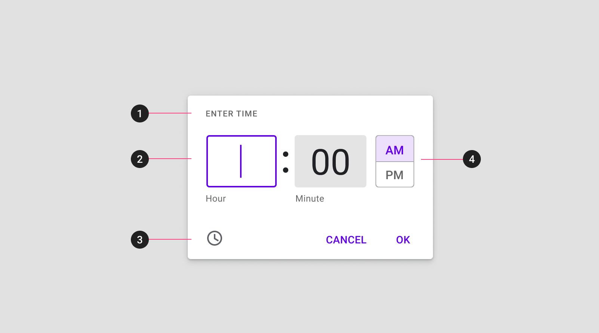
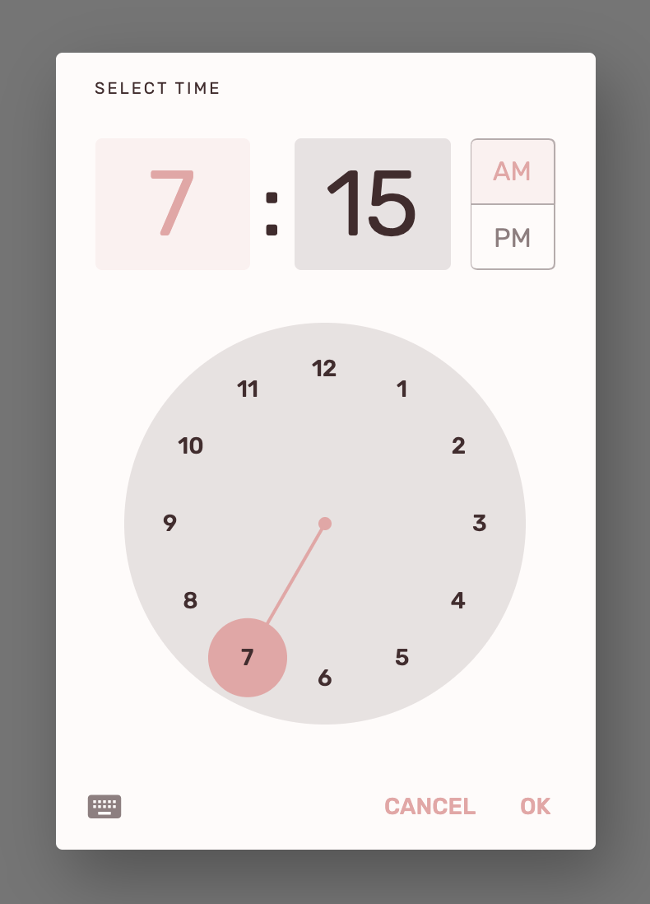

<!--docs:
title: "Material time pickers"
layout: detail
section: components
excerpt: "Time pickers help users select and set a specific time."
iconId: 
path: /catalog/time-pickers/
-->

# Time pickers

[Time pickers](https://material.io/components/time-pickers) help users select and set a specific time. 




## Contents

- [Using time pickers](#using-time-pickers)
- [Making time pickers accessible](#making-time-pickers-accessible)
- [Mobile time pickers](#mobile-time-pickers)
- [Mobile time input pickers](#mobile-time-input-pickers)
- [Theming time pickers](#theming-time-pickers)

## Using time pickers

Time pickers allow users to enter a specific time value. They can be used for a wide range of scenarios.

Common use cases include:
- Setting an alarm
- Scheduling a meeting

Mobile time pickers are displayed in dialogs and can be used to select hours, minutes, and a period of time


## Making time pickers accessible 

Flutter's APIs support accessibility setting for large fonts, screen readers, and sufficient contrast. For more information, go to Flutter's [accessibility](https://flutter.dev/docs/development/accessibility-and-localization/accessibility) and [internationalization](https://flutter.dev/docs/development/accessibility-and-localization/internationalization) pages.


## Types

_**The following types are for non-iOS platforms**_

There are two types of time pickers: 1\. [mobile time pickers](#mobile-time-pickers), and 2\. [mobile time input pickers](#mobile-time-input-pickers):



### Mobile time pickers

Mobile time pickers can be used to specify time down to hours and minutes in a time period. They are displayed in a dialog.  

Mobile time pickers allow selection of hours and minutes. They aren’t ideal for selecting granular amounts of time, such as milliseconds for a stopwatch application.


#### Mobile time pickers example

`showTimePicker`
- [Class definition](https://api.flutter.dev/flutter/material/showTimePicker.html)
- [GitHub source](https://github.com/flutter/flutter/blob/master/packages/flutter/lib/src/material/time_picker.dart)
- [Dartpad demo](https://dartpad.dev/embed-flutter.html?gh_owner=material-components&gh_repo=material-components-flutter&gh_path=docs/components/dartpad/time_pickers/regular&gh_ref=develop)

The following example shows a time picker.



```dart
final TimeOfDay newTime = await showTimePicker(
  context: context,
  initialTime: TimeOfDay(hour: 7, minute: 15),
);
```

#### Anatomy and key properties



1. Title
1. Interactive display and time input for hour and minutes
1. Clock dial
1. Icon button to switch to time input
1. AM/PM selector

##### Title

&nbsp;         | Property
-------------- | ------------------------ 
**Text** | `helpText` property in `showTimePicker`
**Text Style** | `helpTextStyle` property in `TimePickerThemeData`

##### Clock dial

&nbsp;         | Property
-------------- | ------------------------ 
**Background Color** | `dialBackgroundColor` property in `TimePickerThemeData`
**Hand Color** | `dialHandColor` property in `TimePickerThemeData`
**Text Color** | `dialTextColor` property in `TimePickerThemeData`

##### Input type toggle

&nbsp;         | Property
-------------- | ------------------------ 
**Color** | `entryModeIconColor` property in `TimePickerThemeData`

##### AM/PM selector

&nbsp;         | Property
-------------- | ------------------------ 
**Border** | `dayPeriodBorderSide` property in `TimePickerThemeData`
**Shape** | `dayPeriodShape` property in `TimePickerThemeData`
**Color** | `dayPeriodColor` property in `TimePickerThemeData`
**Text Color** | `dayPeriodTextColor` property in `TimePickerThemeData`
**Text Style** | `dayPeriodTextStyle` property in `TimePickerThemeData`


### Mobile time input pickers

Mobile time input pickers allow users to specify time using the numbers on a keyboard. The mobile time input picker can be accessed from any other mobile time picker interface by tapping the keyboard icon

#### Mobile time input picker example

`showTimePicker`
- [Class definition](https://api.flutter.dev/flutter/material/showTimePicker.html)
- [GitHub source](https://github.com/flutter/flutter/blob/master/packages/flutter/lib/src/material/time_picker.dart)
- [Dartpad demo](https://dartpad.dev/embed-flutter.html?gh_owner=material-components&gh_repo=material-components-flutter&gh_path=docs/components/dartpad/time_pickers/input&gh_ref=develop)

The following example shows a time input picker.



```dart
final TimeOfDay newTime = await showTimePicker(
  context: context,
  initialTime: TimeOfDay(hour: 7, minute: 15),
  initialEntryMode: TimePickerEntryMode.input,
);
```

#### Anatomy and key properties



1. Title
1. Hour and minute input field
1. Icon button to switch to dial entry
1. AM/PM selector

##### Title

&nbsp;         | Property
-------------- | ------------------------ 
**Text** | `helpText` property in `showTimePicker`
**Text Style** | `helpTextStyle` property in `TimePickerThemeData`

##### Hour and minute input

&nbsp;         | Property
-------------- | ------------------------ 
**Style** | `inputDecorationTheme` property in `TimePickerThemeData`

##### Input type toggle

&nbsp;         | Property
-------------- | ------------------------ 
**Color** | `entryModeIconColor` property in `TimePickerThemeData`

##### AM/PM selector

&nbsp;         | Property
-------------- | ------------------------ 
**Border** | `dayPeriodBorderSide` property in `TimePickerThemeData`
**Shape** | `dayPeriodShape` property in `TimePickerThemeData`
**Color** | `dayPeriodColor` property in `TimePickerThemeData`
**Text Color** | `dayPeriodTextColor` property in `TimePickerThemeData`
**Text Style** | `dayPeriodTextStyle` property in `TimePickerThemeData`


## Theming time pickers

The following example shows a mobile time picker that uses the [Shrine theme](https://material.io/design/material-studies/shrine.html):

- [Dartpad demo](https://dartpad.dev/embed-flutter.html?gh_owner=material-components&gh_repo=material-components-flutter&gh_path=docs/components/dartpad/time_pickers/theme&gh_ref=develop)



```dart
import 'package:flutter/material.dart';

void main() => runApp(MyApp());

class MyApp extends StatelessWidget {
  @override
  Widget build(BuildContext context) {
    return MaterialApp(
      title: 'Flutter Demo',
      debugShowCheckedModeBanner: false,
      theme: _buildShrineTheme(),
      home: MyHomePage(),
    );
  }
}

class MyHomePage extends StatefulWidget {
  @override
  _MyHomePageState createState() => _MyHomePageState();
}

class _MyHomePageState extends State<MyHomePage> {
  TimeOfDay _time = TimeOfDay(hour: 7, minute: 15);

  void _selectTime() async {
    final TimeOfDay newTime = await showTimePicker(
      context: context,
      initialTime: _time,
    );
    if (newTime != null) {
      setState(() {
        _time = newTime;
      });
    }
  }

  Widget build(BuildContext context) {
    return Scaffold(
      body: Center(
        child: Column(
          mainAxisAlignment: MainAxisAlignment.center,
          children: [
            ElevatedButton(
              onPressed: _selectTime,
              child: Text('SELECT TIME'),
            ),
            SizedBox(height: 8),
            Text(
              'Selected time: ${_time.format(context)}',
            ),
          ],
        ),
      ),
    );
  }
}

ThemeData _buildShrineTheme() {
  final ThemeData base = ThemeData.light();
  return base.copyWith(
    colorScheme: _shrineColorScheme,
    toggleableActiveColor: shrinePink400,
    accentColor: shrineBrown900,
    primaryColor: shrinePink100,
    buttonColor: shrinePink100,
    scaffoldBackgroundColor: shrineBackgroundWhite,
    cardColor: shrineBackgroundWhite,
    textSelectionColor: shrinePink100,
    errorColor: shrineErrorRed,
    buttonTheme: const ButtonThemeData(
      colorScheme: _shrineColorScheme,
      textTheme: ButtonTextTheme.normal,
    ),
    primaryIconTheme: _customIconTheme(base.iconTheme),
    textTheme: _buildShrineTextTheme(base.textTheme),
    primaryTextTheme: _buildShrineTextTheme(base.primaryTextTheme),
    accentTextTheme: _buildShrineTextTheme(base.accentTextTheme),
    iconTheme: _customIconTheme(base.iconTheme),
  );
}

IconThemeData _customIconTheme(IconThemeData original) {
  return original.copyWith(color: shrineBrown900);
}

TextTheme _buildShrineTextTheme(TextTheme base) {
  return base
      .copyWith(
        caption: base.caption.copyWith(
          fontWeight: FontWeight.w400,
          fontSize: 14,
          letterSpacing: defaultLetterSpacing,
        ),
        button: base.button.copyWith(
          fontWeight: FontWeight.w500,
          fontSize: 14,
          letterSpacing: defaultLetterSpacing,
        ),
      )
      .apply(
        fontFamily: 'Rubik',
        displayColor: shrineBrown900,
        bodyColor: shrineBrown900,
      );
}

const ColorScheme _shrineColorScheme = ColorScheme(
  primary: shrinePink400,
  primaryVariant: shrineBrown900,
  secondary: shrinePink50,
  secondaryVariant: shrineBrown900,
  surface: shrineSurfaceWhite,
  background: shrineBackgroundWhite,
  error: shrineErrorRed,
  onPrimary: shrineBrown900,
  onSecondary: shrineBrown900,
  onSurface: shrineBrown900,
  onBackground: shrineBrown900,
  onError: shrineSurfaceWhite,
  brightness: Brightness.light,
);

const Color shrinePink50 = Color(0xFFFEEAE6);
const Color shrinePink100 = Color(0xFFFEDBD0);
const Color shrinePink300 = Color(0xFFFBB8AC);
const Color shrinePink400 = Color(0xFFEAA4A4);

const Color shrineBrown900 = Color(0xFF442B2D);
const Color shrineBrown600 = Color(0xFF7D4F52);

const Color shrineErrorRed = Color(0xFFC5032B);

const Color shrineSurfaceWhite = Color(0xFFFFFBFA);
const Color shrineBackgroundWhite = Colors.white;

const defaultLetterSpacing = 0.03;
```