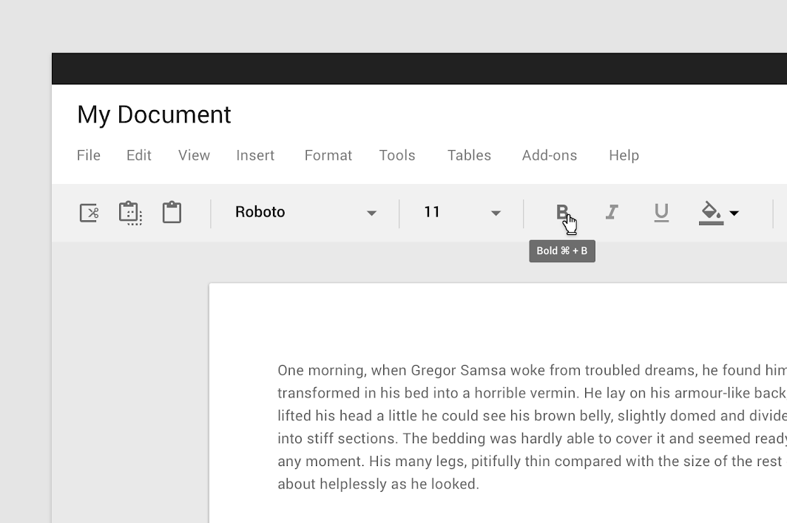
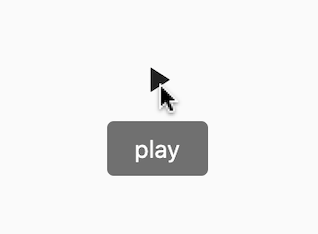
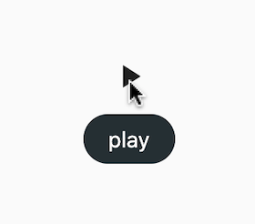

<!--docs:
title: "Tooltips"
layout: detail
section: components
excerpt: "Tooltips display informative text when users hover over, focus on, or tap an element."
iconId: slider
path: /catalog/Tooltips/
-->

# Tooltips

[Tooltips](https://material.io/components/tooltips) display informative text when users hover over, focus on, or tap an element.



## Contents

- [Using tooltips](#using-tooltips)
  - [Making tooltips accessible](#making-tooltips-accessible)
  - [Key properties for tooltips](#key-properties-for-tooltips)
- [Tooltips example](#tooltips-example)
- [Theming tooltips](#theming-tooltips)

## Using tooltips

When activated, tooltips display a text label identifying an element, such as a description of its function.

### Making tooltips accessible

Screen readers will read the `message` property of the `Tooltip`. Adding tooltips is also a good way to make other `Widget`s in your app more accessible.

### Key properties for tooltips

A tooltip has text label and a container.

1. Text label
1. Container

#### Text label for tooltip

| &nbsp; | Property |
| --- | --- |
| **Text label** | `message` of `Tooltip` |
| **Color** | `color` of `textStyle` of `Tooltip` |
| **Typography** | `textStyle` of `Tooltip` |

#### Container for tooltip

| &nbsp; | Property |
| --- | --- |
| **Color** | `color`  of `decoration` of `Tooltip`|
| **Shape** | `shape` of `decoration` of `Tooltip` |

## Tooltips example

`Tooltip`
- [Class defintion](https://api.flutter.dev/flutter/material/Tooltip-class.html)
- [GitHub source](https://github.com/flutter/flutter/blob/master/packages/flutter/lib/src/material/tooltip.dart)
- [Dartpad demo](https://dartpad.dev/embed-flutter.html?gh_owner=material-components&gh_repo=material-components-flutter&gh_path=docs/components/dartpad/tooltips/regular&gh_ref=develop)



```dart
import 'package:flutter/material.dart';

void main() => runApp(MyApp());

class MyApp extends StatelessWidget {
  @override
  Widget build(BuildContext context) {
    return MaterialApp(
      title: 'Tooltip Demo',
      debugShowCheckedModeBanner: false,
      home: Scaffold(
        body: Center(
          child: Tooltip(
            message: 'play',
            child: Icon(Icons.play_arrow),
          ),
        ),
      ),
    );
  }
}
```

## Theming tooltips

Tooltips support [Material Theming](https://material.io/components/tooltips#theming) and can be customized in terms of color, typography, and shape.

To change the background color and shape, use the `decoration` property. To change the text typography, color, etc, use the `textStyle` property.

`Tooltip`
- [Class defintion](https://api.flutter.dev/flutter/material/Tooltip-class.html)
- [GitHub source](https://github.com/flutter/flutter/blob/master/packages/flutter/lib/src/material/tooltip.dart)
- [Dartpad demo](https://dartpad.dev/embed-flutter.html?gh_owner=material-components&gh_repo=material-components-flutter&gh_path=docs/components/dartpad/tooltips/theme&gh_ref=develop)

The following example shows a play icon and tooltip using Material's [Reply](https://material.io/design/material-studies/reply.html) theme.



```dart
import 'package:flutter/material.dart';

void main() => runApp(MyApp());

class MyApp extends StatelessWidget {
  @override
  Widget build(BuildContext context) {
    return MaterialApp(
      title: 'Tooltip Demo',
      debugShowCheckedModeBanner: false,
      theme: ThemeData(
        tooltipTheme: TooltipThemeData(
          decoration: ShapeDecoration(
            color: Color(0xFF232F34),
            shape: StadiumBorder(),
          ),
          textStyle: TextStyle(color: Colors.white),
        ),
      ),
      home: Scaffold(
        body: Center(
          child: Tooltip(
            message: 'Play',
            child: Icon(Icons.play_arrow),
          ),
        ),
      ),
    );
  }
}
```
