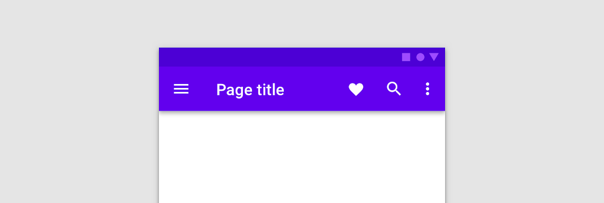

<!--docs:
title: "Material Top App Bar"
layout: detail
section: components
excerpt: "A customizable top app bar component with updated visual styles."
iconId:
path: /catalog/material-top-app-bar/
-->

# Top app bar

The [top app bar](https://material.io/components/app-bars-top/#) displays information and actions relating to the current screen.



## Contents

- [Contents](#contents)
- [Using the top app bar](#using-the-top-app-bar)
- [Regular top app bar](#regular-top-app-bar)
- [Contextual action bar](#contextual-action-bar)
- [Theming a top app bar](#theming-a-top-app-bar)

## Theming a top app bar(#theming-text-fields)

## Using the top app bar

The top app bar provides content and actions related to the current screen. It’s used for branding, screen titles, navigation, and actions.

A regular top app bar can transform into a contextual action bar.

Before you can use Material buttons, you need to import the Material Components package for Flutter:

```dart
package:flutter/material.dart
```

You need to use [`MaterialApp`](https://api.flutter.dev/flutter/material/MaterialApp-class.html).

For more information on getting started with the Material for Flutter, go to the Flutter [Material library](https://api.flutter.dev/flutter/material/material-library.html) page.

### Making the top app bar accessible

Flutter's APIs support accessibility setting for large fonts, screen readers, and sufficient contrast. For more information, go to Flutter's [accessibility](https://flutter.dev/docs/development/accessibility-and-localization/accessibility) and [internationalization](https://flutter.dev/docs/development/accessibility-and-localization/internationalization) pages.

For more guidance on writing labels, go to [our page on how to write a good accessibility label](https://material.io/design/usability/accessibility.html#writing).

### Types

There are two types of top app bar:

1. [Regular top app bar](#regular-top-app-bar)
1. [Contextual action bar](#contextual-top-app-bar)


## Regular top app bar

The top app bar provides content and actions related to the current screen. It’s used for branding, screen titles, navigation, and actions.

### Regular top app bar example

`AppBar`

- [Class definition](https://api.flutter.dev/flutter/material/AppBar-class.html)
- [GitHub source](https://github.com/flutter/flutter/blob/master/packages/flutter/lib/src/material/app_bar.dart)
- [Dartpad Demo](https://dartpad.dev/embed-flutter.html?gh_owner=material-components&gh_repo=material-components-flutter&gh_path=docs/components/dartpad/top-app-bar/regular)

The following example shows a top app bar with a page title, a navigation icon, two action icons, and an overflow menu:


```dart
AppBar(
  leading: Icon(Icons.menu),
  title: Text('Page title'),
  actions: [
    Icon(Icons.favorite),
    Padding(
      padding: EdgeInsets.symmetric(horizontal: 16),
      child: Icon(Icons.search),
    ),
    Icon(Icons.more_vert),
  ],
  backgroundColor: Colors.purple,
),

```

### Anatomy and Key properties for Top App Bar


1. Container (optional)
1. Navigation icon (optional)
1. Title (optional)
1. Action items (optional)
1. Overflow menu (optional)

#### Container for Top App Bar

| &nbsp; | Property |
| --- | --- |
| **Color** | `color` parameter |
| **Stroke color** |  In `leading` parameter, use `Icon` widget. Set `color`|
| **Shape** | `shape` parameter |
| **Elevation** | `elevation` parameter|

#### Navigation icon for Top App Bar (optional)

| &nbsp; | Property |
| --- | --- |
| **Icon** |  In `leading` parameter, use `IconButton` Widget |
| **Color** | In `leading` parameter, use `IconButton` Widget and set parameter `color` |
| **Size** | In `leading` parameter, use `IconButton` Widget and set parameter `iconSize` |
| **Gravity** | `titleSpacing` parameter |
| **Padding** | Wrap `Icon` wiget with `Padding` widget |

#### Title for Top App Bar (optional)

| &nbsp; | Property |
| --- | --- |
| **Text label** | In `title` parameter, use `Text` widget |
| **Color** | In `title` parameter, use `Text` Widget and and set parameter `style` |
| **Typography** | In `title` parameter, use `Text` Widget and and set parameter `style` |

#### Action item for Top App Bar(optional)

| &nbsp; | Property |
| --- | --- |
| **Icon** | In `action` parameter, use `IconButton` widget and set parameter `icon` |
| **Color** | In `action` parameter, use `IconButton` widget and set parameter `color` OR set `actionIconsTheme` |
| **Size** | In `action` parameter, use `IconButton` widget and set parameter `iconSize` OR set `actionIconsTheme`|
| **Padding** | Wrap `IconButton` widget with `Padding` widget |

#### Overflow menu for Top App Bar(optional)

| &nbsp; | Property |
| --- | --- |
| **Icon** | In `action` parameter, add `IconButton` widget to the end of Widget list and set parameter `icon` within `IconButton` |
| **Color** | In `action` parameter, add `IconButton` widget to the end of Widget list and set parameter `color` within `IconButton` |
| **Size** | In `action` parameter, add `IconButton` widget to the end of Widget list and set parameter `iconSize` within `IconButton` |
| **Padding** | In `action` parameter, add `IconButton` widget to the end of Widget list and wrap that Widget with a `Padding` widget  |

## Contextual action bar

A top app bar can transform into a contextual action bar to provide contextual actions to selected items. For example, upon user selection of photos from a gallery, the top app bar transforms to a contextual app bar with actions related to the selected photos.

When a top app bar transforms into a contextual action bar, the following changes occur:

- The bar color changes
- Navigation icon is replaced with a close icon
- Top app bar title text converts to contextual action bar text
- Top app bar actions are replaced with contextual actions
- Upon closing, the contextual action bar transforms back into a top app bar.

### Contextual action bar example

`AppBar`

- [Class definition](https://api.flutter.dev/flutter/material/AppBar-class.html)
- [GitHub source](https://github.com/flutter/flutter/blob/master/packages/flutter/lib/src/material/app_bar.dart)
- [Dartpad Demo](https://dartpad.dev/embed-flutter.html?gh_owner=material-components&gh_repo=material-components-flutter&gh_path=docs/components/dartpad/top-app-bar/contextual)

The following example shows a contextual action bar with a contextual title, a close icon, two contextual action icons, and an overflow menu:


```dart
AppBar(
  leading: Icon(Icons.close),
  title: Text('1 selected'),
  actions: [
    Icon(Icons.file_upload),
    Padding(
      padding: EdgeInsets.symmetric(horizontal: 16),
      child: Icon(Icons.delete),
    ),
    Icon(Icons.more_vert),
  ],
  backgroundColor: Colors.black87,
),

```

### Anatomy and Key properties for Contextual Action Bar


1. Close Button (optional)
1. Contextual title (optional)
1. Contextual action items (optional)
1. Overflow menu (optional)

#### Close Button for Contextual Action Bar (optional)

| &nbsp; | Property |
| --- | --- |
| **Icon** |  In `leading` parameter, use `IconButton` Widget |
| **Color** | In `leading` parameter, use `IconButton` Widget and set parameter `color` |
| **Size** | In `leading` parameter, use `IconButton` Widget and set parameter `iconSize` |
| **Gravity** | `titleSpacing` parameter |
| **Padding** | Wrap `Icon` wiget with `Padding` widget |

#### Contextual title for Contextual Action Bar (optional)

| &nbsp; | Property |
| --- | --- |
| **Text label** | In `title` parameter, use `Text` widget |
| **Color** | In `title` parameter, use `Text` Widget and and set parameter `style` |
| **Typography** | In `title` parameter, use `Text` Widget and and set parameter `style` |

#### Contextual action items for Contextual Action Bar (optional)

| &nbsp; | Property |
| --- | --- |
| **Icon** | In `action` parameter, use `IconButton` widget and set parameter `icon` |
| **Color** | In `action` parameter, use `IconButton` widget and set parameter `color` OR set `actionIconsTheme` |
| **Size** | In `action` parameter, use `IconButton` widget and set parameter `iconSize` OR set `actionIconsTheme`|
| **Padding** | Wrap `IconButton` widget with `Padding` widget |

#### Overflow menu for Contextual Action Bar (optional)

| &nbsp; | Property |
| --- | --- |
| **Icon** | In `action` parameter, add `IconButton` widget to the end of Widget list and set parameter `icon` within `IconButton` |
| **Color** | In `action` parameter, add `IconButton` widget to the end of Widget list and set parameter `color` within `IconButton` |
| **Size** | In `action` parameter, add `IconButton` widget to the end of Widget list and set parameter `iconSize` within `IconButton` |
| **Padding** | In `action` parameter, add `IconButton` widget to the end of Widget list and wrap that Widget with a `Padding` widget  |

## Theming a top app bar

The top app bar supports [Material Theming](https://material.io/components/app-bars-top/#theming) and can be customized in terms of color, typography and shape.

### Top app bar theming example

- [Regular Top App Bar with Theme Dartpad Demo](https://dartpad.dev/embed-flutter.html?gh_owner=material-components&gh_repo=material-components-flutter&gh_path=docs/components/dartpad/top-app-bar/theme)
- [Contextual Action Bar with Dartpad Demo](https://dartpad.dev/embed-flutter.html?gh_owner=material-components&gh_repo=material-components-flutter&gh_path=docs/components/dartpad/top-app-bar/contextual_theme)


```dart
import 'package:flutter/material.dart';

void main() => runApp(MyApp());

class MyApp extends StatelessWidget {
  @override
  Widget build(BuildContext context) {
    return MaterialApp(
      title: 'Flutter Demo',
      home: MyHomePage(),
      theme: _buildShrineTheme(),
    );
  }
}

class MyHomePage extends StatelessWidget {
  Widget build(BuildContext context) {
    return Scaffold(
      appBar: AppBar(
        leading: Icon(Icons.menu),
        title: Text('Page title'),
        actions: [
          Icon(Icons.favorite),
          Padding(
            padding: EdgeInsets.symmetric(horizontal: 16),
            child: Icon(Icons.search),
          ),
          Icon(Icons.more_vert),
        ],
      ),
      body: Container(),
    );
  }
}

ThemeData _buildShrineTheme() {
  final ThemeData base = ThemeData.light();
  return base.copyWith(
    colorScheme: _shrineColorScheme,
    accentColor: shrineBrown900,
    primaryColor: shrinePink100,
    buttonColor: shrinePink100,
    scaffoldBackgroundColor: shrineBackgroundWhite,
    cardColor: shrineBackgroundWhite,
    textSelectionColor: shrinePink100,
    errorColor: shrineErrorRed,
    buttonTheme: const ButtonThemeData(
      colorScheme: _shrineColorScheme,
      textTheme: ButtonTextTheme.normal,
    ),
    primaryIconTheme: _customIconTheme(base.iconTheme),
    textTheme: _buildShrineTextTheme(base.textTheme),
    primaryTextTheme: _buildShrineTextTheme(base.primaryTextTheme),
    accentTextTheme: _buildShrineTextTheme(base.accentTextTheme),
    iconTheme: _customIconTheme(base.iconTheme),
  );
}

IconThemeData _customIconTheme(IconThemeData original) {
  return original.copyWith(color: shrineBrown900);
}

TextTheme _buildShrineTextTheme(TextTheme base) {
  return base
      .copyWith(
        caption: base.caption.copyWith(
          fontWeight: FontWeight.w400,
          fontSize: 14,
          letterSpacing: defaultLetterSpacing,
        ),
        button: base.button.copyWith(
          fontWeight: FontWeight.w500,
          fontSize: 14,
          letterSpacing: defaultLetterSpacing,
        ),
      )
      .apply(
        fontFamily: 'Rubik',
        displayColor: shrineBrown900,
        bodyColor: shrineBrown900,
      );
}

const ColorScheme _shrineColorScheme = ColorScheme(
  primary: shrinePink100,
  primaryVariant: shrineBrown900,
  secondary: shrinePink50,
  secondaryVariant: shrineBrown900,
  surface: shrineSurfaceWhite,
  background: shrineBackgroundWhite,
  error: shrineErrorRed,
  onPrimary: shrineBrown900,
  onSecondary: shrineBrown900,
  onSurface: shrineBrown900,
  onBackground: shrineBrown900,
  onError: shrineSurfaceWhite,
  brightness: Brightness.light,
);

const Color shrinePink50 = Color(0xFFFEEAE6);
const Color shrinePink100 = Color(0xFFFEDBD0);
const Color shrinePink300 = Color(0xFFFBB8AC);
const Color shrinePink400 = Color(0xFFEAA4A4);

const Color shrineBrown900 = Color(0xFF442B2D);
const Color shrineBrown600 = Color(0xFF7D4F52);

const Color shrineErrorRed = Color(0xFFC5032B);

const Color shrineSurfaceWhite = Color(0xFFFFFBFA);
const Color shrineBackgroundWhite = Colors.white;

const defaultLetterSpacing = 0.03;


```
